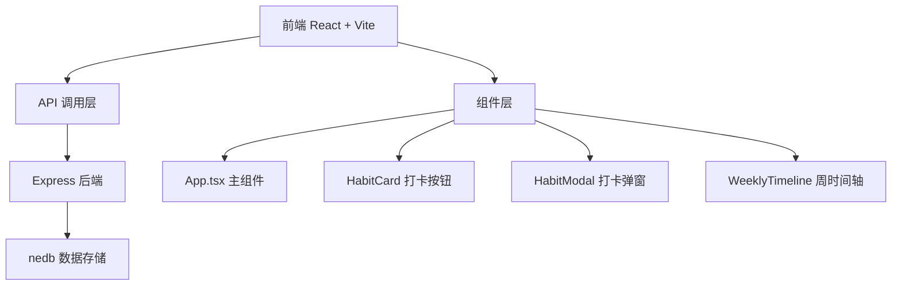
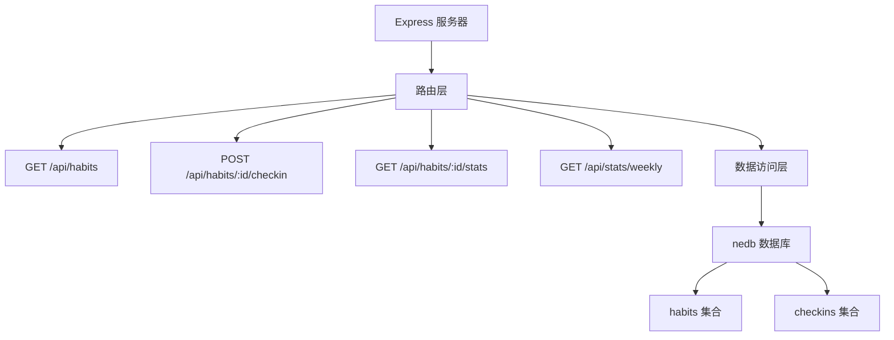
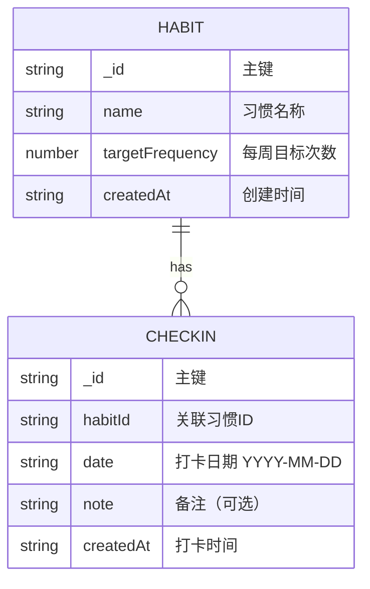

## 1. 架构设计



## 2. 技术描述

- **前端**：React 18 + TypeScript + Vite 5
- **初始化工具**：Vite 脚手架
- **后端**：Express 4
- **数据库**：nedb-promises（嵌入式文档数据库）
- **工具库**：date-fns（日期处理）、uuid（唯一ID生成）

## 3. 路由定义

| 路由 | 用途 |
|-------|---------|
| / | 首页，习惯打卡主界面 |

## 4. API 定义

### 类型定义

```typescript
interface Habit {
  _id: string;
  name: string;
  targetFrequency: number; // 每周目标次数
  createdAt: string;
}

interface CheckIn {
  _id: string;
  habitId: string;
  date: string; // YYYY-MM-DD
  note?: string;
  createdAt: string;
}

interface DailyStats {
  date: string;
  totalHabits: number;
  completedHabits: number;
  completionRate: number;
}
```

### 接口定义

| 方法 | 路径 | 描述 | 请求参数 | 返回值 |
|------|------|------|----------|--------|
| GET | /api/habits | 获取所有习惯列表 | 无 | Habit[] |
| POST | /api/habits/:id/checkin | 为指定习惯打卡 | { note?: string } | CheckIn |
| GET | /api/habits/:id/stats | 获取习惯打卡统计数据 | 无 | { checkins: CheckIn[], streak: number } |
| GET | /api/stats/weekly | 获取近7天每日统计 | 无 | DailyStats[] |

## 5. 服务器架构图



## 6. 数据模型

### 6.1 数据模型定义



### 6.2 初始数据

数据库初始化时自动插入示例习惯数据：
- 晨间阅读（每周7次）
- 体育锻炼（每周3次）
- 冥想（每周5次）
- 健康饮食（每周7次）
