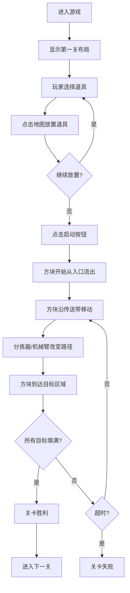

## 1. 产品概述

ConveyorCrafter是一款浏览器端工厂模拟小游戏，玩家通过放置传送带、分拣器和机械臂，将彩色方块从原料入口运送到对应颜色的目标区域，完成关卡挑战。

- **核心玩法**：策略性地布置自动化产线，在限定时间内完成方块分拣任务
- **目标用户**：休闲游戏爱好者、解谜游戏玩家
- **市场价值**：轻量化的策略解谜体验，无需安装即可游玩，适合碎片化时间娱乐

## 2. 核心功能

### 2.1 用户角色
| 角色 | 注册方式 | 核心权限 |
|------|----------|----------|
| 玩家 | 无需注册 | 进行游戏、选择关卡、重置关卡 |

### 2.2 功能模块
1. **游戏主画布**：2D俯视视角网格地图，渲染传送带、方块、分拣器、机械臂、目标区域
2. **关卡系统**：多关卡递进，难度逐步提升（障碍物、限时、更快速度）
3. **道具系统**：传送带、分拣器、机械臂三种可放置道具，有数量限制
4. **交互面板**：道具选择、步数计数、启动/重置按钮、关卡信息
5. **游戏逻辑**：方块移动、碰撞检测、路径跳转、胜负判定

### 2.3 页面详情
| 页面名称 | 模块名称 | 功能描述 |
|----------|----------|----------|
| 游戏主页面 | 游戏画布 | 64px网格系统，支持道具放置、方块移动动画、碰撞检测 |
| 游戏主页面 | 右侧操作面板 | 道具选择按钮（显示剩余数量）、关卡名称、步数计数、启动/重置按钮 |
| 游戏主页面 | 游戏状态提示 | 胜利/失败动画提示、目标区域满时庆祝动画 |

## 3. 核心流程

玩家进入游戏 → 选择关卡（默认第一关）→ 在地图上放置传送带/分拣器/机械臂 → 点击启动按钮 → 方块开始沿传送带移动 → 方块被分拣到对应颜色目标区域 → 所有目标区域填满 → 关卡胜利 → 进入下一关

## 4. 用户界面设计

### 4.1 设计风格
- **主色调**：深蓝 #1e40af（标题、按钮主色），橙色 #f97316（强调色、选中高亮）
- **辅助色**：
  - 方块颜色：红 #ef4444、黄 #f59e0b、绿 #22c55e、蓝 #3b82f6
  - 传送带：#9ca3af，分拣器：#a855f7，机械臂：#14b8a6
  - 背景：浅灰 #f3f4f6，网格线：淡蓝 #e0e7ff
- **按钮样式**：圆角矩形，悬停颜色加深到 #1e3a5f，激活时 scale 0.95 缩小效果
- **字体**：系统默认 sans-serif，数字使用加粗橙色显示
- **布局风格**：左侧游戏画布，右侧固定操作面板；响应式设计，小屏时面板变为底部抽屉
- **动画风格**：所有元素 0.2s ease-out 过渡，放置时上弹动效，目标满时亮度闪烁

### 4.2 页面设计概述
| 页面名称 | 模块名称 | UI元素 |
|----------|----------|--------|
| 游戏主页面 | 游戏画布 | 64px网格、传送带（圆角矩形）、方块（32px正方形）、分拣器（六边形）、机械臂（L形带旋转动画）、目标区域（8个彩色区域） |
| 游戏主页面 | 操作面板 | 白色圆角12px卡片、阴影 0 4px 12px rgba(0,0,0,0.08)、固定宽280px、道具图标按钮带剩余数量显示 |
| 游戏主页面 | 状态提示 | 失败时红色 #ef4444 大字居中，带左右晃动动画；胜利时目标区域闪烁庆祝 |

### 4.3 响应式设计
- 桌面端（≥1024px）：左侧游戏画布 + 右侧固定280px操作面板
- 平板端（800px-1024px）：操作面板折叠为底部抽屉
- 最小宽度：800px，低于此宽度显示横向滚动条

### 4.4 交互反馈
- **选中高亮**：橙色 #f97316 2px虚线外边框
- **放置动画**：translateY(-4px) 再归位，0.15s
- **目标完成**：亮度闪烁0.3s，循环3次
- **按钮交互**：悬停加深颜色、添加投影；点击缩小效果
