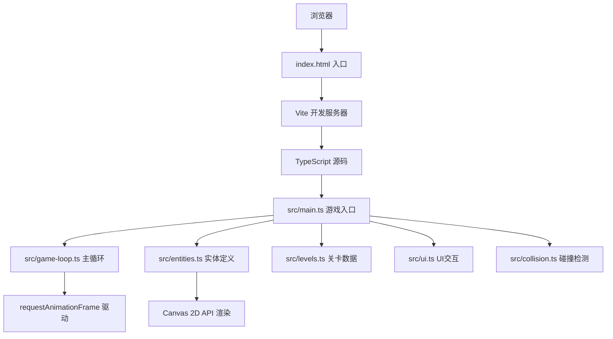

## 1. 架构设计



## 2. 技术描述

- **前端技术栈**：TypeScript 5.x + Canvas 2D API + Vite 5.x
- **构建工具**：Vite
- **包管理器**：npm
- **后端**：无（纯前端游戏）
- **数据库**：无

### 核心技术选型说明：
1. **TypeScript**：提供类型安全，便于游戏逻辑的维护和扩展
2. **Canvas 2D API**：高性能渲染，支持60fps动画，适合2D网格游戏
3. **Vite**：快速的开发服务器和构建工具，热更新提升开发效率
4. **requestAnimationFrame**：浏览器原生动画帧API，保证流畅的游戏体验

## 3. 目录结构

```
auto80/
├── .trae/documents/          # 项目文档
│   ├── PRD.md               # 产品需求文档
│   └── technical-architecture.md  # 技术架构文档
├── src/                      # 源代码目录
│   ├── main.ts              # 游戏入口，初始化画布和循环
│   ├── game-loop.ts         # 游戏主循环，update/render
│   ├── entities.ts          # 实体定义与绘制方法
│   ├── levels.ts            # 关卡配置数据
│   ├── ui.ts                # UI交互与面板控制
│   └── collision.ts         # 碰撞检测与路径逻辑
├── index.html               # 入口HTML
├── package.json             # 项目依赖
├── vite.config.js           # Vite配置
└── tsconfig.json            # TypeScript配置
```

## 4. 数据模型

### 4.1 核心类型定义

```typescript
// 网格位置
interface GridPos {
  x: number;
  y: number;
}

// 像素位置
interface PixelPos {
  x: number;
  y: number;
}

// 方块颜色类型
type BlockColor = 'red' | 'yellow' | 'green' | 'blue';

// 道具类型
type ToolType = 'conveyor' | 'sorter' | 'arm';

// 方向
type Direction = 'up' | 'down' | 'left' | 'right';

// 方块实体
interface Block {
  id: number;
  color: BlockColor;
  pos: PixelPos;       // 当前像素位置（用于动画）
  gridPos: GridPos;    // 当前网格位置
  targetGridPos: GridPos; // 目标网格位置
  progress: number;    // 移动进度 0-1
  isMoving: boolean;
}

// 传送带
interface Conveyor {
  id: number;
  gridPos: GridPos;
  direction: Direction;
}

// 分拣器
interface Sorter {
  id: number;
  gridPos: GridPos;
  colorMap: Record<BlockColor, Direction>;
}

// 机械臂
interface Arm {
  id: number;
  gridPos: GridPos;
  rotation: number;  // 旋转角度 0-360
  rotationSpeed: number;
}

// 目标区域
interface TargetZone {
  id: number;
  gridPos: GridPos;
  color: BlockColor;
  filled: number;    // 已填充数量
  required: number;  // 需要数量
}

// 障碍物
interface Obstacle {
  gridPos: GridPos;
}

// 关卡配置
interface Level {
  id: number;
  name: string;
  gridSize: { width: number; height: number };
  spawnInterval: number;  // 方块生成间隔（毫秒）
  timeLimit: number;      // 时间限制（秒）
  spawnPoint: GridPos;
  spawnDirection: Direction;
  targetZones: TargetZone[];
  obstacles: Obstacle[];
  availableTools: Record<ToolType, number>;
  preplacedConveyors?: Conveyor[];
}

// 游戏状态
interface GameState {
  currentLevel: number;
  isRunning: boolean;
  isPaused: boolean;
  isWon: boolean;
  isLost: boolean;
  timeRemaining: number;
  blocks: Block[];
  conveyors: Conveyor[];
  sorters: Sorter[];
  arms: Arm[];
  selectedTool: ToolType | null;
  steps: number;
  lastSpawnTime: number;
  blockIdCounter: number;
}
```

### 4.2 常量定义

```typescript
const GRID_SIZE = 64;           // 网格边长 64px
const BLOCK_SIZE = 32;          // 方块边长 32px
const MAX_BLOCKS = 12;          // 最大方块数量
const MAX_TOOLS = 10;           // 每种道具最大数量
const COLORS = {
  red: '#ef4444',
  yellow: '#f59e0b',
  green: '#22c55e',
  blue: '#3b82f6',
  conveyor: '#9ca3af',
  sorter: '#a855f7',
  arm: '#14b8a6',
  background: '#f3f4f6',
  gridLine: '#e0e7ff',
  obstacle: '#64748b',
  primary: '#1e40af',
  accent: '#f97316',
  error: '#ef4444',
};
```

## 5. 核心模块职责

### 5.1 game-loop.ts
- 管理 requestAnimationFrame 循环
- 调用 update() 更新游戏状态
- 调用 render() 绘制所有元素
- 控制帧率，确保 ≥55fps

### 5.2 entities.ts
- 定义所有游戏实体的数据结构
- 实现各实体的 draw() 方法（Canvas绘制）
- 处理动画：传送带过渡、机械臂旋转、方块移动

### 5.3 levels.ts
- 定义关卡1：6x6网格，简单直线传送带
- 定义关卡2：8x8网格，中央2x2障碍物
- 导出关卡配置数组

### 5.4 ui.ts
- 右侧操作面板DOM操作
- 道具按钮点击事件处理
- 步数、时间、关卡信息显示
- 胜利/失败提示动画
- 响应式布局处理

### 5.5 collision.ts
- 方块与传送带的碰撞检测
- 方块与分拣器的交互逻辑
- 方块与目标区域的检测
- 方块移动路径计算
- 障碍物碰撞检测

### 5.6 main.ts
- 初始化Canvas画布
- 加载关卡数据
- 绑定事件监听（鼠标点击、右键取消）
- 启动游戏循环
- 整合所有模块

## 6. 性能优化策略

1. **Canvas脏矩形渲染**：只重绘变化区域，而非整个画布
2. **对象池复用**：方块对象重用，避免频繁GC
3. **requestAnimationFrame**：与浏览器刷新同步，避免掉帧
4. **数量限制**：方块≤12个，道具每种≤10个，控制渲染压力
5. **高效碰撞检测**：使用网格坐标直接查找，而非遍历所有实体
