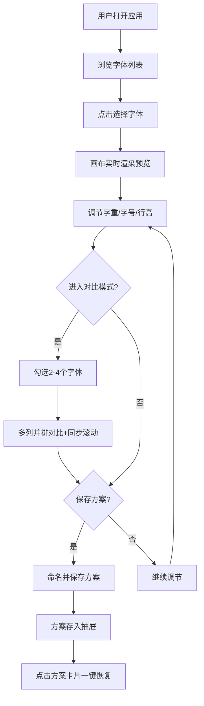

## 1. 产品概述

FontComparator 是一款面向前端开发者的字体排版效果分析与比较工具，解决手动调整CSS、切换浏览器标签页对比字体的低效问题。
- 目标用户：前端开发者、UI设计师、排版爱好者
- 核心价值：一站式字体预览、实时参数调节、多列对比、方案保存与恢复

## 2. 核心功能

### 2.1 功能模块

1. **首页**：字体选择面板 + A4比例预览画布 + 元信息卡片 + 高级对比模式 + 方案抽屉

### 2.2 页面详情

| 页面名称 | 模块名称 | 功能描述 |
|---------|---------|---------|
| 首页 | 字体选择面板 | 左侧列出20种中英文Web安全字体和Google Fonts常用字体，每项以该字体渲染名称作为预览，点击切换画布字体 |
| 首页 | 预览画布 | A4比例(595×842px)画布，默认填充英文诗歌、中文散文、数字符号三段示例文本，支持下拉切换文本类型 |
| 首页 | 元信息卡片 | 画布右上方显示字体名称、字重范围、字符集覆盖情况，字重和字号可实时调节(滑块)，调节时画布立即响应 |
| 首页 | 高级对比模式 | 勾选2-4个字体，画布变为多列并排，每列独立字号/行高滑块，支持同步滚动 |
| 首页 | 方案抽屉 | 保存当前配置为命名方案，以卡片展示在页面顶端抽屉中，点击可一键恢复 |

## 3. 核心流程

用户打开应用 → 浏览字体列表 → 点击选择字体 → 画布实时渲染预览 → 调节字重/字号/行高 → 进入对比模式选择多个字体 → 多列对比并同步滚动 → 保存满意方案 → 随时恢复方案

## 4. 用户界面设计

### 4.1 设计风格

- 主背景色：浅灰 #f9fafb
- 字体列表区域：宽280px，背景白色 #ffffff，右边界限1px #e5e7eb
- 预览画布：背景 #ffffff，圆角12px，阴影 0 4px 16px rgba(0,0,0,0.1)
- 元信息卡片：圆角8px，背景#f8fafc，阴影0 2px 8px rgba(0,0,0,0.06)
- 按钮悬停：淡紫 #eef2ff 背景
- 滑块轨道：浅灰 #d1d5db，滑块头圆形紫色 #8b5cf6 直径14px
- 对比模式分隔线：2px实线 #d1d5db

### 4.2 动画规范

- 字体切换画布淡入淡出：0.2s (opacity 1→0→1)
- 字体切换内容过渡：0.3s ease-in-out
- 方案抽屉展开收起：0.4s cubic-bezier(0.4, 0, 0.2, 1)
- 滑块拖动弹性回弹：0.2s ease-out

### 4.3 响应式适配

- 屏幕宽度 < 768px：字体列表和预览画布从左右并排变为上下堆叠
- 列表宽度自适应100%并显示在顶部
- 画布宽度自适应

### 4.4 性能指标

- 字体切换和字号/行高调节响应时间 ≤ 50ms
- 多列对比模式同步滚动延迟 ≤ 16ms
