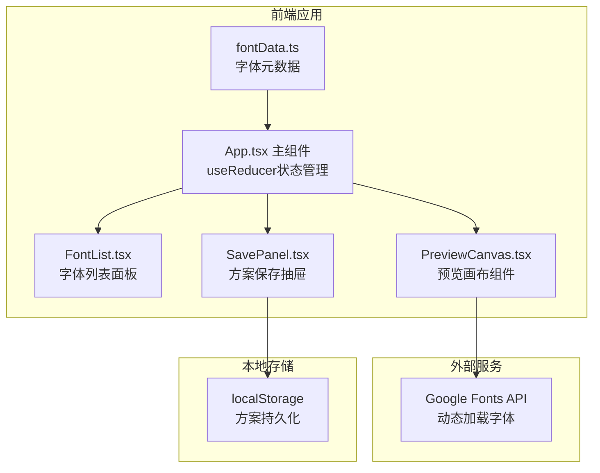

## 1. 架构设计



## 2. 技术说明

- 前端：React 18 + TypeScript + Vite
- 初始化工具：vite-init (react-ts模板)
- 状态管理：React useReducer（管理字体选择、字号、行高、列数、方案列表等全局状态）
- 字体加载：Google Fonts API 动态引入（用户选择Google Fonts时自动加载）
- 持久化：localStorage（方案保存与恢复）
- 后端：无

## 3. 路由定义

| 路由 | 用途 |
|------|------|
| / | 首页（字体选择面板+预览画布+对比模式+方案抽屉） |

## 4. 数据模型

### 4.1 字体数据模型

```typescript
interface FontItem {
  name: string;
  type: 'serif' | 'sans-serif' | 'monospace';
  googleFontName?: string;
  weights: number[];
}
```

### 4.2 方案数据模型

```typescript
interface FontScheme {
  id: string;
  name: string;
  fonts: string[];
  fontSizes: number[];
  lineHeights: number[];
  columnCount: number;
  createdAt: number;
}
```

### 4.3 应用状态模型

```typescript
interface AppState {
  selectedFont: string;
  fontWeight: number;
  fontSize: number;
  lineHeight: number;
  textType: 'english' | 'chinese' | 'symbols';
  compareMode: boolean;
  compareFonts: string[];
  compareFontSizes: number[];
  compareLineHeights: number[];
  schemes: FontScheme[];
  drawerOpen: boolean;
}
```

## 5. 文件组织

```
├── package.json
├── vite.config.ts
├── tsconfig.json
├── index.html
└── src/
    ├── fontData.ts       # 字体元数据(20种字体对象数组)
    ├── App.tsx           # 主组件(布局+useReducer状态管理)
    ├── FontList.tsx      # 字体列表面板组件
    ├── PreviewCanvas.tsx # 预览画布组件(含多列对比+同步滚动)
    ├── SavePanel.tsx     # 方案保存与抽屉组件
    ├── main.tsx          # 入口文件
    └── index.css         # 全局样式
```

## 6. 关键实现要点

### 6.1 Google Fonts 动态加载

用户选择Google Fonts字体时，动态创建`<link>`标签引入对应字体CSS，避免首屏加载所有字体。

### 6.2 多列同步滚动

使用React ref绑定各列滚动容器，监听scroll事件，在requestAnimationFrame回调中同步其他列的scrollTop值，确保延迟不超过16ms。

### 6.3 字体切换淡入淡出

使用CSS transition控制opacity变化，切换字体时先设opacity为0，0.2s后切换字体内容并设回1。

### 6.4 方案持久化

方案保存时序列化为JSON存入localStorage，页面加载时从localStorage读取并恢复。
