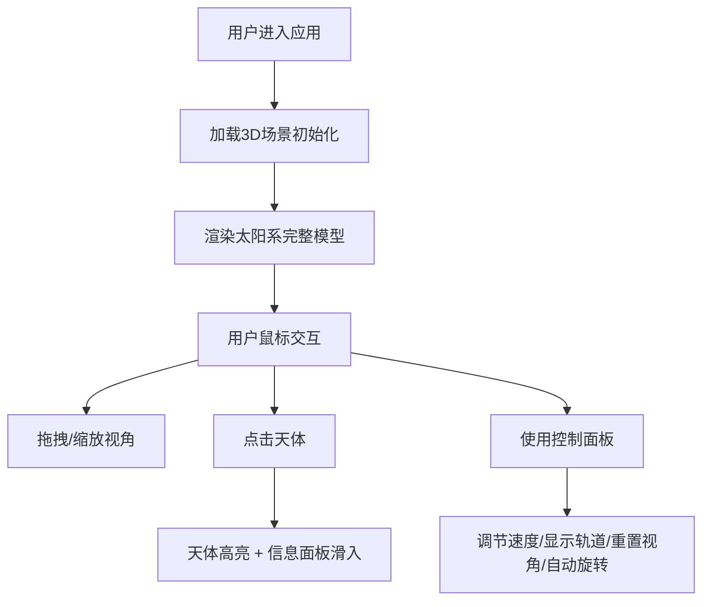

## 1. 产品概述
SolarBreeze是一款沉浸式太阳系三维交互可视化应用，让用户在浏览器中自由探索太阳、八大行星及其主要卫星的3D模型。

- 核心价值：通过交互式3D可视化，提供直观生动的天文科普体验
- 目标用户：天文爱好者、学生、教育工作者及对宇宙探索感兴趣的大众用户
- 市场定位：兼具教育性与观赏性的浏览器端轻应用

## 2. 核心功能

### 2.2 功能模块
1. **3D太阳系场景**：太阳、八大行星及其主要卫星的三维模型展示
2. **天体信息面板**：展示选中天体的详细参数信息
3. **交互动画**：行星公转、自转，视角控制
4. **控制面板**：速度调节、轨道显示切换、视角重置、自动旋转
5. **FPS计数器**：实时性能监控

### 2.3 页面详情

| 页面名称 | 模块名称 | 功能描述 |
|-----------|-------------|---------------------|
| 主场景 | 3D太阳系 | 完整太阳系模型，包含太阳、八大行星及主要卫星，带轨道线和光晕效果 |
| 主场景 | 天体交互 | 点击天体高亮显示，脉动光环动画 |
| 主场景 | 信息面板 | 左侧滑入显示天体详细参数（名称、类型、质量、直径、温度、公转周期等） |
| 主场景 | 控制面板 | 速度滑块、轨道显示开关、重置视角、自动旋转开关 |
| 主场景 | FPS计数器 | 左下角实时帧率显示 |

## 3. 核心流程

## 4. 用户界面设计

### 4.1 设计风格
- **主色调**：深空渐变背景（#0f172a → #020617），UI控件半透明白色/深灰色 + 毛玻璃效果
- **点缀色**：轨道线#ffedd5，FPS显示#34d399，天体颜色按真实特征
- **字体**：信息面板使用现代无衬线字体，数字使用等宽字体
- **控件风格**：圆角设计（8px-16px圆角），backdrop-filter模糊效果
- **动效**：所有交互带0.2s-0.3s缓动动画，避免生硬跳变
- **整体风格**：深色科幻主题，宇宙探索感

### 4.2 页面设计详情

| 页面名称 | 模块名称 | UI元素 |
|-----------|-------------|-------------|
| 主场景 | 3D场景 | 深空渐变背景 + 500颗静态星星 |
| 主场景 | 太阳 | 自发光 + 动态光晕Sprite + 点光源 |
| 主场景 | 行星 | 按比例缩放大小和轨道，半透明橙色椭圆轨道线 |
| 主场景 | 信息面板 | 左侧滑入，#ffffff/0.9背景，16px圆角，320px宽，手风琴式折叠动画0.3s |
| 主场景 | 控制面板 | 右上角悬浮，#ffffff/0.7背景，280px宽，12px圆角，阴影0 4px 24px rgba(0,0,0,0.08) |
| 主场景 | FPS计数器 | 左下角，#1e293b/0.8背景，8px圆角，#34d399等宽字体 |

### 4.3 响应式设计
- **大屏 (>1200px)**：控制面板和信息面板固定位置
- **中屏 (768-1200px)**：控制面板缩小至240px宽，信息面板改为底部抽屉
- **小屏 (<768px)**：控制面板变为顶部固定条(高度60px，宽度100%)，信息面板改为全屏遮罩

### 4.4 3D场景指南
- **环境**：深空渐变背景，500颗随机星星点缀
- **光照**：太阳作为点光源，行星受光面正确
- **相机**：初始斜上方45°，距离原点120单位，PerspectiveCamera
- **交互**：OrbitControls轨道控制器，支持拖拽旋转、滚轮缩放
- **动画**：行星公转和自转动画，选中天体脉动光环（周期1.2s，透明度0.3-0.7）
- **性能**：60FPS流畅运行，加载时间<3秒
