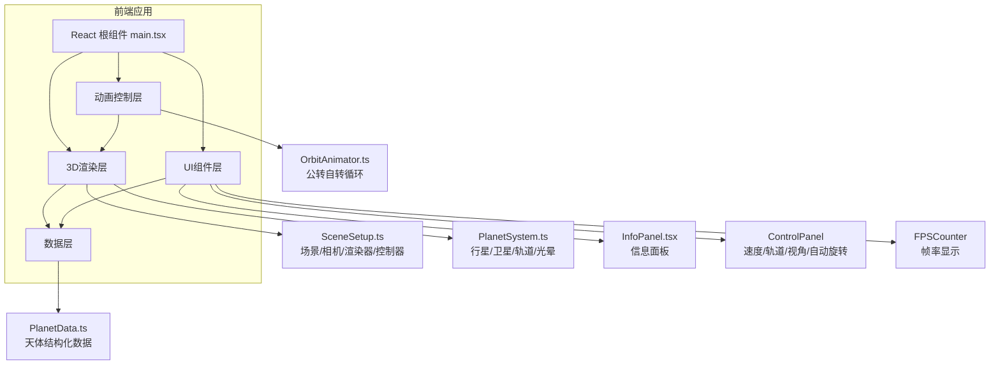

## 1. 架构设计



## 2. 技术描述

- **前端框架**：React 18 + TypeScript 5 + Vite 5
- **3D渲染**：Three.js 0.160 + @react-three/fiber 8.15 + @react-three/drei 9.92
- **UI控件**：leva（控制面板）+ 原生CSS
- **状态管理**：React useState/useRef 本地状态
- **样式方案**：CSS Modules / 内联样式 + CSS变量
- **动画方案**：requestAnimationFrame + CSS transition
- **初始化工具**：Vite

## 3. 文件结构

```
.
├── package.json
├── vite.config.js
├── tsconfig.json
├── index.html
└── src/
    ├── main.tsx
    ├── scene/
    │   ├── SceneSetup.ts
    │   ├── PlanetSystem.ts
    │   └── OrbitAnimator.ts
    ├── components/
    │   └── InfoPanel.tsx
    └── data/
        └── PlanetData.ts
```

## 4. 数据模型

### 4.1 天体数据类型定义

```typescript
interface PlanetData {
  id: string;
  name: string;
  nameEn: string;
  type: 'star' | 'planet' | 'moon';
  radius: number;
  orbitRadius: number;
  orbitPeriod: number;
  rotationSpeed: number;
  color: string;
  emissionColor?: string;
  mass: string;
  diameter: string;
  surfaceTemp: string;
  distanceFromSun: string;
  hasMoons: boolean;
  moons?: MoonData[];
}

interface MoonData {
  id: string;
  name: string;
  radius: number;
  orbitRadius: number;
  orbitPeriod: number;
  color: string;
}
```

## 5. 核心模块职责

| 模块 | 职责 | 输入 | 输出 |
|------|------|------|------|
| SceneSetup.ts | 创建Three.js场景、相机、渲染器、轨道控制器 | canvas元素 | scene, camera, renderer, controls |
| PlanetSystem.ts | 创建所有天体Mesh、轨道线、光晕、卫星 | scene对象 | 行星对象集合 |
| OrbitAnimator.ts | 管理公转和自转动画循环 | 行星集合、时间缩放因子 | 动画帧ID |
| InfoPanel.tsx | 展示选中天体详细信息 | 选中的天体数据 | React组件 |
| PlanetData.ts | 提供天体静态数据 | 无 | 结构化数据数组 |
| main.tsx | 整合所有模块，处理用户交互 | 无 | React根组件 |
