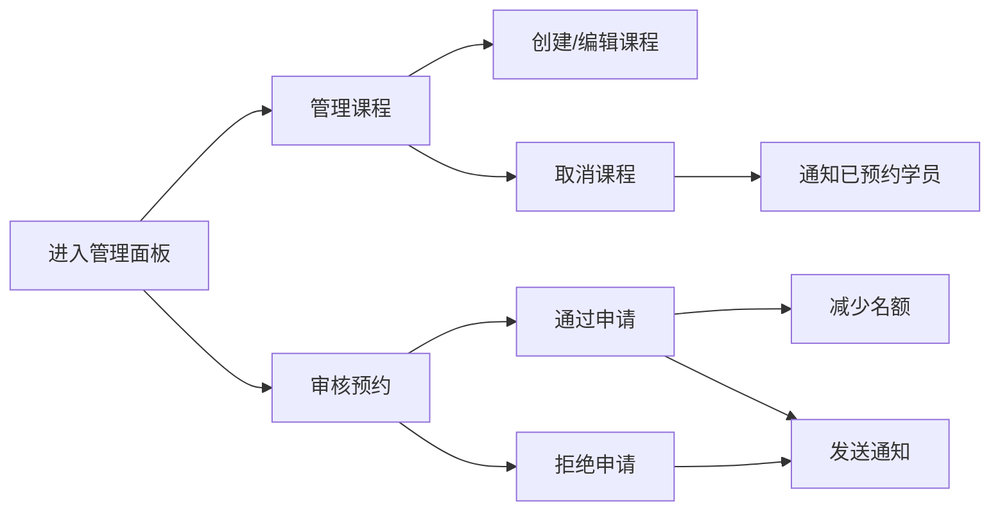

## 1. 产品概述

LeatherCraftHub 是一家手作皮具工坊的在线课程预约与管理平台，旨在为线下手工皮具课程提供数字化预约解决方案。通过该平台，学员可以便捷浏览课程安排、在线报名并支付押金，店主则能高效管理课程名额和学员名单，显著减少电话沟通和手写登记的负担。

- 目标用户：皮具课程学员与工坊店主
- 核心价值：简化课程预约流程，提升管理效率，改善用户体验

## 2. 核心功能

### 2.1 用户角色

| 角色 | 注册方式 | 核心权限 |
|------|---------|----------|
| 学员 | 无需注册，预约时填写信息 | 浏览课程日历、提交预约申请、查看个人预约记录 |
| 店主 | 路由访问/admin | 管理课程信息、设置名额上限、审核预约、发送提醒、取消课程 |

### 2.2 功能模块

1. **课程列表页**：课程日历展示、课程卡片、筛选功能
2. **预约模态框**：预约表单、提交验证、成功提示
3. **学员中心**：个人预约记录查看
4. **店主管理面板**：课程管理、预约审核、名单管理

### 2.3 页面详情

| 页面名称 | 模块名称 | 功能描述 |
|---------|---------|----------|
| 课程列表页 | 课程日历卡片 | 展示未来30天课程，包含名称、时间、讲师、名额、价格；当天课程高亮、已满课程禁用 |
| 课程列表页 | 预约模态框 | 弹出表单填写姓名、手机、邮箱、备注，提交预约申请 |
| 学员中心 | 预约记录 | 展示个人历史预约及状态 |
| 管理面板 | 课程管理 | 创建/编辑/取消课程，设置名额上限 |
| 管理面板 | 预约审核 | 查看预约名单，通过/拒绝申请，发送模拟邮件提醒 |

## 3. 核心流程

### 学员预约流程
学员浏览课程日历 → 选择可用课程 → 点击弹出预约表单 → 填写个人信息 → 提交预约 → 等待店主审核 → 查看预约状态

### 店主管理流程
店主登录管理面板 → 查看课程列表 → 编辑课程信息/设置名额 → 查看预约名单 → 审核预约 → 发送通知 → （可选）取消课程

## 4. 用户界面设计

### 4.1 设计风格
- **主色调**：#d97706（暖橙色），代表手工艺的温暖与活力
- **辅助色**：#fbbf24（金黄色），用于强调和交互元素
- **背景色**：#fef3c7（浅米黄），营造温馨舒适的氛围
- **文字色**：#78350f（深棕色），高对比度确保可读性
- **导航栏**：#78350f（深棕色）固定顶部，高60px
- **按钮样式**：圆角设计，悬停亮度提高10%，0.2s ease-out过渡
- **字体**：采用优雅的衬线与无衬线字体组合，体现手工质感
- **布局风格**：卡片式布局，统一圆角12px，柔和阴影
- **图标风格**：线性图标，与整体暖色调协调

### 4.2 页面设计概述

| 页面名称 | 模块名称 | UI 元素 |
|---------|---------|---------|
| 课程列表页 | 课程卡片 | 宽280px高320px，白底圆角12px，阴影0 2px 8px rgba(0,0,0,0.06)；当天课程顶部#d97706色条4px；已满课程50%透明度 |
| 课程列表页 | 预约模态框 | 半透明遮罩，表单宽480px居中，圆角16px，背景#fef3c7 |
| 课程列表页 | Toast提示 | 右上角淡入淡出0.3s，背景#065f46白字，圆角8px |
| 管理面板 | 预约表格 | 每行显示学员信息，操作栏"通过"/"拒绝"按钮 |
| 管理面板 | 确认对话框 | 取消课程时弹出二次确认 |
| 全局 | 骨架屏 | 灰色闪烁块，背景#e5e7eb，pulse动画1.5s无限循环 |

### 4.3 响应式设计
- 桌面优先设计，最小宽度1024px
- 768px以下：课程卡片每行2列
- 触控设备优化：按钮最小点击区域48px
- 导航栏在移动端可折叠

### 4.4 动效设计
- 页面加载：卡片渐入动画，staggered延迟效果
- 卡片悬停：微妙上浮+阴影加深
- 模态框：缩放+淡入组合动画
- Toast：滑入+淡出动画
- 按钮点击：轻微缩放反馈
