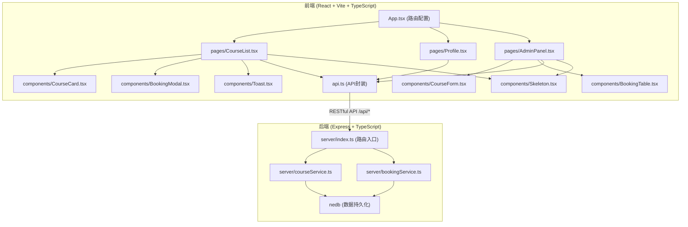
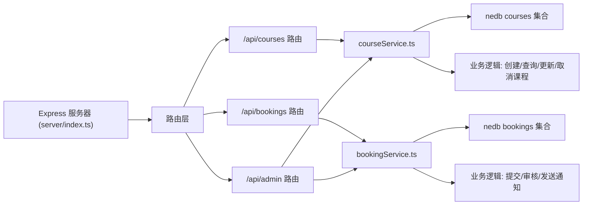
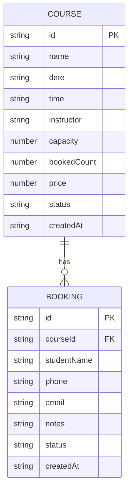

## 1. 架构设计



## 2. 技术描述

- **前端**：React@18 + TypeScript@5 + Vite@5
- **状态管理**：React Hooks (useState, useEffect) + Context
- **路由**：react-router-dom@6
- **HTTP客户端**：axios@1
- **后端**：Express@4 + TypeScript@5
- **数据库**：nedb-promises@6（嵌入式文档数据库）
- **唯一ID**：uuid@9
- **构建工具**：Vite@5，代理/api到后端3001端口
- **代码规范**：TypeScript严格模式，ES2020模块

## 3. 路由定义

| 路由 | 用途 |
|------|------|
| / | 课程列表页，展示未来30天课程日历 |
| /profile | 学员中心，查看个人预约记录 |
| /admin | 店主管理面板，课程管理与预约审核 |

### 后端 API 路由

| 方法 | 路径 | 用途 |
|------|------|------|
| GET | /api/courses | 获取所有课程列表（未来30天） |
| GET | /api/courses/:id | 获取单门课程详情 |
| POST | /api/courses | 创建新课程（店主） |
| PUT | /api/courses/:id | 更新课程信息（店主） |
| DELETE | /api/courses/:id | 取消课程（店主） |
| POST | /api/bookings | 提交预约申请 |
| GET | /api/bookings | 获取所有预约记录（店主） |
| GET | /api/bookings/course/:courseId | 获取某课程的预约名单 |
| PUT | /api/bookings/:id/approve | 通过预约申请 |
| PUT | /api/bookings/:id/reject | 拒绝预约申请 |

## 4. API 类型定义

```typescript
// 课程类型
interface Course {
  id: string;
  name: string;
  date: string; // ISO date string
  time: string; // "HH:mm"
  instructor: string;
  capacity: number; // 名额上限，默认10
  bookedCount: number; // 已通过预约数
  price: number;
  status: 'active' | 'cancelled';
  createdAt: string;
}

// 预约类型
interface Booking {
  id: string;
  courseId: string;
  studentName: string;
  phone: string;
  email: string;
  notes: string;
  status: 'pending' | 'approved' | 'rejected';
  createdAt: string;
}

// 创建课程请求
interface CreateCourseRequest {
  name: string;
  date: string;
  time: string;
  instructor: string;
  capacity?: number;
  price: number;
}

// 更新课程请求
interface UpdateCourseRequest {
  name?: string;
  date?: string;
  time?: string;
  instructor?: string;
  capacity?: number;
  price?: number;
}

// 提交预约请求
interface CreateBookingRequest {
  courseId: string;
  studentName: string;
  phone: string;
  email: string;
  notes: string;
}

// 通用响应
interface ApiResponse<T> {
  success: boolean;
  data?: T;
  message?: string;
}
```

## 5. 服务器架构图



## 6. 数据模型

### 6.1 数据模型定义



### 6.2 初始化数据

项目启动时自动插入示例课程数据（未来30天内的5-6门课程），用于演示功能。数据通过nedb持久化存储在`server/data/`目录下。

### 6.3 文件结构说明

```
LeatherCraftHub/
├── package.json              # 项目依赖与脚本
├── vite.config.ts            # Vite配置，代理/api到3001端口
├── tsconfig.json             # TypeScript严格模式配置
├── index.html                # 入口HTML
├── src/
│   ├── App.tsx               # 根组件，路由配置
│   ├── api.ts                # REST API封装函数
│   ├── main.tsx              # React入口
│   ├── types/                # 共享类型定义
│   ├── pages/
│   │   ├── CourseList.tsx    # 课程列表页
│   │   ├── Profile.tsx       # 学员中心
│   │   └── AdminPanel.tsx    # 管理面板
│   ├── components/
│   │   ├── CourseCard.tsx    # 课程卡片组件
│   │   ├── BookingModal.tsx  # 预约模态框
│   │   ├── Toast.tsx         # Toast提示
│   │   ├── Skeleton.tsx      # 骨架屏加载
│   │   ├── Navbar.tsx        # 导航栏
│   │   ├── CourseForm.tsx    # 课程表单
│   │   └── BookingTable.tsx  # 预约表格
│   └── styles/
│       └── index.css         # 全局样式与CSS变量
└── server/
    ├── index.ts              # Express服务器入口
    ├── courseService.ts      # 课程业务逻辑
    ├── bookingService.ts     # 预约业务逻辑
    ├── types.ts              # 后端类型定义
    └── data/                 # nedb数据存储目录
```

### 6.4 调用关系与数据流

1. **数据流方向**：用户操作 → 前端组件 → api.ts → Express路由 → Service层 → nedb → 返回响应 → 更新前端状态
2. **课程查询**：CourseList → useEffect → fetchCourses() → GET /api/courses → courseService.getCourses() → nedb.find()
3. **预约提交**：BookingModal → onSubmit → submitBooking() → POST /api/bookings → bookingService.createBooking() → nedb.insert()
4. **审核预约**：BookingTable → onApprove → approveBooking() → PUT /api/bookings/:id/approve → bookingService.approveBooking() → 更新booking状态 + course.bookedCount++
5. **取消课程**：AdminPanel → onDelete → DELETE /api/courses/:id → courseService.deleteCourse() → 更新course状态 + 遍历关联bookings发送通知
