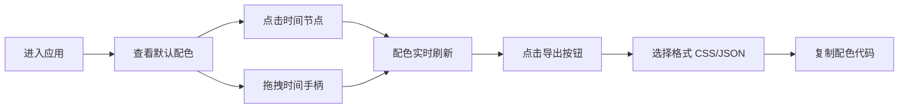

## 1. 产品概述

ColorChron 是一款面向设计师和前端开发者的时间序列色彩主题生成工具，基于日出日落等自然时间规律自动生成协调的配色方案，比手动调整更高效，比随机取色更具逻辑性。

- 核心价值：将时间维度转化为可感知的色彩语言，为 24 小时 UI 状态变化（日/夜模式切换）提供专业级配色支持
- 目标用户：UI 设计师、前端开发者、品牌设计人员

## 2. 核心功能

### 2.1 功能模块

1. **时间轴控制面板**：24 小时可视化时间轴，支持点击选择和拖拽调整
2. **配色预览面板**：5 色卡实时展示（主色、辅色、强调色、背景色、文字色）
3. **导出功能面板**：支持 CSS 变量和 JSON 格式导出

### 2.2 页面详情

| 页面名称 | 模块名称 | 功能描述 |
|-----------|-------------|---------------------|
| 主页面 | 分屏布局 | 左侧 30% 时间轴区域，右侧 70% 配色预览区域 |
| 主页面 | 时间轴模块 | 24 个整点节点，当前选中节点高亮显示并带脉冲动画，蓝色拖拽手柄实时调整 |
| 主页面 | 色板预览模块 | 5 个色板卡片按顺序排列，随时间变化平滑过渡变色 |
| 主页面 | 导出模块 | 渐变色导出按钮，点击弹出导出选项面板 |

## 3. 核心流程

用户进入应用 → 查看默认时间点（如 12:00）的配色方案 → 通过点击时间节点或拖拽手柄调整时间 → 实时预览配色变化 → 点击导出按钮 → 选择 CSS 或 JSON 格式 → 复制使用

## 4. 用户界面设计

### 4.1 设计风格

- **主色调**：#6366f1 → #4f46e5 渐变（品牌色），#f59e0b（时间节点高亮），#3b82f6（拖拽手柄）
- **字体**：现代无衬线字体，标题 24px，正文 14px
- **布局**：左右分屏，卡片式设计，大量留白
- **动效**：0.6s ease-in-out 平滑过渡，1.5s 脉冲呼吸动画
- **交互细节**：悬停反色效果，点击缩放反馈

### 4.2 页面设计概述

| 页面名称 | 模块名称 | UI Elements |
|-----------|-------------|-------------|
| 主页面 | 时间轴区域 | 垂直线条 + 24 个灰色圆点（8px），选中节点 #f59e0b + 脉冲动画，蓝色圆形拖拽手柄（20px） |
| 主页面 | 色板预览区域 | 5 个色卡（220×140px，圆角 12px，阴影 0 4px 12px rgba(0,0,0,0.08)），平滑过渡动画 |
| 主页面 | 导出按钮 | 160×48px，渐变背景，圆角 8px，悬停反色，点击缩放 0.95 |
| 主页面 | 导出弹窗 | 格式选择器 + 代码展示区 + 复制按钮 |

### 4.3 性能要求

- 时间轴拖拽帧率 ≥ 50fps
- 配色过渡动画帧率 ≥ 50fps
- 响应式布局，支持桌面端（≥1200px）

### 4.4 色彩算法

- 基于色相旋转原理，24 小时对应色相环 360° 旋转
- 亮度曲线模拟自然光照：正午最亮，深夜最暗
- 饱和度随时间智能调整：白天高饱和，夜晚低饱和
