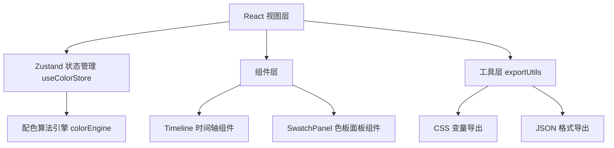

## 1. 架构设计



## 2. 技术描述

- **前端框架**：React 18 + TypeScript 5
- **构建工具**：Vite 5
- **状态管理**：Zustand 4（轻量级状态管理）
- **样式方案**：原生 CSS + CSS 变量（无需 Tailwind，保持项目轻量化）
- **项目初始化**：使用 vite-init 模板创建 react-ts 项目

## 3. 项目文件结构

| 文件路径 | 说明 |
|----------|------|
| `package.json` | 项目依赖：react, react-dom, vite, @vitejs/plugin-react, typescript, @types/react, @types/react-dom, zustand |
| `vite.config.ts` | Vite 配置，启用 React 插件 |
| `tsconfig.json` | TypeScript 配置（strict: true, jsx: react-jsx） |
| `index.html` | 入口 HTML，包含 id 为 root 的 div |
| `src/main.tsx` | React 渲染入口 |
| `src/App.tsx` | 主应用组件，左右分屏布局 |
| `src/store/useColorStore.ts` | Zustand 全局状态，管理当前时间、配色数组、导出状态 |
| `src/engine/colorEngine.ts` | 纯函数配色引擎，接收小时数返回 5 个色值 |
| `src/components/Timeline.tsx` | 24 小时时间轴组件，含拖拽交互和脉冲动画 |
| `src/components/SwatchPanel.tsx` | 5 色板预览组件，含平滑过渡动画 |
| `src/utils/exportUtils.ts` | 导出工具，支持 CSS 变量和 JSON 格式 |

## 4. 核心数据结构

### 4.1 状态定义

```typescript
interface ColorState {
  currentHour: number;           // 当前选中小时 0-23
  colors: string[];              // 5 个色值数组
  exportPanelOpen: boolean;      // 导出面板状态
  setCurrentHour: (hour: number) => void;
  generateColors: () => void;
  toggleExportPanel: () => void;
}
```

### 4.2 配色引擎接口

```typescript
/**
 * 根据小时生成配色方案
 * @param hour - 小时数 0-23（支持小数用于拖拽实时刷新）
 * @returns 5 个色值的数组 [primary, secondary, accent, background, text]
 */
function generateColorPalette(hour: number): string[];
```

## 5. 核心组件 Props 定义

### 5.1 Timeline 组件

```typescript
interface TimelineProps {
  currentHour: number;
  onHourChange: (hour: number) => void;
}
```

### 5.2 SwatchPanel 组件

```typescript
interface SwatchPanelProps {
  colors: string[];
}
```

### 5.3 导出工具函数

```typescript
function exportToCSS(colors: string[]): string;
function exportToJSON(colors: string[]): string;
```

## 6. 性能优化策略

1. **拖拽性能**：使用 `requestAnimationFrame` 处理拖拽更新，确保 60fps
2. **颜色过渡**：使用 CSS `transition: background-color 0.6s ease-in-out` 硬件加速
3. **避免重渲染**：Zustand 天然支持选择器，组件只订阅所需状态
4. **脉冲动画**：使用 CSS `@keyframes` + `transform: scale()` + `opacity` 实现，不触发重排
5. **拖拽节流**：鼠标移动事件使用 `requestAnimationFrame` 合并更新

## 7. 配色算法设计

- **色相 (Hue)**：`hour / 24 * 360`，24 小时完成色相环一周旋转
- **亮度 (Lightness)**：使用正弦曲线模拟自然光照 `50 + 25 * sin((hour - 6) / 24 * PI * 2)`
- **饱和度 (Saturation)**：白天 70-80%，夜晚 40-50%，平滑过渡
- **5 色板关系**：主色为基准色，辅色偏移 30°，强调色偏移 180°（互补色），背景和文字色根据亮度自动适配
