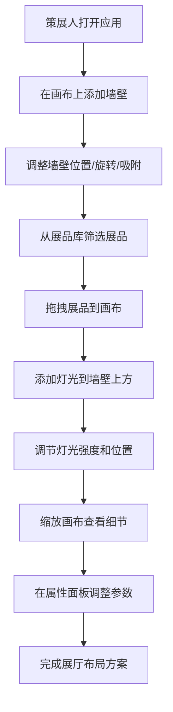

## 1. 产品概述

虚拟展厅策展平台是一款面向博物馆策展人的在线展厅布局设计工具，解决传统展厅布置依赖手工图纸和现场调整、展品与空间关系难以在策展阶段直观验证的问题。通过拖拽式交互，策展人可以在数字化画布上快速搭建展厅墙壁、布置展品、配置灯光，实现展厅方案的所见即所得设计与验证。

- 目标用户：博物馆策展人、展览设计师、美术馆工作人员
- 核心价值：降低策展沟通成本，缩短布展周期，提升展览空间利用率

## 2. 核心功能

### 2.1 用户角色

| 角色 | 注册方式 | 核心权限 |
|------|----------|----------|
| 策展人 | 无需注册（单机工具） | 创建/编辑展厅布局、管理展品库、配置灯光 |

### 2.2 功能模块

1. **展厅画布页面**：网格画布、墙壁绘制与编辑、展品放置、灯光配置、缩放与平移
2. **展品库侧边栏**：展品分类筛选、展品搜索、展品拖拽至画布
3. **属性面板**：选中元素属性查看与编辑、灯光强度调节

### 2.3 页面详情

| 页面名称 | 模块名称 | 功能描述 |
|----------|----------|----------|
| 展厅画布 | 网格背景 | 800x600画布，浅灰背景#f0f0f0，40px间距浅色网格线 |
| 展厅画布 | 墙壁管理 | 拖拽添加矩形墙壁，支持宽高调整、旋转(0/90/180/270°)、自动吸附对齐(<15px)、吸附高亮(蓝色#3b82f6) |
| 展厅画布 | 展品放置 | 从侧边栏拖拽展品到画布，自动缩放适配(1cm=2px)，显示名称标签 |
| 展厅画布 | 灯光配置 | 拖拽放置灯光图标，实时预览径向渐变光照范围，强度可调(0-100) |
| 展厅画布 | 画布操控 | 鼠标滚轮缩放(0.5x-2x)，缩放原点为鼠标位置 |
| 展品库侧边栏 | 分类筛选 | 按绘画/雕塑/装置分类筛选展品 |
| 展品库侧边栏 | 展品列表 | 展示展品缩略图、名称、尺寸、颜色标签，支持拖拽 |
| 属性面板 | 元素属性 | 显示选中墙壁/展品/灯光的属性，支持编辑 |
| 属性面板 | 灯光强度 | 滑块控制灯光强度(0-100) |

## 3. 核心流程

策展人打开应用后，在画布上通过拖拽添加墙壁构建展厅空间，从右侧展品库中筛选并拖拽展品到画布指定位置，在墙壁上方添加灯光并调节光照强度，通过鼠标滚轮缩放画布查看细节，点击元素在属性面板中调整参数，最终形成完整的虚拟展厅布局方案。

## 4. 用户界面设计

### 4.1 设计风格

- 主色：#f5f5f5（浅灰白），辅色：#e0e0e0（中灰），强调色：#3b82f6（蓝色）
- 按钮风格：圆角矩形（border-radius: 6px），扁平化设计，悬停0.2s淡入阴影
- 字体：系统字体栈，标签12px，标题16px
- 布局风格：左侧画布 + 右侧边栏，响应式折叠
- 图标风格：简约线条图标，灯光使用黄色圆形

### 4.2 页面设计概览

| 页面名称 | 模块名称 | UI元素 |
|----------|----------|--------|
| 展厅画布 | 画布区域 | 800x600矩形，#f0f0f0背景，40px网格线，墙壁灰色#888边框半透明白#ffffff66填充，吸附蓝色#3b82f6高亮 |
| 展厅画布 | 展品元素 | 缩放后矩形，黑色12px名称标签，颜色标签条 |
| 展厅画布 | 灯光元素 | 黄色圆形直径12px，径向渐变光晕(#fff9c4→透明) |
| 展品库侧边栏 | 侧边栏 | 宽250px，背景#fafafa，分类Tab，展品卡片网格 |
| 属性面板 | 属性面板 | 嵌入侧边栏下方，属性字段+灯光强度滑块 |

### 4.3 响应式设计

- 桌面端(≥768px)：画布左侧 + 右侧边栏250px
- 移动端(<768px)：右侧面板折叠到底部，画布自动调整高度
- 触摸优化：拖拽操作同时支持鼠标和触摸事件

### 4.4 性能要求

- 拖拽和缩放操作帧率不低于50fps
- 使用requestAnimationFrame优化渲染
- Canvas渲染使用CSS transform而非重绘
- 吸附计算使用空间索引优化
