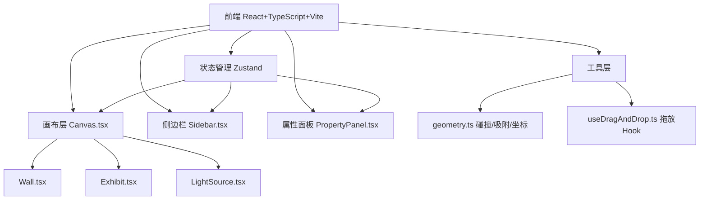
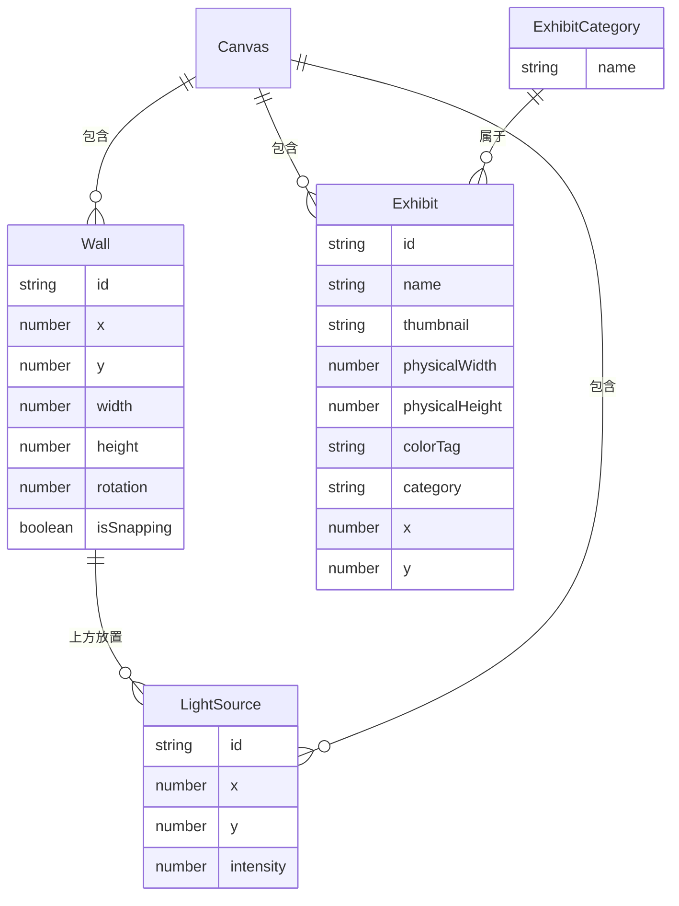

## 1. 架构设计



## 2. 技术说明

- 前端：React@18 + TypeScript + Vite
- 初始化工具：vite-init (react-ts模板)
- 状态管理：Zustand
- 样式：Tailwind CSS + 内联样式（画布元素）
- 后端：无（纯前端应用）
- 数据：模拟数据源 src/data/exhibits.ts

## 3. 路由定义

| 路由 | 用途 |
|------|------|
| / | 主页面，包含画布、侧边栏和属性面板 |

## 4. API定义

无后端API，所有数据为本地模拟数据。

## 5. 数据模型

### 5.1 数据模型定义



### 5.2 核心类型定义

- **Wall**: id, x, y, width, height, rotation(0/90/180/270), isSnapping
- **Exhibit**: id, name, thumbnail, physicalWidth, physicalHeight, colorTag, category, x, y
- **LightSource**: id, x, y, intensity(0-100)
- **CanvasState**: walls, exhibits, lights, zoom, selectedId
- **ExhibitCategory**: '绘画' | '雕塑' | '装置'

## 6. 文件组织

```
├── package.json
├── index.html
├── vite.config.js
├── tsconfig.json
├── src/
│   ├── App.tsx          # 根组件，管理布局
│   ├── types.ts          # 类型定义
│   ├── store.ts          # Zustand状态管理
│   ├── components/
│   │   ├── Canvas.tsx     # 展厅画布
│   │   ├── Wall.tsx       # 墙壁组件
│   │   ├── Exhibit.tsx    # 展品组件
│   │   ├── LightSource.tsx # 灯光组件
│   │   ├── Sidebar.tsx    # 展品库侧边栏
│   │   └── PropertyPanel.tsx # 属性面板
│   ├── utils/
│   │   └── geometry.ts    # 几何计算工具
│   ├── hooks/
│   │   └── useDragAndDrop.ts # 拖放Hook
│   └── data/
│       └── exhibits.ts    # 模拟展品数据
```

## 7. 关键技术决策

1. **画布渲染方案**：使用CSS transform实现缩放和平移，而非Canvas 2D API，以便各元素独立响应事件和保持DOM结构
2. **吸附算法**：遍历所有墙壁的边，计算当前拖拽墙壁边与目标墙壁边的距离，距离<15px时吸附并高亮
3. **展品缩放**：1cm = 2px的固定比例，展品在画布中以缩放后的尺寸渲染
4. **灯光预览**：使用CSS径向渐变(radial-gradient)模拟光照范围，强度通过opacity控制
5. **性能优化**：拖拽时使用requestAnimationFrame，缩放使用CSS transform避免重排
6. **响应式**：CSS media query检测宽度<768px时侧边栏折叠到底部
