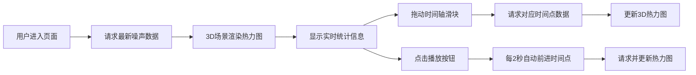

## 1. 产品概述

UrbanSoundMap是一款3D城市噪声热力图可视化应用，通过三维地图直观展示城市不同区域的实时噪声等级，并支持历史数据回放功能。

- **核心价值**：帮助城市管理者、环境监测人员和普通市民直观了解城市噪声分布情况，为城市规划、噪声治理提供数据支持
- **目标用户**：城市规划部门、环境监测机构、科研人员、普通市民

## 2. 核心功能

### 2.1 用户角色
| 角色 | 注册方式 | 核心权限 |
|------|----------|----------|
| 普通用户 | 无需注册 | 查看实时噪声热力图、回放历史数据、查看统计信息 |

### 2.2 功能模块
1. **3D噪声热力图展示**：20x20街区网格的三维可视化，热力柱高度和颜色反映噪声等级
2. **实时数据监测**：左上角显示当前时间和平均噪声值，右上角显示最高噪声街区
3. **历史数据回放**：底部时间轴滑块支持12小时历史数据回放，播放/暂停控制
4. **统计信息展示**：实时更新的噪声统计数据卡片

### 2.3 页面详情
| 页面名称 | 模块名称 | 功能描述 |
|----------|----------|----------|
| 主页面 | 3D场景模块 | Three.js渲染20x20街区网格和热力柱，支持鼠标交互旋转查看 |
| 主页面 | 实时信息卡片 | 左上角显示当前时间（HH:MM:SS）和平均噪声值（整数） |
| 主页面 | 最高噪声卡片 | 右上角显示最高噪声街区坐标和数值 |
| 主页面 | 时间轴控制 | 底部12小时时间轴滑块，支持拖动选择时间点 |
| 主页面 | 播放控制 | 播放/暂停按钮，点击后每2秒自动前进一个时间点 |

## 3. 核心流程

用户进入应用 → 自动加载最新噪声数据 → 3D场景渲染热力图 → 用户可拖动时间轴查看历史数据 → 点击播放按钮自动回放 → 热力图实时更新

## 4. 用户界面设计

### 4.1 设计风格
- **主色调**：深色背景 `#0f172a`
- **热力柱颜色**：绿色 `#22c55e`（0）→ 黄色 `#fde047`（50）→ 红色 `#ef4444`（100）
- **文字颜色**：白色 `#f1f5f9`
- **强调色**：蓝色 `#60a5fa`（平均噪声值）、红色 `#f87171`（最高噪声值）、青蓝色 `#38bdf8`（滑块）
- **UI控件**：半透明毛玻璃效果，背景 `rgba(30,41,59,0.7)`，边框 `1px solid rgba(255,255,255,0.1)`，圆角12px

### 4.2 页面设计概述
| 页面名称 | 模块名称 | UI元素 |
|----------|----------|--------|
| 主页面 | 3D场景 | 深色背景、20x20网格地面（灰色网格线 `#9ca3af`，半透明地面 `#e5e7eb`）、热力柱（宽3.6，高=值/10，半透明度0.6，呼吸动画） |
| 主页面 | 实时信息卡片 | 左上角、毛玻璃效果、时间显示、平均噪声值（蓝色粗体） |
| 主页面 | 最高噪声卡片 | 右上角、毛玻璃效果、街区坐标、最高噪声值（红色粗体） |
| 主页面 | 时间轴控制 | 底部全屏宽度、毛玻璃效果、滑块（青蓝色 `#38bdf8`）、时间刻度 |
| 主页面 | 播放按钮 | 滑块左侧、毛玻璃效果、360度旋转加载动画 |

### 4.3 响应式设计
- **桌面端**（≥768px）：3D场景占满屏幕，UI控件悬浮在场景上方
- **移动端**（<768px）：3D场景缩小至屏幕一半，UI控件改为垂直排列在右侧

### 4.4 3D场景指导
- **环境**：深色背景，营造科技感和数据可视化氛围
- **光照**：环境光 + 方向光，确保热力柱颜色清晰可见
- **相机设置**：透视相机，初始角度45度俯视，支持鼠标拖拽旋转、滚轮缩放
- **动画效果**：热力柱呼吸动画（3秒周期，亮度0.9-1.0变化）
- **性能要求**：帧率≥45fps，热力图更新响应时间<200ms
