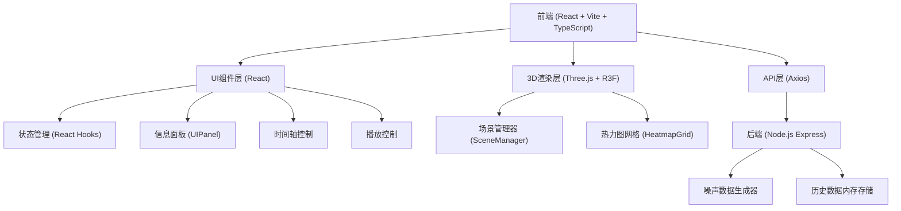
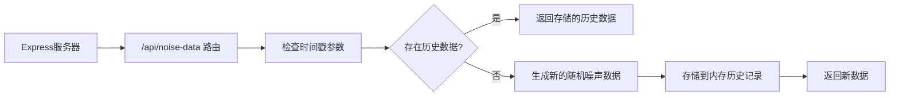

## 1. 架构设计



## 2. 技术描述

- **前端框架**：React 18 + TypeScript
- **构建工具**：Vite
- **3D渲染**：Three.js + @react-three/fiber + @react-three/drei
- **HTTP客户端**：Axios
- **后端**：Node.js Express
- **状态管理**：React Hooks (useState, useEffect, useRef)
- **样式方案**：CSS Modules + 内联样式

## 3. 项目文件结构

```
auto90/
├── package.json              # 项目依赖和脚本
├── index.html                # 入口HTML文件
├── tsconfig.json             # TypeScript配置
├── vite.config.js            # Vite配置
├── server/
│   └── index.mjs             # Express后端服务
└── src/
    ├── main.tsx              # 应用入口
    ├── App.tsx               # 主应用组件
    ├── SceneManager.ts       # Three.js场景管理
    ├── HeatmapGrid.ts        # 热力图网格模块
    ├── UIPanel.tsx           # UI控制面板组件
    └── types.ts              # 类型定义
```

## 4. API 定义

### 4.1 获取噪声数据

**GET** `/api/noise-data`

**请求参数**：
| 参数 | 类型 | 必填 | 说明 |
|------|------|------|------|
| timestamp | number | 否 | 指定时间戳（毫秒），不传则返回最新数据 |

**响应格式**：
```typescript
interface NoiseDataResponse {
  timestamp: number;
  gridSize: number;
  data: number[][];  // 20x20的噪声值数组，范围0-100
}
```

**响应示例**：
```json
{
  "timestamp": 1750000000000,
  "gridSize": 20,
  "data": [
    [45, 62, 38, ...],
    [71, 55, 49, ...],
    ...
  ]
}
```

### 4.2 数据类型定义

```typescript
// 噪声数据点
interface NoisePoint {
  x: number;
  z: number;
  value: number;
}

// 热力图单元格
interface HeatmapCell {
  position: [number, number, number];
  height: number;
  color: string;
  value: number;
}

// 应用状态
interface AppState {
  noiseData: number[][];
  currentTimestamp: number;
  isPlaying: boolean;
  averageNoise: number;
  maxNoise: { x: number; z: number; value: number };
}
```

## 5. 服务器架构



### 5.1 后端核心逻辑

- **数据生成**：每2秒自动生成一组新的20x20随机噪声数据（0-100）
- **历史存储**：内存中存储最近12小时的数据（每2秒一条，共21600条）
- **时间映射**：滑块值0-100映射到12小时时间范围，前端将滑块位置转换为时间戳

## 6. 核心模块说明

### 6.1 SceneManager.ts
- 初始化Three.js场景、相机、渲染器
- 管理光照设置（环境光 + 方向光）
- 创建20x20网格地面
- 提供`updateHeatmap(data: number[][])`方法更新热力柱
- 处理窗口大小变化响应

### 6.2 HeatmapGrid.ts
- 独立模块，根据噪声值生成几何体
- 每个网格单元4x4单位，热力柱宽3.6单位
- 高度计算：`height = value / 10`
- 颜色映射：0→绿(#22c55e)，50→黄(#fde047)，100→红(#ef4444)
- 半透明度0.6
- 呼吸动画：每3秒亮度在0.9-1.0之间变化

### 6.3 UIPanel.tsx
- 左上角：实时时间显示（HH:MM:SS）、平均噪声值（蓝色粗体#60a5fa）
- 右上角：最高噪声街区坐标（如"街区(3,7)"）、数值（红色粗体#f87171）
- 底部：时间轴滑块（12小时范围）、播放/暂停按钮
- 播放功能：每2秒自动前进一个时间点
- 播放按钮旋转动画：点击时360度旋转加载效果

### 6.4 App.tsx
- 整合所有模块
- 管理应用状态：噪声数据、当前时间、播放状态
- 定时请求最新数据（播放模式下）
- 计算平均噪声值和最高噪声点
- 响应式布局处理

## 7. 性能优化策略

1. **3D渲染优化**：
   - 使用BufferGeometry减少Draw Call
   - 热力柱使用InstancedMesh批量渲染
   - 材质复用，避免重复创建

2. **数据更新优化**：
   - 仅更新变化的热力柱位置和颜色
   - 使用requestAnimationFrame确保动画流畅
   - 防抖处理滑块拖动事件

3. **内存管理**：
   - 及时清理不再需要的Three.js对象
   - 后端历史数据限制存储数量（12小时）
