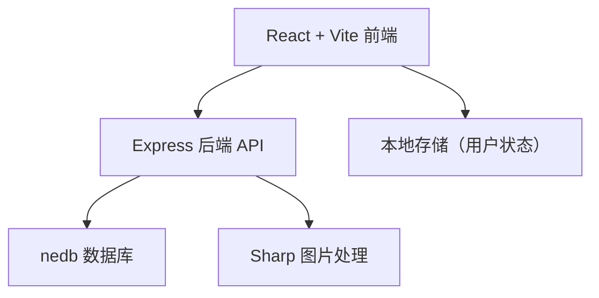
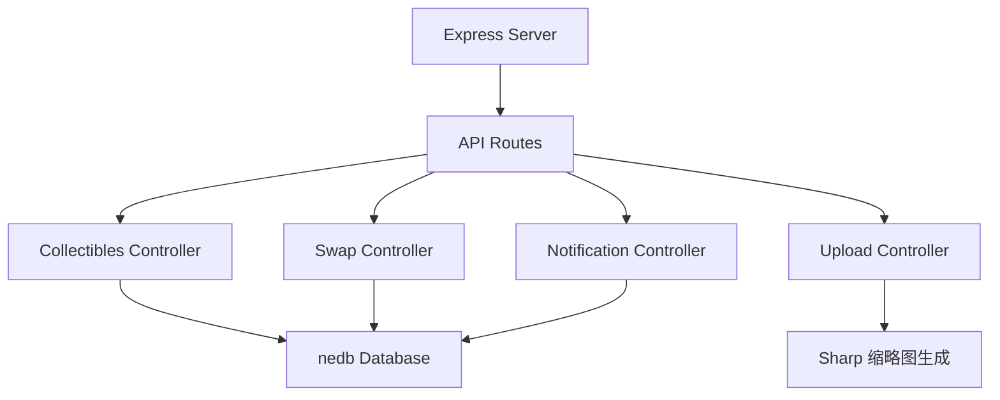
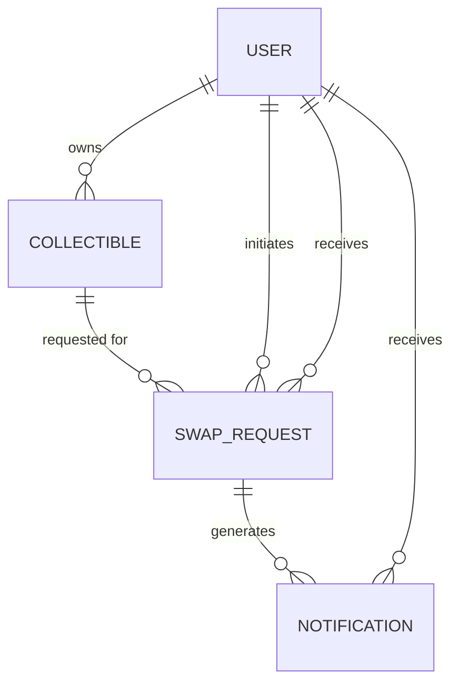

## 1. 架构设计



## 2. 技术描述

- 前端：React 18 + TypeScript + Vite 5
- 路由：react-router-dom 6
- HTTP客户端：axios
- 后端：Express 4 + TypeScript
- 数据库：nedb-promises（嵌入式文档数据库）
- 文件上传：multer
- 图片处理：sharp（生成缩略图）
- 唯一标识：uuid

## 3. 路由定义

| 路由 | 用途 |
|------|------|
| / | 藏品墙首页 |
| /collection/:id | 藏品详情页 |
| /swap | 交换广场 |
| /notifications | 通知中心 |

## 4. API 定义

### 4.1 藏品API

```typescript
interface Collectible {
  _id: string;
  name: string;
  series: string;
  purchaseDate: string;
  price: number;
  status: 'new' | 'opened' | 'swap';
  notes: string;
  image: string;
  thumbnail: string;
  owner: string;
  createdAt: string;
  updatedAt: string;
}

// GET /api/collectibles - 获取藏品列表
// Response: Collectible[]

// GET /api/collectibles/:id - 获取单个藏品
// Response: Collectible

// POST /api/collectibles - 创建藏品
// Request: FormData (name, series, purchaseDate, price, status, notes, image)
// Response: Collectible

// PUT /api/collectibles/:id - 更新藏品
// Request: Partial<Collectible>
// Response: Collectible

// DELETE /api/collectibles/:id - 删除藏品
// Response: { success: boolean }

// POST /api/upload - 上传图片并生成缩略图
// Request: FormData (image)
// Response: { image: string, thumbnail: string }
```

### 4.2 交换请求API

```typescript
interface SwapRequest {
  _id: string;
  collectibleId: string;
  collectibleName: string;
  requester: string;
  owner: string;
  status: 'pending' | 'accepted' | 'rejected';
  createdAt: string;
}

interface Notification {
  _id: string;
  userId: string;
  type: 'swap_request' | 'swap_accepted' | 'swap_rejected';
  swapRequestId: string;
  collectibleName: string;
  fromUser: string;
  read: boolean;
  createdAt: string;
}

// GET /api/swap - 获取待交换藏品列表
// Response: Collectible[]

// POST /api/swap/request - 发起交换请求
// Request: { collectibleId: string, requester: string }
// Response: SwapRequest

// GET /api/notifications/:userId - 获取用户通知
// Response: Notification[]

// PUT /api/notifications/:id/read - 标记通知已读
// Response: Notification

// POST /api/swap/:id/accept - 接受交换
// Response: { success: boolean }

// POST /api/swap/:id/reject - 拒绝交换
// Response: { success: boolean }
```

## 5. 服务器架构



## 6. 数据模型

### 6.1 实体关系



### 6.2 数据库集合

**collectibles 集合**
```javascript
{
  _id: string,           // uuid
  name: string,          // 藏品名称
  series: string,        // 系列名
  purchaseDate: string,  // 购买日期 ISO
  price: number,         // 入手价格
  status: string,        // new | opened | swap
  notes: string,         // 备注
  image: string,         // 原图路径
  thumbnail: string,     // 缩略图路径
  owner: string,         // 所有者用户名
  createdAt: string,
  updatedAt: string
}
```

**swapRequests 集合**
```javascript
{
  _id: string,
  collectibleId: string,
  collectibleName: string,
  requester: string,     // 请求者用户名
  owner: string,         // 所有者用户名
  status: string,        // pending | accepted | rejected
  createdAt: string
}
```

**notifications 集合**
```javascript
{
  _id: string,
  userId: string,        // 接收通知的用户
  type: string,          // swap_request | swap_accepted | swap_rejected
  swapRequestId: string,
  collectibleName: string,
  fromUser: string,      // 触发通知的用户
  read: boolean,
  createdAt: string
}
```

### 6.3 初始化数据

启动时自动插入演示数据：
- 3位用户：alice, bob, charlie
- 8-10件初始藏品，覆盖乐高、手办、盲盒等类型
- 2-3条待交换请求演示数据
