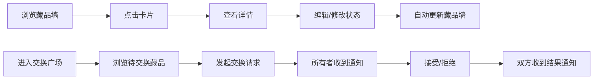

## 1. 产品概述

CollectorsNook是一款面向玩具收藏爱好者的藏品管理与交换平台，帮助用户系统化记录乐高、手办、盲盒等收藏品，同时提供社交交换功能，让重复的藏品流动起来。

- 核心价值：替代零散的Excel表格和群聊消息，提供专业的藏品管理体验
- 目标用户：玩具收藏爱好者，年龄覆盖15-45岁
- 市场定位：垂直领域的收藏管理工具，兼具社交属性

## 2. 核心功能

### 2.1 用户角色
| 角色 | 注册方式 | 核心权限 |
|------|----------|----------|
| 普通用户 | 默认登录（演示版） | 管理个人藏品、浏览交换广场、发起/响应交换请求 |

### 2.2 功能模块
1. **藏品墙首页**：网格布局展示藏品卡片，支持状态筛选和快速浏览
2. **藏品详情页**：展示完整信息，支持编辑、删除、状态修改
3. **交换广场**：展示所有待交换藏品，支持发起交换请求
4. **通知中心**：接收交换请求通知，支持接受/拒绝操作

### 2.3 页面详情
| 页面名称 | 模块名称 | 功能描述 |
|----------|----------|----------|
| 藏品墙首页 | 卡片网格 | 280x360px卡片展示藏品缩略图、名称、系列、状态标签，悬停动效，点击进入详情 |
| 藏品墙首页 | 导航栏 | 顶部导航，包含Logo、交换广场入口、通知铃铛图标（未读红点） |
| 藏品详情页 | 信息展示 | 大图展示、完整藏品信息（名称、系列、购买日期、价格、状态、备注） |
| 藏品详情页 | 操作区 | 编辑按钮、删除按钮（带确认对话框）、状态修改下拉 |
| 交换广场 | 待交换列表 | 每行显示缩略图80x80、名称、系列、所有者，请求交换按钮 |
| 通知中心 | 通知列表 | 未读/已读分类，显示交换请求详情，接受/拒绝操作按钮 |

## 3. 核心流程

用户浏览藏品墙 → 点击卡片查看详情 → 编辑/修改状态 → 状态同步更新藏品墙

用户进入交换广场 → 浏览待交换藏品 → 发起交换请求 → 所有者收到通知 → 接受/拒绝 → 双方收到结果通知

## 4. 用户界面设计

### 4.1 设计风格
- 主色调：#f97316（温暖橙色，营造收藏氛围）
- 背景色：#faf9f6（暖白）、#e5e7eb（浅灰）
- 卡片风格：白色#ffffff背景，圆角16px，阴影0 4px 12px rgba(0,0,0,0.06)
- 按钮风格：圆角8px，过渡动画0.3s ease
- 字体：采用现代无衬线字体，标题加粗，正文清晰易读
- 状态标签：全新#22c55e、拆封#f59e0b、待交换#3b82f6，圆角6px，内边距4px 10px

### 4.2 页面设计概述
| 页面名称 | 模块名称 | UI元素 |
|----------|----------|--------|
| 藏品墙首页 | 卡片网格 | 逐项淡入动画（间隔0.1s），悬停上浮6px加深阴影，响应式布局（768px以下2列，480px以下单列） |
| 藏品详情页 | 大图区域 | 400x300px大图，下方信息卡片，操作按钮组 |
| 藏品详情页 | 删除对话框 | 淡入动画，确认/取消按钮 |
| 交换广场 | 列表项 | 左对齐缩略图，右侧信息垂直排列，右侧操作按钮 |
| 通知中心 | 通知项 | 未读高亮标记，时间戳，操作按钮组 |

### 4.3 响应式
- 桌面端：藏品墙网格自适应多列，卡片宽度280px固定
- 平板端（<768px）：藏品墙2列布局
- 移动端（<480px）：藏品墙单列布局，按钮尺寸增大便于触控

### 4.4 动效设计
- 页面加载：卡片逐项淡入，animation-delay递增0.1s
- 悬停交互：卡片上浮6px，阴影加深，过渡0.3s ease
- 状态变更：卡片颜色平滑过渡
- 对话框：背景遮罩淡入，弹窗缩放出现
