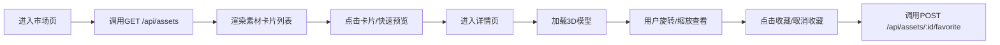
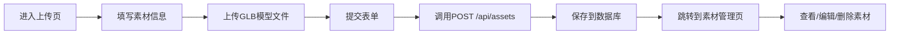

## 1. 产品概述

AssetVault是一个面向独立游戏开发者的3D素材预览与交易管理平台，解决游戏素材买卖双方沟通成本高、缺乏3D预览能力的痛点。买方可以实时浏览和旋转预览3D模型，卖方可以上传、分类和管理自己的素材库。

- **核心价值**：提供一站式3D素材交易平台，整合3D实时预览、素材管理、搜索收藏功能
- **目标用户**：独立游戏开发者（买方）、3D艺术家/素材创作者（卖方）
- **市场定位**：垂直领域的游戏素材交易市场，主打高质量3D预览体验

## 2. 核心功能

### 2.1 用户角色

| 角色 | 注册方式 | 核心权限 |
|------|---------|---------|
| 买家 | 默认角色 | 浏览素材、3D预览、收藏、搜索、查看详情 |
| 卖家 | 切换角色 | 上传素材、编辑/删除素材、管理素材库、查看已上传素材 |

### 2.2 功能模块

1. **素材市场页**：3D轮播展示区、素材卡片网格、搜索框、分类筛选、收藏功能
2. **素材详情页**：3D模型实时预览（旋转/缩放）、素材信息展示、上传者信息、标签、收藏按钮
3. **素材上传页**：表单填写（名称/类别/标签）、GLB文件上传（≤15MB）、标签自动补全
4. **素材管理页**：卖家素材列表、编辑/删除操作、状态管理

### 2.3 页面详情

| 页面名称 | 模块名称 | 功能描述 |
|---------|---------|---------|
| 素材市场页 | 3D轮播区 | 精选素材自动旋转轮播展示，每秒5度旋转 |
| 素材市场页 | 搜索栏 | 按名称和标签模糊查询，实时返回结果 |
| 素材市场页 | 素材卡片网格 | 280x360px卡片，展示缩略图、名称、标签、价格、收藏图标，hover显示快速预览按钮 |
| 素材详情页 | 3D预览场景 | Three.js渲染，OrbitControls交互，渐变背景，自动旋转 |
| 素材详情页 | 信息面板 | 展示名称、描述、价格、标签、上传者、收藏数 |
| 素材上传页 | 上传表单 | 名称输入、类别选择（模型/纹理/音效）、标签（≤5个）、GLB文件上传 |
| 素材管理页 | 素材列表 | 展示卖家所有素材，支持编辑和删除 |

## 3. 核心流程

### 3.1 买家浏览流程

### 3.2 卖家上传流程

## 4. 用户界面设计

### 4.1 设计风格

- **设计基调**：深色科技风格，游戏化视觉体验
- **主背景**：#0f172a（深靛蓝）
- **卡片背景**：#1e293b（中靛蓝）
- **文字颜色**：#e2e8f0（浅灰蓝）
- **强调色1**：#3b82f6（亮蓝，主要操作）
- **强调色2**：#f59e0b（琥珀，收藏/高亮）
- **次强调**：#9ca3af（灰色，未收藏状态）
- **圆角**：卡片和按钮使用8px圆角
- **字体**：标题使用Space Grotesk，正文使用Inter
- **动效**：所有交互元素0.2秒过渡，点击缩放动画（scale 0.95→1.0，150ms）

### 4.2 页面设计概述

| 页面名称 | 模块名称 | UI元素 |
|---------|---------|--------|
| 素材市场页 | 顶部导航 | Logo、搜索框、角色切换（买家/卖家）、上传入口 |
| 素材市场页 | 3D轮播区 | 全屏宽度，渐变背景，自动旋转的3D模型展示 |
| 素材市场页 | 卡片网格 | 响应式网格，卡片hover时右移浮现快速预览按钮 |
| 素材详情页 | 3D场景 | 占页面2/3宽度，渐变背景#1e1b4b到#312e81 |
| 素材详情页 | 信息侧边栏 | 占页面1/3宽度，展示详情和操作按钮 |
| 素材上传页 | 表单 | 分区布局，拖拽上传区域，标签自动补全 |
| 素材管理页 | 列表 | 表格布局，操作按钮列 |

### 4.3 响应式设计

- **桌面断点（≥1200px）**：卡片网格4列，详情页左右分栏
- **平板断点（≥768px）**：卡片网格2列，详情页上下分栏
- **移动端（<768px）**：卡片网格1列，详情页垂直堆叠

### 4.4 3D场景设计

- **环境**：渐变背景（#1e1b4b → #312e81），柔和环境光
- **光照**：DirectionalLight + AmbientLight组合，突出模型细节
- **相机**：PerspectiveCamera，初始距离适中，可通过OrbitControls调整
- **交互**：OrbitControls支持旋转、缩放，禁用平移
- **动画**：自动旋转（每秒5度），用户交互时暂停自动旋转
- **性能**：目标30+ FPS，模型优化，LOD策略

## 5. 交互反馈

- **Toast提示**：背景#334155，圆角8px，2秒后自动消失
- **收藏操作**：图标颜色平滑过渡，收藏数实时更新
- **搜索空状态**：显示占位图和"暂无匹配素材"文字
- **按钮点击**：scale(0.95) → scale(1.0) 150ms动画
- **加载状态**：骨架屏占位，模型加载进度指示
