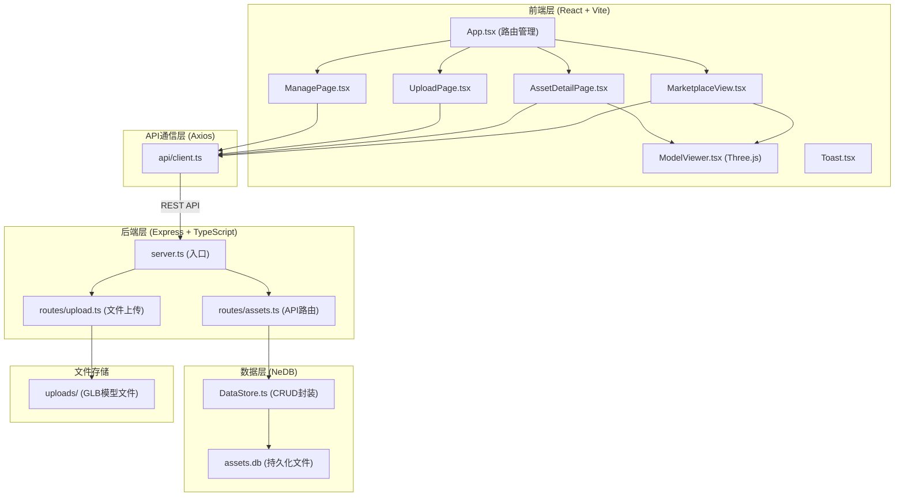
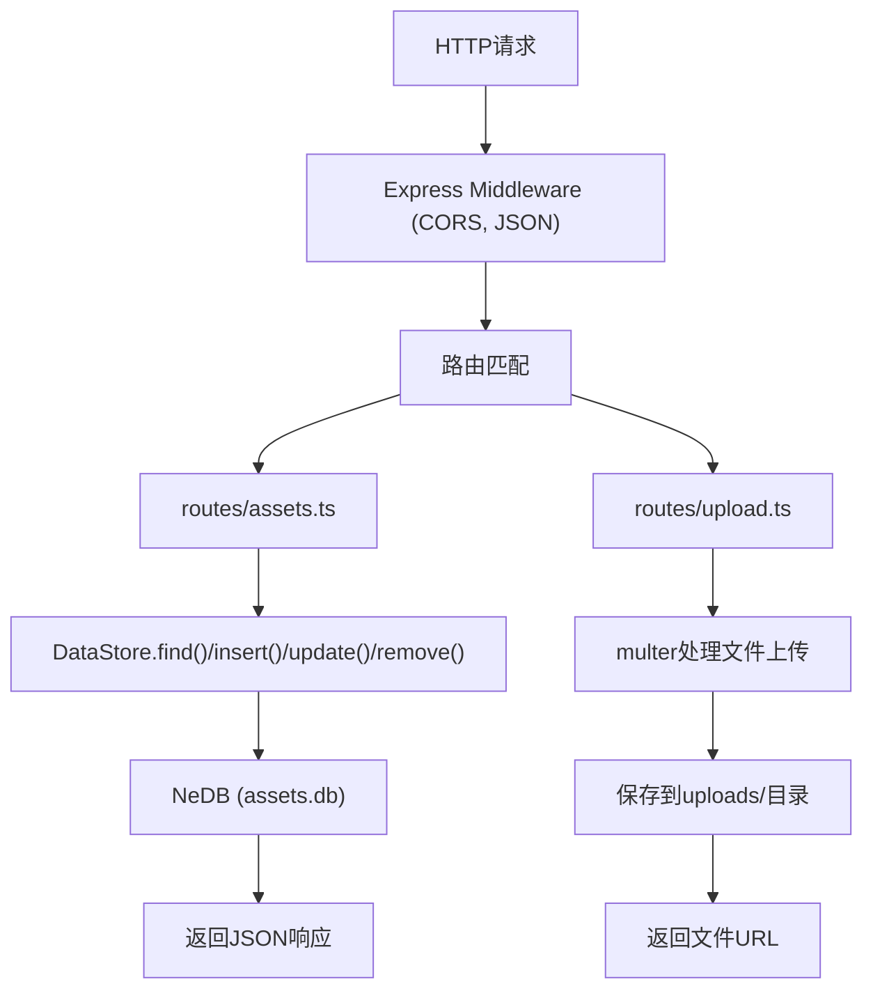
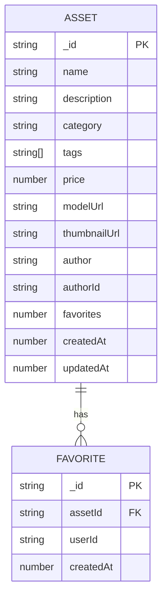

## 1. 架构设计



## 2. 技术栈描述

### 2.1 前端技术
- **框架**：React@18 + TypeScript
- **构建工具**：Vite@5
- **路由**：react-router-dom@6
- **HTTP客户端**：axios@1
- **3D渲染**：three@0.160 + @react-three/fiber@8 + @react-three/drei@9
- **状态管理**：zustand@4
- **图标**：lucide-react@0.294

### 2.2 后端技术
- **框架**：Express@4
- **语言**：TypeScript
- **数据库**：nedb-promises@6
- **文件上传**：multer@1.4
- **ID生成**：uuid@9
- **CORS**：cors@2.8

### 2.3 开发工具
- **类型定义**：@types/react、@types/react-dom、@types/three、@types/express、@types/uuid、@types/multer
- **Vite插件**：@vitejs/plugin-react@4

## 3. 目录结构

```
auto96/
├── package.json
├── vite.config.ts
├── tsconfig.json
├── index.html
├── .trae/
│   └── documents/
│       ├── PRD-AssetVault.md
│       └── Tech-Architecture-AssetVault.md
├── src/
│   ├── client/
│   │   ├── App.tsx              # 根组件，路由配置
│   │   ├── main.tsx             # 入口文件
│   │   ├── types.ts             # 类型定义
│   │   ├── api/
│   │   │   └── client.ts        # API客户端封装
│   │   ├── store/
│   │   │   └── useStore.ts      # Zustand状态管理
│   │   ├── components/
│   │   │   ├── MarketplaceView.tsx    # 市场页
│   │   │   ├── AssetDetailPage.tsx    # 详情页
│   │   │   ├── UploadPage.tsx         # 上传页
│   │   │   ├── ManagePage.tsx         # 管理页
│   │   │   ├── ModelViewer.tsx        # 3D预览组件
│   │   │   ├── AssetCard.tsx          # 素材卡片
│   │   │   ├── SearchBar.tsx          # 搜索框
│   │   │   ├── TagInput.tsx           # 标签输入
│   │   │   ├── FileUpload.tsx         # 文件上传
│   │   │   ├── Toast.tsx              # Toast提示
│   │   │   └── Navbar.tsx             # 导航栏
│   │   ├── hooks/
│   │   │   └── useToast.ts            # Toast Hook
│   │   └── styles/
│   │       └── index.css              # 全局样式
│   ├── server/
│   │   ├── server.ts            # 服务器入口
│   │   ├── routes/
│   │   │   ├── assets.ts        # 素材API路由
│   │   │   └── upload.ts        # 文件上传路由
│   │   ├── models/
│   │   │   └── DataStore.ts     # 数据持久化层
│   │   ├── types.ts             # 后端类型
│   │   └── seed.ts              # 种子数据
│   └── shared/
│       └── types.ts             # 共享类型
├── uploads/                     # 上传文件存储
└── data/                        # 数据库文件存储
```

## 4. 路由定义

| 前端路由 | 页面 | 说明 |
|---------|------|------|
| / | MarketplaceView | 素材市场首页 |
| /asset/:id | AssetDetailPage | 素材详情页 |
| /upload | UploadPage | 素材上传页 |
| /manage | ManagePage | 素材管理页 |

| API路由 | 方法 | 说明 |
|---------|------|------|
| /api/assets | GET | 获取素材列表，支持?q=搜索参数 |
| /api/assets/:id | GET | 获取单条素材详情 |
| /api/assets | POST | 创建新素材 |
| /api/assets/:id | PATCH | 更新素材信息 |
| /api/assets/:id | DELETE | 删除素材 |
| /api/assets/:id/favorite | POST | 切换收藏状态 |
| /api/upload | POST | 上传GLB文件 |

## 5. API定义

### 5.1 数据类型

```typescript
// src/shared/types.ts
export interface Asset {
  _id: string;
  name: string;
  description: string;
  category: 'model' | 'texture' | 'sound';
  tags: string[];
  price: number;
  modelUrl: string;
  thumbnailUrl: string;
  author: string;
  authorId: string;
  favorites: number;
  isFavorited?: boolean;
  createdAt: number;
  updatedAt: number;
}

export interface CreateAssetDto {
  name: string;
  description: string;
  category: 'model' | 'texture' | 'sound';
  tags: string[];
  price: number;
  modelUrl: string;
  thumbnailUrl: string;
  author: string;
}

export interface UpdateAssetDto {
  name?: string;
  description?: string;
  category?: 'model' | 'texture' | 'sound';
  tags?: string[];
  price?: number;
}
```

### 5.2 请求响应格式

```typescript
// GET /api/assets
interface AssetListResponse {
  data: Asset[];
  total: number;
}

// GET /api/assets?q=keyword
// 参数: q (string, 可选) - 搜索关键词

// POST /api/assets
// Body: CreateAssetDto
// Response: { success: true; data: Asset }

// POST /api/assets/:id/favorite
// Response: { success: true; favorites: number; isFavorited: boolean }
```

## 6. 服务器架构



## 7. 数据模型

### 7.1 ER图



### 7.2 种子数据

系统启动时自动生成500条模拟素材数据，包含：
- 随机名称和描述
- 随机分类（模型/纹理/音效）
- 随机标签（从预设标签池中选择）
- 随机价格（$5-$200）
- 示例模型URL（使用公共GLB模型）
- 预置50+常用标签用于自动补全

## 8. 性能优化

### 8.1 前端优化
- **Bundle体积**：目标gzip后≤500KB
- **代码分割**：路由级代码分割，按需加载
- **3D性能**：模型压缩、DRACO解码、实例化渲染
- **图片优化**：WebP格式，懒加载
- **缓存策略**：HTTP缓存，本地存储常用数据

### 8.2 后端优化
- **数据库**：NeDB索引优化，查询响应≤300ms
- **文件上传**：文件类型校验，大小限制15MB
- **CORS**：合理配置跨域策略

## 9. 数据流向

### 9.1 素材列表数据流向
```
页面挂载 → useEffect → api.getAssets() → axios GET /api/assets 
→ Express路由 → DataStore.find() → NeDB查询 
→ 返回JSON → 更新store → 渲染AssetCard列表
```

### 9.2 3D模型预览数据流
```
进入详情页 → 获取路由id → api.getAsset(id) → 获取modelUrl
→ ModelViewer组件 → useLoader(GLTFLoader) → 加载GLB模型
→ Three.js场景渲染 → OrbitControls交互 → 自动旋转动画
```

### 9.3 收藏操作数据流
```
点击收藏图标 → api.toggleFavorite(id) → POST /api/assets/:id/favorite
→ 后端更新favorites计数 → 返回新的favorites值和状态
→ 更新本地store → 实时更新UI显示
```
