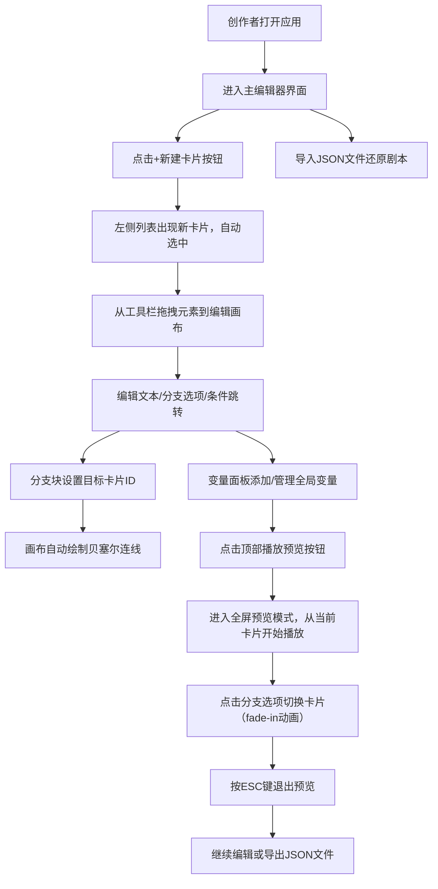

## 1. 产品概述

StorySlate是一款面向创作者的浏览器端交互叙事剧本编辑器，让用户能以类似PPT的卡片式画布快速搭建分支叙事剧本，比流程图工具或手动编写JSON更加直观高效。

- 核心用途：快速构建可视化交互叙事剧本，支持文本、分支选项、条件跳转和变量状态管理
- 目标用户：游戏编剧、互动小说作者、教育内容创作者、产品原型设计师
- 产品价值：将复杂的分支叙事逻辑可视化、卡片化，降低创作门槛，提升迭代效率

## 2. 核心功能

### 2.1 用户角色

| 角色 | 注册方式 | 核心权限 |
|------|----------|----------|
| 创作者 | 无需注册，本地使用 | 创建/编辑卡片、管理变量、预览叙事、导入导出JSON |

### 2.2 功能模块

1. **主编辑器界面**：左右分栏布局，顶部导航栏，全局变量面板
2. **卡片列表管理**：卡片创建、选择、删除、标题摘要展示
3. **卡片编辑画布**：拖拽式元素放置、文本/分支/条件块编辑、大小调节、贝塞尔连线
4. **全局变量系统**：变量定义、初始值设置、变量删除
5. **全屏预览模式**：幻灯片式播放、分支选择、卡片切换动画、ESC退出
6. **数据持久化**：JSON导入导出、本地状态管理

### 2.3 页面详情

| 页面名称 | 模块名称 | 功能描述 |
|----------|----------|----------|
| 主编辑器 | 顶部导航栏 | 应用标题、播放预览按钮、导入导出功能入口 |
| 主编辑器 | 左侧卡片列表面板 | +新建卡片按钮、卡片垂直列表、选中高亮、删除操作 |
| 主编辑器 | 右侧编辑画布 | 工具栏（文本/分支/条件块按钮）、拖拽放置区、元素缩放手柄、贝塞尔连线 |
| 主编辑器 | 左下角变量面板 | 变量表格（变量名/初始值）、删除按钮、+添加变量按钮、可折叠 |
| 全屏预览 | 预览播放器 | 逐页幻灯片播放、分支选项按钮、fade-in淡入动画、ESC退出 |

## 3. 核心流程

## 4. 用户界面设计

### 4.1 设计风格

- **主色调**：莫兰迪色系
  - 深蓝灰 `#22223b`（导航栏、卡片面板背景）
  - 暖灰紫 `#9a8c98`（主按钮背景、摘要文字）
  - 浅灰粉 `#c9ada7`（高亮边框、连接线、手柄）
  - 米白 `#f2e9e4`（编辑画布背景）
  - 深靛蓝 `#4a4e69`（工具栏按钮、分支选项按钮）

- **按钮风格**：圆角8-16px，悬停变亮，点击缩放反馈，过渡动画0.15-0.2s ease
- **字体**：sans-serif无衬线字体，标题14px，摘要/辅助文字12px
- **布局风格**：桌面端左右分栏（左侧260px固定），移动端响应式抽屉
- **视觉元素**：圆形缩放手柄（8x8px）、贝塞尔曲线连线、虚线边框添加按钮

### 4.2 页面设计概述

| 页面名称 | 模块名称 | UI元素描述 |
|----------|----------|------------|
| 主编辑器 | 顶部导航栏 | 高48px，背景#22223b，右侧播放预览按钮（100x36px，圆角8px，#9a8c98背景白字） |
| 主编辑器 | 左侧卡片面板 | 宽260px，背景#22223b，顶部+新建按钮（120x40px，圆角8px，#9a8c98），卡片选中左边框2px实线#c9ada7 |
| 主编辑器 | 编辑画布 | 背景#f2e9e4，圆角16px，左边距16px，工具栏按钮（44x36px，圆角8px，#4a4e69），最小高度400px |
| 主编辑器 | 变量面板 | 宽260px，表格（表头加粗#4a4e69，数据#22223b），删除按钮（24x24px红x，圆角4px），底部虚线按钮 |
| 全屏预览 | 播放器 | 全屏黑色背景，卡片内容居中，分支按钮（#4a4e69圆角8px，padding12px24px），卡片切换0.3s fade-in |

### 4.3 响应式设计

- **设计原则**：桌面端优先（desktop-first），移动端自适应
- **断点**：浏览器宽度 < 768px 触发响应式
- **移动端行为**：
  - 左侧卡片面板折叠为顶部可展开抽屉（最大高度320px）
  - 编辑画布占满剩余宽度
  - 变量面板调整为底部可折叠面板
  - 触控友好：增大点击区域，优化拖拽手感

### 4.4 性能指标

- 预览模式卡片切换响应时间：≤ 100ms
- 编辑区同时支持拖拽元素数量：≥ 30个无卡顿
- 动画帧率：60fps（使用CSS transform和opacity实现GPU加速）
