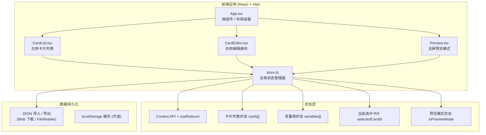
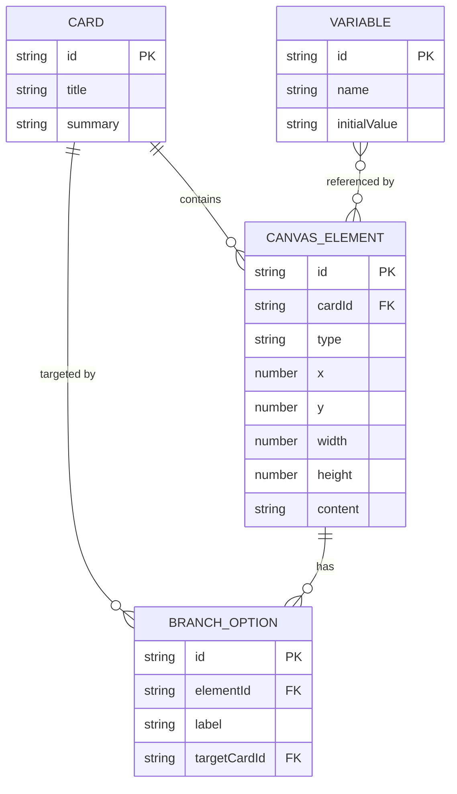

## 1. 架构设计



## 2. 技术描述

- **前端框架**: React@18 + TypeScript（严格模式）
- **构建工具**: Vite@5 + @vitejs/plugin-react
- **状态管理**: React Context API + useReducer（自定义全局store，无额外依赖）
- **样式方案**: 原生CSS（使用CSS变量管理莫兰迪色系，inline-style处理动态位置/尺寸）
- **拖拽实现**: 原生HTML5 Drag and Drop API + mousedown/move/up事件（元素内部拖拽/缩放）
- **连线绘制**: SVG `<path>` + 三次贝塞尔曲线（C命令）
- **动画方案**: CSS3 transition/animation（GPU加速：transform + opacity）
- **数据格式**: JSON（导入导出）
- **无后端**: 纯前端应用，所有状态在客户端内存维护

## 3. 模块文件结构

```
StorySlate/
├── package.json              # 依赖声明 + dev脚本
├── index.html                # Vite入口HTML
├── tsconfig.json             # TS严格模式配置
├── vite.config.js            # Vite构建配置
└── src/
    ├── App.tsx               # 根组件：左右分栏、导航栏、Provider、预览切换
    ├── CardList.tsx          # 左侧：卡片列表、新建/删除/选中
    ├── CardEditor.tsx        # 右侧：工具栏、画布、拖拽/缩放、SVG连线
    ├── store.ts              # 全局状态：types、reducer、context、actions
    └── Preview.tsx           # 全屏预览：幻灯片播放、分支按钮、淡入动画
```

## 4. 数据模型定义

### 4.1 TypeScript 类型定义

```typescript
// 画布元素类型
type ElementType = 'text' | 'branch' | 'condition';

// 单个画布元素
interface CanvasElement {
  id: string;               // 唯一ID
  type: ElementType;        // 元素类型
  x: number;                // 画布X坐标 (px)
  y: number;                // 画布Y坐标 (px)
  width: number;            // 宽度 (px)
  height: number;           // 高度 (px)
  
  // 文本块专属
  content?: string;         // 文本内容
  
  // 分支选项块专属
  branches?: BranchOption[];
  
  // 条件跳转块专属
  condition?: string;       // 条件表达式（变量名）
  targetCardId?: string;    // 条件满足时跳转目标
}

// 分支选项
interface BranchOption {
  id: string;
  label: string;            // 按钮显示文字，如"选项A"
  targetCardId: string;     // 目标卡片ID
}

// 卡片定义
interface Card {
  id: string;
  title: string;            // 卡片标题
  summary: string;          // 摘要（列表显示）
  elements: CanvasElement[];// 画布元素数组
}

// 全局变量
interface Variable {
  id: string;
  name: string;             // 变量名
  initialValue: string;     // 初始值
}

// 全局应用状态
interface AppState {
  cards: Card[];
  variables: Variable[];
  selectedCardId: string | null;
  selectedElementId: string | null;
  isPreviewMode: boolean;
  previewCurrentCardId: string | null;
}

// 剧本导出格式
interface StoryScriptJSON {
  version: '1.0';
  exportedAt: string;       // ISO时间戳
  cards: Card[];
  variables: Variable[];
  startCardId: string | null;
}
```

### 4.2 ER模型（数据关系）



## 5. 核心算法与实现要点

### 5.1 元素拖拽与缩放

- **拖拽移动**: mousedown记录初始偏移 → mousemove更新x/y（使用requestAnimationFrame节流）→ mouseup结束
- **八点缩放**: 四角+四边中点8个手柄，根据手柄位置计算deltaX/deltaY，同步更新width/height和位置
- **性能保障**: 使用CSS `transform: translate(x,y)` 而非 top/left，触发GPU合成层

### 5.2 贝塞尔曲线连线算法

```
源点 S = (Sx, Sy) = 分支块底部中心
目标点 T = (Tx, Ty) = 目标卡片（根据ID取卡片索引估算纵向位置）

控制点:
  C1 = (Sx, Sy + 80)
  C2 = (Tx, Ty - 80)

SVG Path:
  M Sx Sy C C1x C1y, C2x C2y, Tx Ty
```

- 所有连线叠加在编辑画布的独立SVG层，z-index低于可交互元素
- hover连线时改变stroke颜色（#4a4e69 → #9a8c98）

### 5.3 全局状态管理（store.ts）

- 使用 `React.createContext<{state, dispatch}>` 传递状态
- `useReducer` 管理复杂状态变更，action类型：
  - `ADD_CARD` / `DELETE_CARD` / `SELECT_CARD`
  - `ADD_ELEMENT` / `UPDATE_ELEMENT` / `DELETE_ELEMENT`
  - `ADD_VARIABLE` / `UPDATE_VARIABLE` / `DELETE_VARIABLE`
  - `TOGGLE_PREVIEW` / `SET_PREVIEW_CARD`
  - `IMPORT_STATE` / `RESET_STATE`

### 5.4 JSON导入导出

- **导出**: `JSON.stringify(state)` → `new Blob([json], {type:'application/json'})` → `URL.createObjectURL` → 动态`<a download>`触发下载
- **导入**: `<input type="file" accept=".json">` → `FileReader.readAsText` → `JSON.parse` → dispatch `IMPORT_STATE`

## 6. 性能优化策略

| 场景 | 优化方案 |
|------|----------|
| 元素拖拽卡顿 | 使用transform而非top/left，rAF节流mousemove事件，避免在回调中触发reflow |
| 30+元素同时渲染 | CanvasElement使用`React.memo`，props浅比较跳过重渲染 |
| 预览卡片切换 < 100ms | 预渲染下一张卡片到DOM（opacity:0），切换时仅改opacity，不触发layout |
| SVG连线重绘 | 仅当分支targetCardId变化时重算path，使用useMemo缓存path数组 |
| 响应式布局 | 使用CSS媒体查询 + transform控制抽屉，避免layout thrashing |
