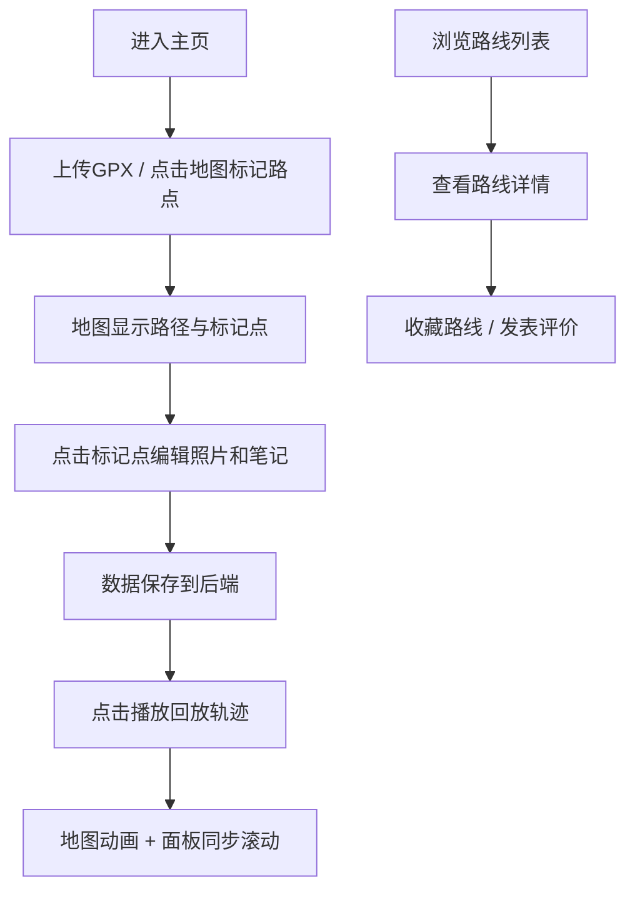

## 1. 产品概述

RouteRecall 是一款面向户外徒步爱好者的交互式旅行日志应用，让用户能够记录带海拔、照片和笔记的徒步路线，并通过地图动画回放完整行程，将零散的 GPS 数据和照片转化为生动的旅行回忆。

### 1.1 目标用户
- 户外徒步、登山、骑行爱好者
- 希望记录和分享旅行路线的旅行者
- 需要整理路线资料的户外领队

### 1.2 产品价值
- 将 GPX 轨迹、照片、文字笔记整合为统一的旅行日志
- 通过动画回放让路线重现更具沉浸感和故事性
- 社区评价功能帮助用户发现优质路线

---

## 2. 核心功能

### 2.1 功能模块
1. **主页面（路线编辑/浏览）**：左右两栏布局，左侧地图区域，右侧信息面板
2. **地图交互**：GPX 上传、手动标记路点、路径绘制、标记点弹窗
3. **路点详情**：照片拖拽上传、预览、文字笔记编辑
4. **轨迹回放**：播放/暂停控制、路径动画、笔记照片同步滚动
5. **路线收藏与评价**：路线卡片列表、用户评价卡片流

### 2.2 页面详情

| 页面名称 | 模块名称 | 功能描述 |
|-----------|-------------|---------------------|
| 主页面 | 顶部标题栏 | 深色主题（#2d3748），高度 56px，显示应用名称和操作按钮 |
| 主页面 | 地图区域（70%） | Leaflet 渲染，CartoDB Positron 瓦片，背景 #f0f4f8，支持 GPX 上传和点击标记 |
| 主页面 | 信息面板（30%） | 白色背景，展示路线详情、照片、笔记、回放控制栏 |
| 主页面 | 回放控制栏 | 圆形播放/暂停按钮（40x40px），蓝色主题，控制轨迹动画 |
| 路线详情 | 评价卡片流 | 卡片展示用户头像、评价内容，背景 #f7fafc，圆角 8px |

---

## 3. 核心流程

用户创建一条路线的完整流程：

1. 用户进入主页，看到左侧地图和右侧空白信息面板
2. 用户通过上传 GPX 文件或点击地图手动添加路点
3. 地图上显示红色圆形标记点和连接路径
4. 用户点击标记点，弹出信息卡片，上传照片并添加笔记
5. 照片生成 100x100 缩略图预览，数据保存到后端
6. 用户点击播放按钮，地图上路径按时间顺序高亮显示渐变轨迹线
7. 右侧面板同步滚动显示对应路点的笔记和照片
8. 用户可浏览其他用户的路线卡片，收藏并发表评价

---

## 4. 用户界面设计

### 4.1 设计风格
- **设计方向**：清爽自然的户外风格，大地色系
- **主色调**：
  - 深灰蓝 #2d3748（标题栏、文字）
  - 苔绿 #48bb78（成功状态、轨迹起始色）
  - 浅灰 #e2e8f0（边框、分隔线）
  - 珊瑚红 #e53e3e（标记点、轨迹终点色）
  - 蓝色 #4299e1（主要按钮）
- **字体**：系统无衬线体（system-ui）
- **圆角**：卡片 8-12px，按钮 40px（圆形）
- **阴影**：细微阴影，层级感明显
- **过渡动画**：所有交互元素 0.2s-0.3s ease 过渡

### 4.2 关键 UI 元素

| 元素 | 样式规范 |
|-------|---------|
| 标记点 | 圆形 #e53e3e，半径 8px |
| 信息卡片弹窗 | 圆角 12px，阴影 0 4px 12px rgba(0,0,0,0.1) |
| 照片缩略图 | 100x100px，圆角 8px，悬停放大 120px + #e2e8f0 边框 |
| 笔记文字 | 字号 14px，行高 1.6，system-ui |
| 播放按钮 | 圆形 40x40px，背景 #4299e1，悬停 #3182ce，白色文字 |
| 轨迹线 | 从 #48bb78 渐变到 #e53e3e，线宽 4px |
| 评价卡片 | 100% 宽，背景 #f7fafc，圆角 8px，阴影 0 1px 3px rgba(0,0,0,0.05) |
| 用户头像 | 圆形 36x36px |
| 评价文字 | 字号 14px，颜色 #4a5568 |

### 4.3 响应式设计
- **桌面端**：左右两栏布局，地图 70%，面板 30%
- **平板/手机**：单列布局，地图占满全宽，信息面板在下方
- **触摸优化**：标记点点击区域扩大，按钮尺寸适配触摸操作

### 4.4 性能要求
- 地图拖拽缩放保持 30FPS 以上
- 回放动画流畅无卡顿
- 照片缩略图生成不超过 200ms
