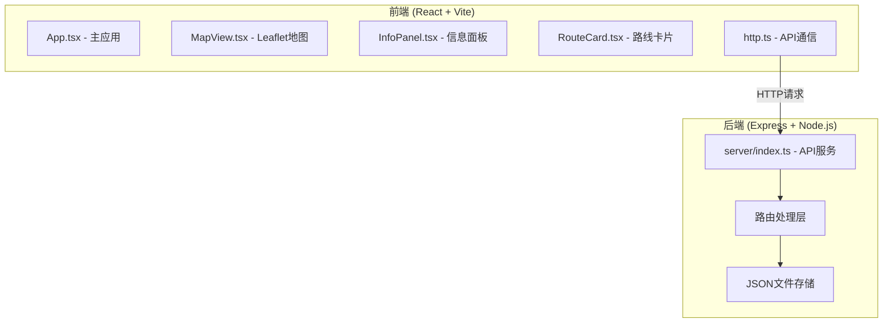
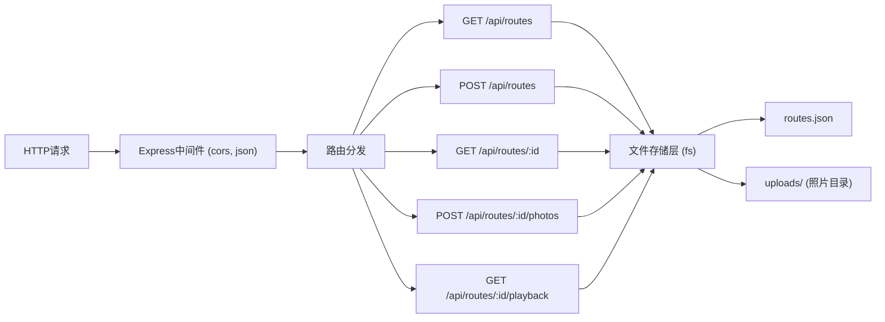
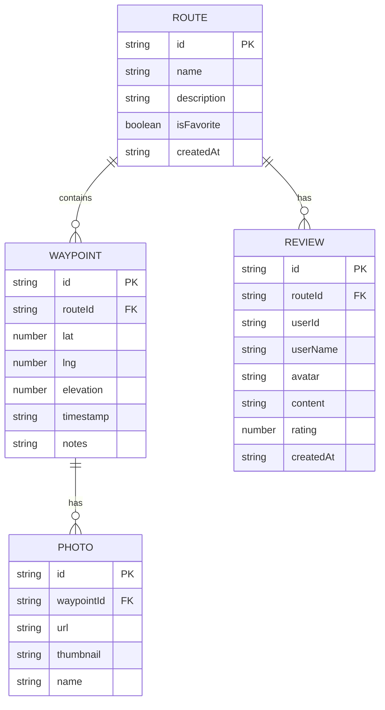

## 1. 架构设计



## 2. 技术选型说明

| 层级 | 技术栈 | 说明 |
|-------|---------|------|
| 前端框架 | React 18 + TypeScript | 组件化开发，类型安全 |
| 构建工具 | Vite 5 | 快速开发体验，HMR |
| 地图引擎 | Leaflet 1.9 | 轻量开源地图库，支持自定义瓦片 |
| 状态管理 | React Hooks (useState/useRef) | 轻量场景无需额外状态库 |
| HTTP 客户端 | Axios | 统一请求封装 |
| 后端框架 | Express 4 | 轻量 Node.js Web 框架 |
| 数据存储 | JSON 文件 (server/data/routes.json) | 轻量持久化存储 |
| 样式方案 | 原生 CSS + CSS Modules | 用户指定无需 tailwind |

## 3. 前端路由定义

本项目为单页应用，使用视图切换而非路由：

| 视图 | 说明 |
|-------|---------|
| 编辑视图 | 地图 + 信息面板，创建/编辑路线 |
| 浏览视图 | 路线卡片列表，展示所有路线 |
| 详情视图 | 路线回放 + 评价卡片流 |

## 4. API 定义

### 4.1 TypeScript 类型

```typescript
interface Waypoint {
  id: string;
  lat: number;
  lng: number;
  elevation?: number;
  timestamp: string;
  photos: Photo[];
  notes: string;
}

interface Photo {
  id: string;
  url: string;
  thumbnail: string;
  name: string;
}

interface Review {
  id: string;
  userId: string;
  userName: string;
  avatar: string;
  content: string;
  rating: number;
  createdAt: string;
}

interface Route {
  id: string;
  name: string;
  description: string;
  waypoints: Waypoint[];
  isFavorite: boolean;
  reviews: Review[];
  createdAt: string;
}
```

### 4.2 API 接口列表

| 方法 | 路径 | 说明 | 请求体 | 响应 |
|------|------|------|--------|------|
| GET | `/api/routes` | 获取所有路线 | - | `Route[]` |
| POST | `/api/routes` | 创建新路线 | `{ name, description, waypoints }` | `Route` |
| GET | `/api/routes/:id` | 获取单条路线详情 | - | `Route` |
| POST | `/api/routes/:id/photos` | 上传路点照片 | `FormData { waypointId, file }` | `Photo` |
| GET | `/api/routes/:id/playback` | 获取回放数据 | - | `{ waypoints, path }` |

## 5. 后端服务架构



## 6. 数据模型

### 6.1 ER 图



### 6.2 文件结构

```
project/
├── package.json
├── index.html
├── vite.config.ts
├── tsconfig.json
├── server/
│   ├── index.ts
│   └── data/
│       └── routes.json
└── src/
    ├── main.tsx
    ├── App.tsx
    ├── http.ts
    └── components/
        ├── MapView.tsx
        ├── InfoPanel.tsx
        └── RouteCard.tsx
```

## 7. 性能优化策略

- **地图性能**：Leaflet Canvas 渲染模式，标记点批量更新
- **回放动画**：requestAnimationFrame 控制帧速率，增量更新路径
- **图片处理**：Canvas 生成缩略图，异步处理避免阻塞 UI
- **状态优化**：useMemo/useCallback 减少不必要重渲染
- **防抖节流**：地图事件添加适当节流
