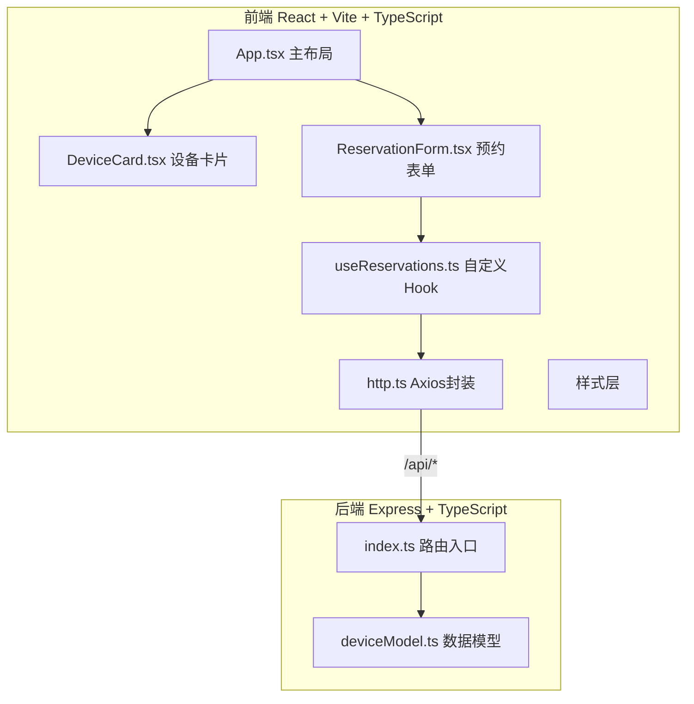
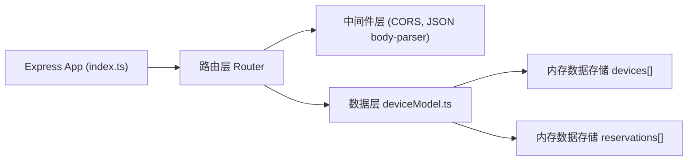
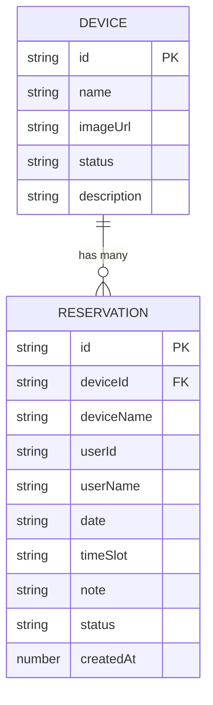

## 1. 架构设计



## 2. 技术选型说明

| 层级 | 技术栈 | 版本要求 |
|--------|--------|----------|
| 前端框架 | React 18 + ReactDOM | 最新稳定版 |
| 构建工具 | Vite + @vitejs/plugin-react | 最新稳定版 |
| 类型系统 | TypeScript | strict 模式 + esModuleInterop: true |
| HTTP 客户端 | Axios | 封装统一拦截与错误处理 |
| 后端框架 | Express 4 | RESTful API |
| 跨域处理 | CORS | 允许 Vite 代理 + 后端 CORS 中间件 |
| ID 生成 | uuid | 预约记录唯一标识 |
| 数据存储 | 内存数据（运行时） | deviceModel 中数组模拟 |

## 3. 路由定义

| 路由路径 | 用途 |
|-----------|------|
| `/` | 主应用入口（Vite 入口，读取 URL 参数 `?admin=true` 进入管理员模式） |
| `/api/devices` | 获取全部设备列表 |
| `/api/devices/:id` | 更新单个设备信息（PUT） |
| `/api/reservations` | 提交预约申请（POST，含冲突检测） |
| `/api/reservations/user/:userId` | 获取指定用户的预约列表 |
| `/api/reservations/:id` | 删除/取消预约（DELETE） |
| `/api/reservations/:id/approve` | 审批通过预约（PUT，管理员） |
| `/api/reservations/:id/reject` | 审批拒绝预约（PUT，管理员） |
| `/api/reservations/pending` | 获取待审批预约列表（管理员） |

## 4. API 数据结构定义

### 4.1 设备类型 Device

```typescript
interface Device {
  id: string;
  name: string;
  imageUrl: string;
  status: 'available' | 'borrowed' | 'maintenance';
  description: string;
}
```

### 4.2 预约类型 Reservation

```typescript
interface Reservation {
  id: string;
  deviceId: string;
  deviceName: string;
  userId: string;
  userName: string;
  date: string;        // YYYY-MM-DD
  timeSlot: string;    // e.g. "09:00-09:30"
  note?: string;
  status: 'pending' | 'approved' | 'rejected';
  createdAt: number;
}
```

### 4.3 预约创建请求 ReservationCreateDto

```typescript
interface ReservationCreateDto {
  deviceId: string;
  userId: string;
  userName: string;
  date: string;
  timeSlot: string;
  note?: string;
}
```

### 4.4 响应通用结构

```typescript
interface ApiResponse<T> {
  success: boolean;
  data?: T;
  message?: string;
}
```

## 5. 服务端架构图



## 6. 数据模型

### 6.1 数据关系图 (ER)



### 6.2 初始化数据

```typescript
// deviceModel.ts 中预置设备数据（示例）：
// 1. 光学显微镜（available）
// 2. 离心机（available）
// 3. PCR 仪（borrowed）
// 4. 恒温水浴锅（maintenance）
// 5. 电子分析天平（available）
// 6. 紫外分光光度计（available）
```

### 6.3 Vite 配置说明

```typescript
// vite.config.ts
// proxy: { '/api': { target: 'http://localhost:3001', changeOrigin: true } }
// 开发模式下前端端口 5173，后端端口 3001
```

## 7. 前端项目文件结构

```
auto105/
├── package.json
├── index.html
├── vite.config.ts
├── tsconfig.json
├── src/
│   ├── http.ts                # Axios 封装
│   ├── App.tsx                # 主布局组件
│   ├── components/
│   │   ├── DeviceCard.tsx        # 设备卡片
│   │   └── ReservationForm.tsx   # 预约表单
│   ├── hooks/
│   │   └── useReservations.ts   # 预约操作 Hook
│   └── styles.css             # 全局样式
└── server/
    ├── index.ts                 # Express 服务器
    └── deviceModel.ts         # 数据模型 & Mock 数据
```
