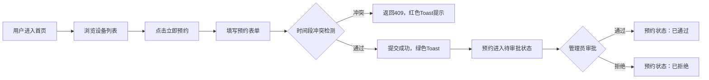

## 1. 产品概述

InvenTree 是面向科研实验室的小型设备借用预约与库存管理系统，解决实验室设备调度混乱、借用流程不规范、设备状态难以追踪的问题。

- 核心用户：实验室管理员（设备维护、审批）、实验室成员（设备查看、预约借用）
- 产品价值：规范设备借用流程，提升设备利用率，实现设备全生命周期状态管理

## 2. 核心功能

### 2.1 用户角色

| 角色 | 登录方式 | 核心权限 |
|------|----------|----------|
| 普通用户 | 直接访问（模拟 userId） | 浏览设备、提交预约申请、查看/取消本人预约 |
| 管理员 | URL 参数 `?admin=true` | 维护设备档案（增删改、上下架）、审批/拒绝预约请求、查看全部预约 |

### 2.2 功能模块

1. **设备管理模块**：设备列表展示、设备档案编辑、设备状态切换（可选/已借出/维修中）
2. **预约管理模块**：预约表单提交、时间段冲突检测、预约状态流转（待审批→已通过/已拒绝）
3. **我的预约模块**：个人预约历史查看、取消预约操作
4. **审批管理模块（管理员）**：待审批预约列表、通过/拒绝操作

### 2.3 页面详情

| 页面名称 | 模块名称 | 功能描述 |
|----------|----------|----------|
| 主页面 | 顶部导航栏 | 显示应用名称、管理员入口链接 |
| 主页面 | 左侧设备列表区 | 两列网格展示设备卡片，支持骨架屏加载、滚动固定阴影 |
| 主页面 | 右侧预约面板 | 预约表单（日期+时间段+备注）、我的预约列表、管理员审批列表 |
| 主页面 | 设备卡片 | 设备图片、名称、状态标签、预约按钮、管理员管理按钮 |
| 主页面 | 浮动抽屉按钮（移动端） | 视口<900px时显示，点击展开右侧面板 |

## 3. 核心流程

### 3.1 用户预约流程

用户进入首页 → 浏览可用设备 → 点击「立即预约」→ 右侧表单滑动展开 → 选择日期（未来14天内）→ 选择时间段（30分钟粒度）→ 填写备注 → 提交 → 冲突检测通过 → Toast 成功提示 → 预约进入「待审批」状态 → 出现在「我的预约」列表

### 3.2 管理员审批流程

管理员通过 `?admin=true` 进入 → 设备卡片显示「管理」按钮 → 可编辑设备信息/状态 → 右侧面板显示「待审批列表」→ 点击「通过」或「拒绝」→ 预约状态更新 → 用户在「我的预约」中查看结果

## 4. 用户界面设计

### 4.1 设计风格

- **主色调**：`#3182ce`（科技蓝，用于按钮、导航、主要交互元素）
- **辅助色**：`#38a169`（绿色，成功状态、通过操作）、`#e53e3e`（红色，错误/拒绝/取消）、`#d69e2e`（黄色，待审批）、`#dd6b20`（橙色，维修中）、`#805ad5`（紫色，管理操作）
- **文字色**：`#2d3748`（主要文字）、`#a0aec0`（辅助/占位文字）
- **背景色**：`#f7fafc`（页面背景）、`#ffffff`（卡片/面板背景）、`#e2e8f0`（分割线/边框）
- **按钮风格**：圆角 8px，高度 44px，hover/active 过渡 `0.2s ease`，禁用态背景 `#a0aec0`
- **字体**：Inter 字体，主要标题 18px，正文 14px-16px
- **布局风格**：左右分栏布局，卡片式设计，顶部导航栏固定高度 56px
- **图标风格**：简洁线性风格，使用 emoji 增强识别度

### 4.2 页面设计概览

| 页面名称 | 模块名称 | UI 元素 |
|----------|----------|----------|
| 主页面 | 顶部导航栏 | 高 56px，背景 `#2c5282`，白色文字，右侧「管理员入口」链接 |
| 主页面 | 左侧设备区 | 背景 `#f7fafc`，内边距 24px，两列网格（间距 24px，每列 min 280px），滚动时顶部 100px 阴影 |
| 主页面 | 右侧面板 | 固定宽 400px，背景白色，内边距 16px，分隔区域 8px `#e2e8f0` |
| 主页面 | 设备卡片 | 最大宽 360px，图片高 160px cover，圆角 12px，状态标签圆角 8px 内边距 4px 10px |
| 主页面 | 预约表单 | slide-in 动画（右→左，0.3s ease-out），日期/时间段/备注，提交按钮绿色系 |
| 主页面 | 我的预约 | 标题字号 16px，底部 2px `#e2e8f0` 分隔，状态标签圆角 8px 内边距 3px 8px |
| 主页面 | Toast | 顶部居中，圆角 8px，成功背景 `#c6f6d5`/文字 `#22543d`，错误背景 `#fed7d7`/文字 `#9b2c2c`，3 秒消失 |
| 主页面 | 骨架屏 | 灰色 `#e2e8f0` 背景，圆角 12px，闪烁动画 |
| 主页面 | 移动端抽屉按钮 | 直径 56px 圆形，蓝色背景，白色 + 图标，阴影 `0 4px 12px rgba(0,0,0,0.3)` |

### 4.3 响应式设计

- **桌面端（≥900px）**：左右分栏布局，左侧设备列表 + 右侧 400px 固定面板
- **移动端（<900px）**：右侧面板折叠为底部抽屉，浮动圆形按钮触发展开/收起，设备列表单列展示
- **触控优化**：按钮最小触摸区域 44×44px，间距适配手指点击

### 4.4 性能要求

- API 响应时间：设备列表和预约列表请求 ≤ 200ms
- 骨架屏 → 真实内容切换：60fps 无明显卡顿
- 后端数据量：≤ 50 条设备 / ≤ 100 条预约记录
