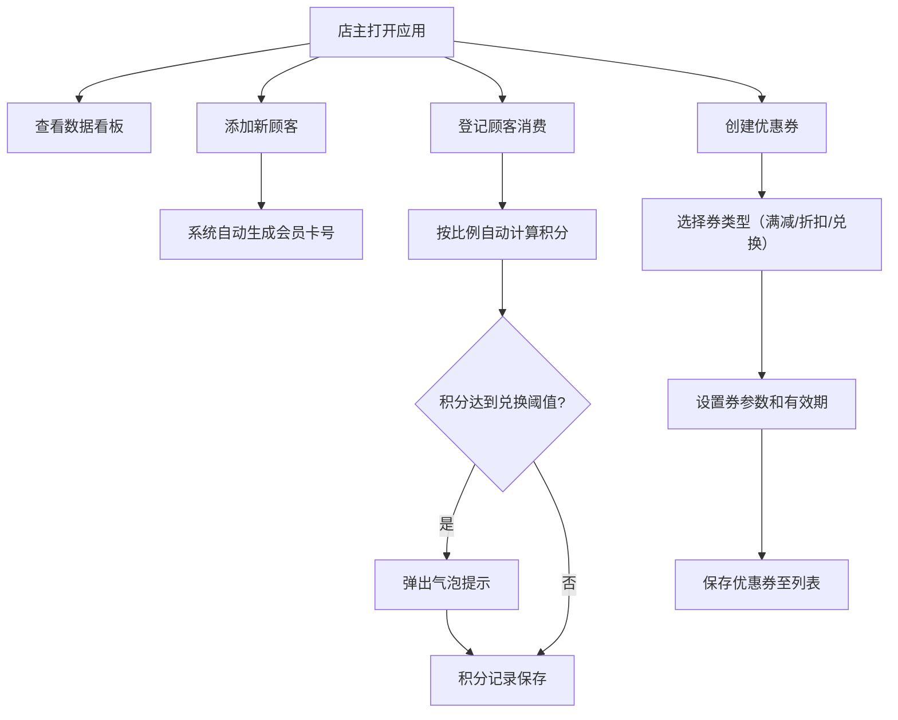

## 1. 产品概述

咖啡馆/茶饮店会员积分与优惠券管理系统，专为小型咖啡馆和茶饮店主设计。解决纸质积分卡易丢失、Excel记录难以分析、手动计算优惠繁琐的问题，帮助店主高效管理顾客、分析消费行为、精准发放优惠券。

- 目标用户：小型咖啡馆、茶饮店店主及店员
- 核心价值：数字化会员管理、自动化积分兑换、数据驱动的营销决策

## 2. 核心功能

### 2.1 用户角色

| 角色 | 登录方式 | 核心权限 |
|------|----------|----------|
| 店主/店员 | 本地应用直接访问 | 管理顾客、发放积分、创建与核销优惠券、查看数据看板 |

### 2.2 功能模块

1. **概查看板**：积分排行榜柱状图、优惠券发放/兑换统计、周/月数据筛选
2. **顾客管理**：批量/逐个添加顾客、会员卡号自动生成、顾客卡片列表、消费记录
3. **积分系统**：消费自动积分（每满10元积1分）、积分阈值提醒、积分日志记录
4. **优惠券管理**：满减券/折扣券/兑换券创建、优惠券网格展示、编辑/删除操作

### 2.3 页面详情

| 页面名称 | 模块名称 | 功能描述 |
|----------|----------|----------|
| 主页 | 侧边导航栏 | 四个功能入口：概览看板、顾客管理、积分记录、优惠券中心 |
| 主页 | 概查看板区域 | 会员积分排行榜（Top10横向柱状图）、发放优惠券数量、已兑换优惠券数量、周/月切换按钮 |
| 主页 | 顾客列表区域 | 顾客信息卡片（姓名、手机号、等级标签、最近消费时间）、添加顾客按钮、批量导入 |
| 主页 | 优惠券网格区域 | 优惠券卡片（类型、金额/折扣、有效期、状态指示点）、新增/编辑/删除优惠券 |
| 顾客详情模态框 | 积分日志列表 | 展示该顾客所有积分变动记录（时间、变动原因、积分变化量） |

## 3. 核心流程

## 4. 用户界面设计

### 4.1 设计风格

- **主色调**：温暖木质色 — 主色 `#d4a373`，辅色 `#8c7853`
- **背景色**：米色 `#faf3e0`，卡片白色 `#ffffff`
- **文字色**：深褐色 `#3e2723`
- **会员等级色**：青铜 `#e67e22`、白银 `#3498db`、黄金 `#f1c40f`、钻石 `#bdc3c7`
- **按钮风格**：圆角设计，悬停时背景色平滑过渡（0.2s ease）
- **字体**：Google Fonts - Noto Serif SC（中文衬线体，营造温暖质感）
- **布局风格**：左右分栏（桌面端）、卡片式设计、网格布局
- **动效设计**：卡片悬停上移2px并加深阴影（0.3s ease）、页面切换淡入（0.3s）、气泡通知滑入滑出（0.4s ease）

### 4.2 页面设计概览

| 页面名称 | 模块名称 | UI元素 |
|----------|----------|--------|
| 主页 | 侧边导航栏 | 宽200px，深褐背景`#3e2723`，米色文字`#f5e6d0`，右上圆角8px，每项高48px，选中项左侧3px主色装饰条 |
| 主页 | 顾客卡片 | 宽280px，圆角12px，白背景，阴影`0 2px 12px rgba(0,0,0,0.04)`，姓名20px加粗，手机号14px灰色 |
| 主页 | 优惠券卡片 | 宽200px高120px，圆角10px，浅灰背景`#f8f9fa`，边框`1px solid #e9ecef`，有效期左侧绿色/灰色圆点 |
| 主页 | 排行榜柱状图 | 柱高40px，宽度按积分比例动态变化，颜色从`#e74c3c`渐变到`#2ecc71`，过渡0.6s ease-out |
| 主页 | 统计数字卡片 | 数字60px大号字体，说明文字16px |

### 4.3 响应式设计

- 桌面端（>768px）：左右分栏布局，侧边栏固定200px宽度，主内容区自适应
- 移动端（≤768px）：侧边栏折叠为汉堡菜单，点击展开全屏覆盖，内容区单列垂直布局
- 触摸优化：增大点击热区（最小44x44px），卡片间距适配手指操作

### 4.4 性能要求

- 排行榜数据加载时间 ≤ 500ms
- 优惠券列表初始渲染 ≤ 200ms
- 所有动画保持60fps流畅度
