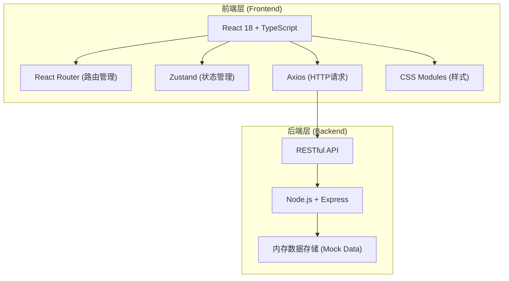
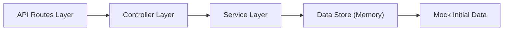
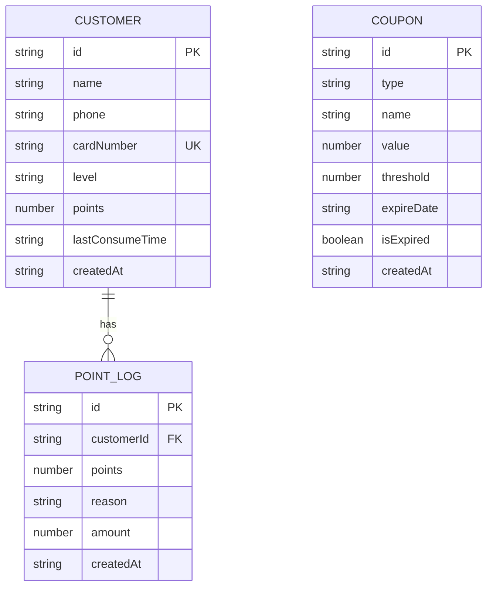

## 1. 架构设计



## 2. 技术栈说明

- **前端框架**：React@18 + TypeScript
- **构建工具**：Vite@5
- **路由管理**：React Router DOM@6
- **状态管理**：Zustand（轻量级状态管理）
- **HTTP客户端**：Axios
- **样式方案**：原生 CSS + CSS Variables（设计令牌）
- **后端框架**：Express@4
- **运行环境**：Node.js@18+
- **数据存储**：内存存储（含初始Mock数据）

## 3. 路由定义

| 路由路径 | 页面/组件 | 功能说明 |
|----------|-----------|----------|
| `/` | Dashboard + 顾客列表 + 优惠券网格 | 主页（包含所有模块） |
| `/dashboard` | Dashboard | 数据看板（积分排行、统计数字） |
| `/customers` | CustomerList | 顾客管理列表 |
| `/coupons` | CouponGrid | 优惠券管理中心 |

## 4. API 接口定义

```typescript
// 顾客类型
interface Customer {
  id: string;
  name: string;
  phone: string;
  cardNumber: string;
  level: 'bronze' | 'silver' | 'gold' | 'diamond';
  points: number;
  lastConsumeTime: string | null;
  createdAt: string;
}

// 积分记录类型
interface PointLog {
  id: string;
  customerId: string;
  points: number;
  reason: string;
  amount: number;
  createdAt: string;
}

// 优惠券类型
interface Coupon {
  id: string;
  type: 'discount' | 'fullReduction' | 'exchange';
  name: string;
  value: number;           // 折扣百分比 / 减免金额 / 兑换所需积分
  threshold?: number;      // 满减门槛金额
  expireDate: string;
  isExpired: boolean;
  createdAt: string;
}

// 统计数据类型
interface Stats {
  issuedCoupons: number;
  redeemedCoupons: number;
  topCustomers: Customer[];
}
```

### 4.1 顾客相关接口

| Method | Path | Description | Request Body | Response |
|--------|------|-------------|--------------|----------|
| GET | `/api/customers` | 获取所有顾客列表 | - | `Customer[]` |
| POST | `/api/customers` | 添加单个顾客 | `{ name, phone }` | `Customer` |
| POST | `/api/customers/batch` | 批量添加顾客 | `{ customers: {name, phone}[] }` | `Customer[]` |
| GET | `/api/customers/:id` | 获取顾客详情 | - | `Customer` |
| POST | `/api/customers/:id/consume` | 登记消费并积分 | `{ amount: number }` | `{ customer: Customer, log: PointLog, reachedThreshold: boolean }` |

### 4.2 积分记录接口

| Method | Path | Description | Request Body | Response |
|--------|------|-------------|--------------|----------|
| GET | `/api/point-logs/:customerId` | 获取顾客积分日志 | - | `PointLog[]` |

### 4.3 优惠券相关接口

| Method | Path | Description | Request Body | Response |
|--------|------|-------------|--------------|----------|
| GET | `/api/coupons` | 获取所有优惠券 | - | `Coupon[]` |
| POST | `/api/coupons` | 创建优惠券 | `Partial<Coupon>` | `Coupon` |
| PUT | `/api/coupons/:id` | 更新优惠券 | `Partial<Coupon>` | `Coupon` |
| DELETE | `/api/coupons/:id` | 删除优惠券 | - | `{ success: boolean }` |

### 4.4 统计接口

| Method | Path | Description | Request Body | Response |
|--------|------|-------------|--------------|----------|
| GET | `/api/stats` | 获取看板统计数据 | `?period=week\|month` | `Stats` |

## 5. 后端服务架构



- **Routes**：定义RESTful路由，参数解析
- **Controller**：处理HTTP请求/响应，输入验证
- **Service**：业务逻辑（积分计算、等级判定、优惠券过期检查）
- **Data Store**：内存数据存储，含初始化Mock数据

## 6. 数据模型

### 6.1 ER 图



### 6.2 数据初始化（Mock Data）

- 预置15名顾客数据（覆盖四个等级）
- 预置30条积分变动记录
- 预置8张优惠券（含不同类型和有效期状态）

## 7. 文件结构

```
├── package.json
├── index.html
├── vite.config.ts
├── tsconfig.json
├── src/
│   ├── App.tsx              # 根组件，路由+全局状态
│   ├── http.ts              # Axios封装
│   ├── store.ts             # Zustand状态管理
│   ├── types/
│   │   └── index.ts         # 类型定义
│   ├── styles/
│   │   └── global.css       # 全局样式+CSS变量
│   └── components/
│       ├── Sidebar.tsx      # 侧边导航栏
│       ├── Dashboard.tsx    # 数据看板
│       ├── CustomerCard.tsx # 顾客卡片
│       ├── CustomerModal.tsx# 顾客详情模态框
│       ├── CustomerList.tsx # 顾客列表
│       ├── CouponGrid.tsx   # 优惠券网格
│       ├── CouponCard.tsx   # 优惠券卡片
│       ├── CouponModal.tsx  # 优惠券编辑模态框
│       └── Toast.tsx        # 气泡通知组件
└── server/
    └── server.js            # Express后端服务
```
