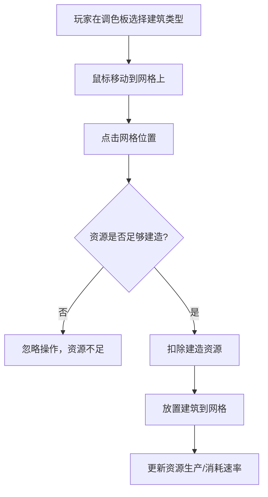
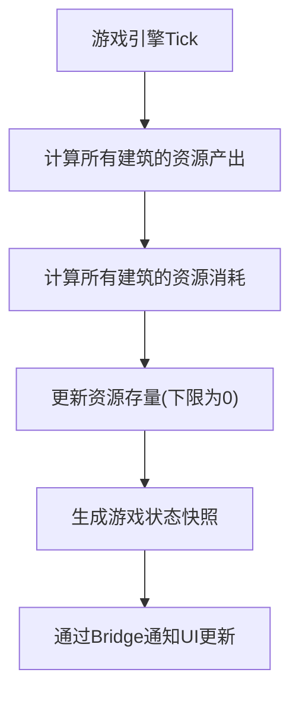

## 1. 产品概述

ColonyLoop 是一款以资源管理为核心的太空殖民地模拟游戏原型，面向独立游戏开发者进行核心玩法验证。玩家通过放置、升级和拆除各类建筑来管理能量、矿石、食物三种资源，在网格地图上建立和发展自己的太空殖民地。

- **目标用户**：独立游戏开发者、策略模拟游戏爱好者
- **核心价值**：快速验证资源生产消耗循环、建筑放置与升级系统的游戏乐趣
- **市场定位**：游戏原型 / 技术演示

## 2. 核心功能

### 2.1 用户角色

| 角色 | 注册方式 | 核心权限 |
|------|---------|---------|
| 玩家 | 直接进入 | 放置建筑、升级建筑、拆除建筑、暂停/继续游戏 |

### 2.2 功能模块

1. **资源系统**：能量、矿石、食物三种资源，实时计算生产/消耗速率，资源存量防止负值
2. **建筑系统**：太阳能板、采矿机、温室三种建筑，支持放置、升级、拆除操作
3. **网格地图**：20x20 格子殖民地网格，建筑占用 1 格空间
4. **游戏循环**：每秒 1 tick 更新资源，支持暂停/继续控制

### 2.3 页面详情

| 页面名称 | 模块名称 | 功能描述 |
|---------|---------|---------|
| 主游戏界面 | 顶部状态栏 | 显示当前Tick数、暂停/继续按钮 |
| 主游戏界面 | 左侧建筑调色板 | 展示可放置的建筑类型，支持选中切换 |
| 主游戏界面 | 中央殖民地图 | 20x20网格画布，渲染建筑，支持点击放置/选中 |
| 主游戏界面 | 右侧资源面板 | 2x2展示资源存量和生产消耗速率 |
| 主游戏界面 | 建筑操作菜单 | 点击已放置建筑时弹出，提供升级和拆除选项 |
| 主游戏界面 | 建筑悬停提示 | 鼠标悬停建筑时显示建筑详情 |

## 3. 核心流程

### 3.1 建筑放置流程

### 3.2 游戏循环流程

## 4. 用户界面设计

### 4.1 设计风格

- **设计主题**：深空科幻风格
- **主色调**：深蓝黑色背景 `#0b0e1a`
- **辅助色**：
  - 网格背景 `#1a1f2e`
  - 网格线 `#2a3040`
  - 卡片背景 `#1e2434` / `#141a28`
  - 边框 `#3a4050`
- **强调色**：
  - 选中高亮 `#64ffda`
  - 能量 `#ffd54f`
  - 矿石 `#b0bec5`
  - 食物 `#81c784`
- **字体**：现代无衬线字体，清晰易读
- **图标风格**：使用 emoji 表示建筑和资源类型
- **动效风格**：平滑过渡，0.2s-0.5s 缓动

### 4.2 页面设计概述

| 页面名称 | 模块名称 | UI元素 |
|---------|---------|-------|
| 主游戏界面 | 顶部状态栏 | 高50px，深色背景，居中Tick数，右侧暂停按钮，圆角6px |
| 主游戏界面 | 建筑调色板 | 左侧垂直排列，60x60px卡片，8px圆角，选中时#64ffda边框+光晕 |
| 主游戏界面 | 殖民地图 | 中央Canvas画布，20x20网格，每格30px，建筑淡入动画0.5s |
| 主游戏界面 | 资源面板 | 右侧2x2网格，140x80px卡片，10px圆角，资源颜色数值，速率右下角 |
| 主游戏界面 | 建筑操作菜单 | 弹出式菜单，升级/拆除选项，半透明黑底 |
| 主游戏界面 | 悬停提示 | rgba(0,0,0,0.8)背景，6px圆角，白色12px字体 |

### 4.3 响应式设计

- **桌面端（>800px）**：左调色板 + 中画布 + 右资源面板的三栏布局，20x20 网格
- **移动端（<800px）**：上调色板（横向排列） + 中画布 + 下资源面板，15x15 网格
- 触控优化：增大点击区域，支持触摸放置建筑

### 4.4 动效与交互

- 资源数值变化：0.3s ease-out 数字滚动过渡
- 建筑放置：从透明淡入，0.5s ease 动画
- 选中建筑：边框光晕脉动效果
- 按钮悬停：背景变亮，0.2s 过渡
- 暂停/继续：状态切换平滑过渡
