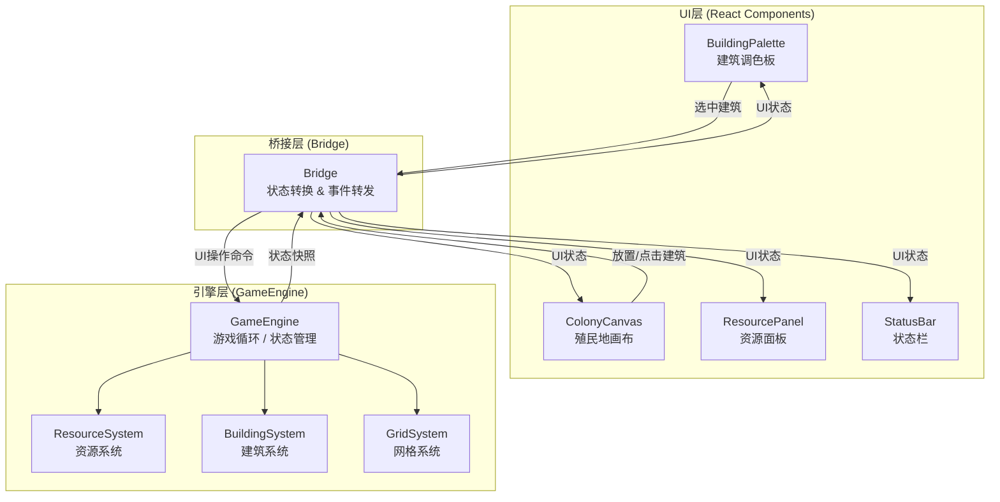

## 1. 架构设计



## 2. 技术描述

- **前端框架**：React 18 + TypeScript
- **构建工具**：Vite 5 + @vitejs/plugin-react
- **状态管理**：
  - 游戏引擎内部状态：纯 TypeScript 类管理
  - UI 状态：通过 Bridge 订阅引擎事件，React useState/useEffect 驱动
- **渲染方案**：
  - 网格和建筑：Canvas2D 渲染（保证 100+ 建筑时的性能）
  - UI 面板：React DOM 组件
- **动画方案**：CSS 过渡 + Canvas 逐帧动画
- **响应式**：CSS Media Queries + 窗口大小监听

## 3. 文件结构

```
src/
├── GameEngine.ts          # 游戏引擎核心（游戏循环、资源、建筑、网格）
├── Bridge.ts              # 引擎与UI的桥梁（状态转换、事件转发）
├── main.tsx               # 应用入口
├── components/
│   ├── ColonyCanvas.tsx   # 殖民地画布组件（Canvas2D）
│   ├── ResourcePanel.tsx  # 资源面板组件
│   ├── BuildingPalette.tsx# 建筑调色板组件
│   └── StatusBar.tsx      # 顶部状态栏组件
├── types/
│   └── index.ts           # 类型定义
└── styles/
    └── global.css         # 全局样式
```

## 4. 模块调用关系与数据流向

### 4.1 文件调用关系

```
main.tsx
  ├── GameEngine.ts        (实例化)
  ├── Bridge.ts            (实例化，注入引擎)
  ├── StatusBar.tsx        (使用Bridge状态)
  ├── BuildingPalette.tsx  (使用Bridge状态，发送命令)
  ├── ColonyCanvas.tsx     (使用Bridge状态，发送命令)
  └── ResourcePanel.tsx    (使用Bridge状态)
```

### 4.2 数据流向

**引擎 → UI 数据流：**
1. GameEngine 每 tick 更新内部状态
2. GameEngine 触发 stateChange 事件，携带状态快照
3. Bridge 监听事件，将引擎状态转换为 UI 友好格式
4. Bridge 触发自己的 update 事件
5. React 组件监听 Bridge 事件，更新本地 state
6. React 重新渲染 UI

**UI → 引擎数据流：**
1. 用户与 UI 交互（点击放置、升级等）
2. UI 组件调用 Bridge 的命令方法（placeBuilding, upgradeBuilding 等）
3. Bridge 转发命令给 GameEngine
4. GameEngine 执行业务逻辑，更新内部状态
5. GameEngine 触发 stateChange 事件（回到引擎→UI 流程）

## 5. 核心数据模型

### 5.1 资源类型

```typescript
type ResourceType = 'energy' | 'ore' | 'food';

interface Resource {
  type: ResourceType;
  amount: number;
  production: number;  // 每秒产出
  consumption: number; // 每秒消耗
  label: string;
  color: string;
  icon: string;
}
```

### 5.2 建筑类型

```typescript
type BuildingType = 'solarPanel' | 'miner' | 'greenhouse';

interface BuildingConfig {
  type: BuildingType;
  name: string;
  icon: string;
  color: string;
  baseCost: Record<ResourceType, number>;
  baseProduction: Partial<Record<ResourceType, number>>;
  baseConsumption: Partial<Record<ResourceType, number>>;
  upgradeCostMultiplier: number;
  efficiencyMultiplier: number;
}

interface Building {
  id: string;
  type: BuildingType;
  x: number;
  y: number;
  level: number;
  createdAt: number;
}
```

### 5.3 游戏状态快照

```typescript
interface GameSnapshot {
  tick: number;
  isPaused: boolean;
  resources: Record<ResourceType, Resource>;
  buildings: Building[];
  gridSize: number;
  selectedBuildingType: BuildingType | null;
  selectedBuildingId: string | null;
}
```

## 6. 性能优化策略

1. **Canvas2D 渲染**：网格和建筑使用 Canvas 绘制，避免大量 DOM 节点
2. **状态快照**：引擎只在 tick 时生成快照，UI 按需订阅
3. **按需渲染**：Canvas 使用 requestAnimationFrame，仅在状态变化时重绘
4. **对象池**：建筑数据对象复用，减少 GC
5. **节流与防抖**：高频事件（如鼠标移动）做节流处理
