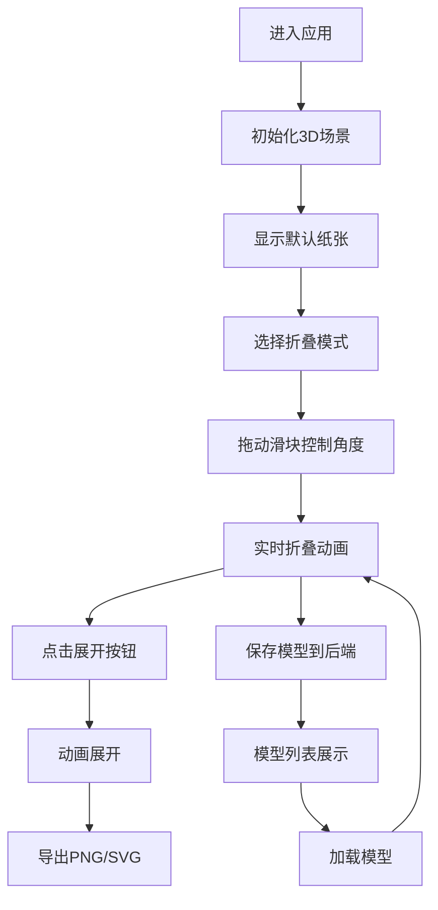

## 1. 产品概述

UnfoldOrigami是一款基于Web的3D折纸设计可视化应用，让用户能够在浏览器中通过直观的交互方式实时折叠、展开和旋转虚拟纸张。

- 主要用途：折纸艺术创作、教学演示、折纸模型分享
- 目标用户：折纸爱好者、设计师、教育工作者
- 产品价值：降低折纸学习门槛，提供数字化折纸创作和分享平台

## 2. 核心功能

### 2.1 用户角色

| 角色 | 注册方式 | 核心权限 |
|------|----------|----------|
| 普通用户 | 无需注册 | 浏览、创建、导出折纸模型，保存和加载分享的模型 |

### 2.2 功能模块

1. **3D场景渲染模块**：Three.js实时渲染纸张网格，Cannon.es物理模拟
2. **折叠引擎模块**：核心折纸算法，折痕检测，顶点变换，层叠逻辑
3. **UI控制面板模块**：折叠角度控制、模式选择、颜色设置、导出功能
4. **导出模块**：PNG步骤图导出、SVG折痕图案导出
5. **后端存储模块**：模型保存、模型列表获取、模型详情加载

### 2.3 页面详情

| 页面名称 | 模块名称 | 功能描述 |
|---------|----------|----------|
| 主页面 | 3D场景区域 | 显示可交互的3D纸张模型，支持拖拽旋转、滚轮缩放、点击选择 |
| 主页面 | 控制面板 | 折叠角度滑条、展开/重置按钮、颜色选择、模式选择、导出按钮 |
| 主页面 | 模型分享区 | 显示已分享的折纸模型列表，支持点击加载 |

## 3. 核心流程

用户进入应用后，默认显示一张平铺的方形纸张。用户可以选择预设折叠模式，或手动设置折痕进行折叠。通过滑块精确控制折叠角度，点击展开按钮可动画展开。完成创作后可导出步骤图或折痕图，也可保存到后端分享。

## 4. 用户界面设计

### 4.1 设计风格

- 主色调：深蓝#2c3e50、亮蓝#3498db
- 强调色：红色#e74c3c（山折）、蓝色#3498db（谷折）、黄色#f1c40f（高亮）
- 按钮风格：圆角8px，渐变背景#3498db到#2980b9，悬停变亮
- 字体：现代无衬线字体，标题1.5rem，正文0.9rem
- 布局：左右分栏，左侧70%场景区域，右侧340px控制面板
- 交互：所有控件0.2秒渐入，按钮0.15秒背景过渡

### 4.2 页面设计概述

| 页面名称 | 模块名称 | UI元素 |
|---------|----------|---------|
| 主页面 | 3D场景区域 | 渐变背景、网格地面、3D纸张、OrbitControls |
| 主页面 | 控制面板 | 标题、颜色下拉、模式图标按钮、角度滑条、按钮组、步数统计、状态提示 |
| 主页面 | 模型分享 | 模型列表卡片、加载按钮 |

### 4.3 响应式设计

- 桌面端（>1200px）：左右分栏布局，控制面板宽340px
- 平板端（768px-1200px）：保持左右布局，自适应宽度
- 移动端（<768px）：控制面板折叠为底部60px横向条，点击展开完整面板

### 4.4 3D场景设计

- 环境：渐变灰背景（顶部#2c3e50到底部#1a252f）
- 光照：方向光+环境光，支持阴影投射
- 相机：PerspectiveCamera，初始距离5，角度45度
- 地面：半透明网格辅助线，白色#ffffff，不透明度0.1
- 纸张：位于原点，有轻微厚度，支持分层渲染
- 交互：OrbitControls旋转缩放，Raycaster点击选择顶点
- 动画：easeInOutCubic缓动，折叠0.5秒，展开2秒
- 后处理：抗锯齿，阴影软化

## 5. 非功能性需求

- 性能：渲染帧率≥50FPS，滑条响应延迟<50ms，API响应<200ms
- 兼容：支持Chrome、Firefox、Safari最新版本
- 数据：模型数据存储在nedb文件，无需外部数据库
