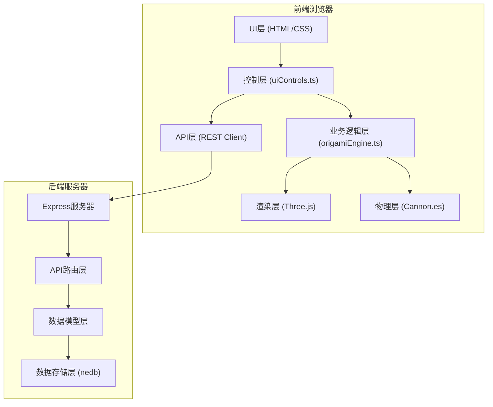
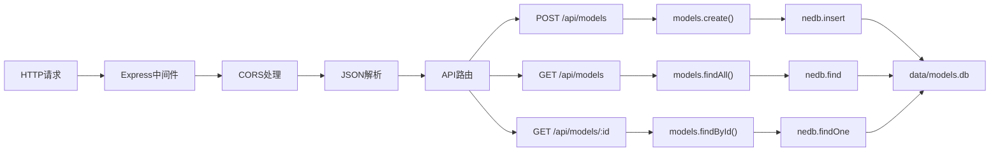
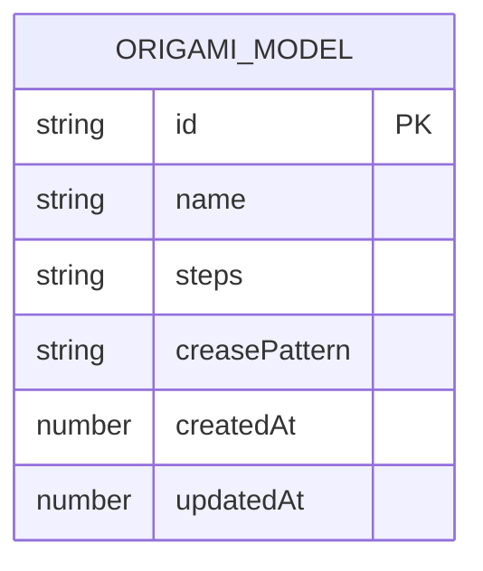

## 1. 架构设计



## 2. 技术描述

- **前端构建**：Vite 5.x + TypeScript 5.x
- **前端框架**：原生TypeScript（无框架）
- **3D渲染**：Three.js 0.160.x
- **物理引擎**：Cannon.es 0.20.x
- **样式**：原生CSS3（CSS变量、Flexbox、Grid）
- **后端框架**：Express 4.x + TypeScript
- **数据库**：nedb-promises 6.x（嵌入式文件数据库）
- **工具库**：uuid 9.x

## 3. 项目结构

```
UnfoldOrigami/
├── package.json              # 项目依赖和脚本
├── vite.config.js            # Vite构建配置
├── tsconfig.json             # TypeScript配置
├── index.html                # 入口HTML
├── frontend/
│   └── src/
│       ├── main.ts           # 前端入口
│       ├── origamiEngine.ts  # 折叠引擎核心
│       ├── uiControls.ts     # UI控制
│       └── types.ts          # 类型定义
├── backend/
│   ├── server.ts             # Express服务器
│   └── models.ts             # 数据模型
└── data/
    └── models.db             # nedb数据库文件
```

## 4. 路由定义

| 路由 | 方法 | 用途 |
|------|------|------|
| / | GET | 前端应用入口 |
| /api/models | POST | 保存折纸模型 |
| /api/models | GET | 获取所有模型列表 |
| /api/models/:id | GET | 获取单个模型详情 |

## 5. API定义

### 5.1 数据类型定义

```typescript
interface CreasePattern {
  lines: CreaseLine[];
  vertices: [number, number][];
}

interface CreaseLine {
  start: [number, number];
  end: [number, number];
  type: 'mountain' | 'valley';
  angle: number;
}

interface FoldStep {
  creaseLineId: string;
  targetAngle: number;
  currentAngle: number;
  timestamp: number;
}

interface OrigamiModel {
  id: string;
  name: string;
  steps: FoldStep[];
  creasePattern: CreasePattern;
  createdAt: number;
  updatedAt: number;
}
```

### 5.2 请求/响应定义

**POST /api/models**

请求体：
```typescript
{
  name: string;
  steps: FoldStep[];
  creasePattern: CreasePattern;
}
```

响应：
```typescript
{
  success: boolean;
  data: OrigamiModel;
}
```

**GET /api/models**

响应：
```typescript
{
  success: boolean;
  data: OrigamiModel[];
}
```

**GET /api/models/:id**

响应：
```typescript
{
  success: boolean;
  data: OrigamiModel;
}
```

## 6. 服务器架构



## 7. 数据模型

### 7.1 实体关系图



### 7.2 核心接口定义

**origamiEngine.ts 核心方法：**

```typescript
class OrigamiEngine {
  constructor(scene: THREE.Scene, world: CANNON.World);
  createPaper(size: number, segments: number): void;
  foldPaper(creaseLineId: string, targetAngle: number, duration?: number): Promise<void>;
  unfoldPaper(duration?: number): Promise<void>;
  getCurrentState(): FoldState;
  getCreasePattern(): CreasePattern;
  exportStepImage(width: number, height: number): Promise<string>;
  exportCreasePatternSVG(): string;
  applyPresetMode(modeId: string): void;
  update(deltaTime: number): void;
}
```

**uiControls.ts 核心方法：**

```typescript
class UIControls {
  constructor(engine: OrigamiEngine);
  init(): void;
  onFoldAngleChange(angle: number): void;
  onUnfoldClick(): void;
  onResetCamera(): void;
  onExportStepImage(): void;
  onExportCreasePattern(): void;
  onColorChange(color: string): void;
  onModeSelect(modeId: string): void;
  updateStatus(message: string): void;
  updateStepCount(current: number, total: number): void;
}
```

### 7.3 预设折叠模式

| 模式ID | 名称 | 描述 |
|--------|------|------|
| horizontal | 横对折 | 沿水平中线对折 |
| vertical | 竖对折 | 沿垂直中线对折 |
| diagonal1 | 对角折1 | 沿左上到右下对角线折叠 |
| diagonal2 | 对角折2 | 沿右上到左下对角线折叠 |
| waterbomb | 水雷折 | 经典水雷基础折叠 |

## 8. 性能优化策略

1. **3D渲染优化**：
   - 纸张网格顶点数控制在2000以内
   - 使用BufferGeometry替代Geometry
   - 启用frustumCulling
   - 合理设置pixelRatio

2. **物理模拟优化**：
   - 使用Cannon.es Trimesh形状进行碰撞检测
   - 降低物理模拟频率（30-60Hz）
   - 适当设置sleepSpeedThreshold

3. **UI响应优化**：
   - 滑条事件使用requestAnimationFrame节流
   - 动画缓动函数使用easeInOutCubic
   - 避免频繁的DOM操作

4. **网络优化**：
   - 后端API使用nedb内存缓存
   - 响应启用Gzip压缩
   - 合理设置缓存头
