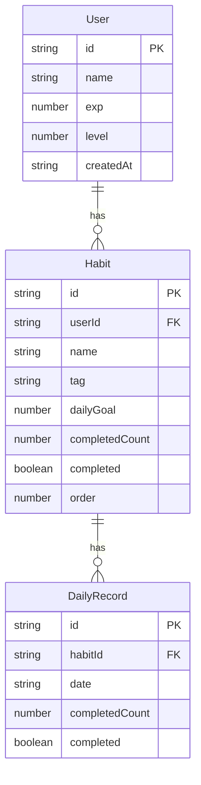

## 1. 架构设计

```mermaid
graph TB
    "Frontend[前端 React+Vite+TypeScript]" --> "http.ts[axios请求封装]"
    "http.ts" --> "Backend[后端 Express.js]"
    "Backend" --> "DataJSON[data.json文件存储]"
    "Frontend" --> "ProfileArea[角色展示区]"
    "Frontend" --> "HabitBoard[任务链面板]"
    "Frontend" --> "StatsPanel[统计看板]"
```

## 2. 技术说明
- 前端：React@18 + TypeScript + Vite + Tailwind CSS + Recharts + @dnd-kit/core
- 初始化工具：vite-init (react-express-ts 模板)
- 后端：Express@4 + CORS
- 数据库：JSON文件存储 (data.json)
- 状态管理：Zustand

## 3. 路由定义
| 路由 | 用途 |
|------|------|
| / | 主页面（角色展示区 + 今日任务链） |
| /habits | 习惯配置页 |
| /stats | 统计看板页 |

## 4. API定义

### 4.1 习惯相关
- `GET /api/habits` — 获取所有习惯列表
- `POST /api/habits` — 创建新习惯
- `PATCH /api/habits/:id` — 更新习惯（状态/顺序/完成次数）
- `DELETE /api/habits/:id` — 删除习惯

### 4.2 统计相关
- `GET /api/stats` — 获取统计数据（周/月完成率、六维度能力值）

### 4.3 角色相关
- `GET /api/profile` — 获取用户档案（经验值、等级、角色数据）
- `PATCH /api/profile` — 更新用户档案

### 4.4 TypeScript类型定义

```typescript
interface Habit {
  id: string;
  name: string;
  tag: 'health' | 'study' | 'creative' | 'life';
  dailyGoal: number;
  completedCount: number;
  completed: boolean;
  order: number;
}

interface UserProfile {
  id: string;
  name: string;
  exp: number;
  level: number;
  createdAt: string;
}

interface StatsData {
  weekly: HabitStat[];
  monthly: HabitStat[];
  radar: RadarData;
}

interface HabitStat {
  name: string;
  tag: string;
  completionRate: number;
}

interface RadarData {
  physical: number;
  intelligence: number;
  creativity: number;
  social: number;
  discipline: number;
  emotion: number;
}
```

## 5. 服务器架构图

```mermaid
graph LR
    "Router[Express Router]" --> "HabitsController[习惯控制器]"
    "Router" --> "StatsController[统计控制器]"
    "Router" --> "ProfileController[角色控制器]"
    "HabitsController" --> "DataService[数据服务层]"
    "StatsController" --> "DataService"
    "ProfileController" --> "DataService"
    "DataService" --> "JSONStore[data.json文件]"
```

## 6. 数据模型

### 6.1 数据模型定义



### 6.2 数据定义
- 数据存储为 `server/data.json` 文件
- 初始数据包含一个默认用户和3个示例习惯
- 每次API请求时读取文件，写入时全量覆盖
