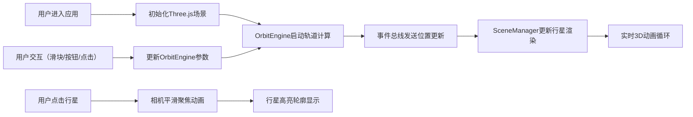

## 1. 产品概述
OrbitViz是一款面向天文爱好者的3D太阳系公转模拟工具，通过可视化方式直观展示行星轨道速度差异、近日点/远日点概念及相对位置关系。
产品核心价值在于将抽象的天体物理概念转化为可交互的3D体验，帮助用户深入理解开普勒定律在太阳系中的实际应用。

## 2. 核心功能

### 2.1 用户角色
| 角色 | 注册方式 | 核心权限 |
|------|----------|----------|
| 天文爱好者 | 无需注册，直接访问 | 完整使用所有模拟功能、调整参数、切换视角 |

### 2.2 功能模块
1. **3D场景渲染模块**：太阳系行星公转实时渲染，包含行星球体、轨道环、光照系统
2. **轨道计算引擎模块**：基于开普勒定律简化版的行星位置计算，支持时间缩放
3. **交互控制面板模块**：时间流速调节、暂停/恢复、行星选择、视角切换
4. **相机控制模块**：行星点击聚焦、预设视角平滑过渡
5. **信息显示模块**：模拟时间实时显示、行星高亮轮廓

### 2.3 页面详情
| 页面名称 | 模块名称 | 功能描述 |
|----------|----------|----------|
| 主界面 | 3D场景容器 | 渲染太阳系6颗行星（水星、金星、地球、火星、木星、土星）的公转运动，支持点击交互 |
| 主界面 | 控制面板 | 提供时间流速滑块（0.1x-100x）、暂停/恢复按钮、行星选择下拉菜单、2个预设视角按钮 |
| 主界面 | 时间显示 | 右上角实时显示模拟运行时间，格式化为"XX天 XX小时 XX分" |
| 主界面 | 行星聚焦 | 点击行星后相机平滑聚焦，行星周围出现发光轮廓 |

## 3. 核心流程
用户进入应用后，系统自动初始化3D场景并开始太阳系公转模拟。用户可通过右侧控制面板调整时间流速、暂停动画、选择特定行星进行聚焦观察，或切换到预设的俯瞰/侧面视角。OrbitEngine持续计算各行星位置并通过事件总线通知SceneManager更新渲染。

## 4. 用户界面设计

### 4.1 设计风格
- **主题**：深空暗色主题，整体色调以深邃宇宙蓝紫色系为主
- **主色调**：背景#0a0a1a，控制面板#1a1a2e，强调色#6c63ff
- **按钮样式**：圆角8px，背景#2d2d44，悬停#3d3d54，过渡0.2s
- **字体**：采用现代无衬线字体，标题24px字重700，正文清晰可读
- **布局风格**：左右分栏，左侧75%为3D场景，右侧25%为控制面板
- **视觉细节**：行星发光轮廓、半透明轨道环、星空背景营造宇宙沉浸感

### 4.2 页面设计概述
| 页面名称 | 模块名称 | UI元素 |
|----------|----------|--------|
| 主界面 | 3D场景容器 | 黑色背景、6颗彩色行星球体、白色半透明轨道环、点光源、环境光 |
| 主界面 | 控制面板 | 标题"OrbitViz"、时间流速滑块（#6c63ff滑块按钮）、暂停/恢复按钮、行星选择下拉、视角切换按钮组 |
| 主界面 | 时间显示 | CSS2DRenderer渲染，右上角白色文字，每秒更新 |
| 主界面 | 行星高亮 | RingGeometry发光轮廓，颜色与行星一致，透明度0.6 |

### 4.3 响应式设计
- 桌面端（≥768px）：左侧3D容器75%，右侧控制面板25%
- 移动端（<768px）：左侧3D容器60%，右侧控制面板40%
- 所有UI元素自适应容器宽度，保持良好的触控交互区域

### 4.4 3D场景指导
- **环境与氛围**：深空黑色背景，营造宇宙沉浸感，可添加微弱星空粒子背景
- **光照设置**：中心点光源模拟太阳（白色，强度1.5），环境光（强度0.3）提供基础照明
- **相机设置**：默认PerspectiveCamera，初始位置(0, 8, 12)，看向原点
- **动画与交互**：行星公转动画流畅，相机聚焦使用easeInOutCubic缓动，时长1秒
- **性能预算**：多边形总数≤20000，帧率稳定≥50fps，使用TWEEN.js管理动画过渡
- **资源来源**：所有3D模型通过Three.js程序化生成，无需外部资源
