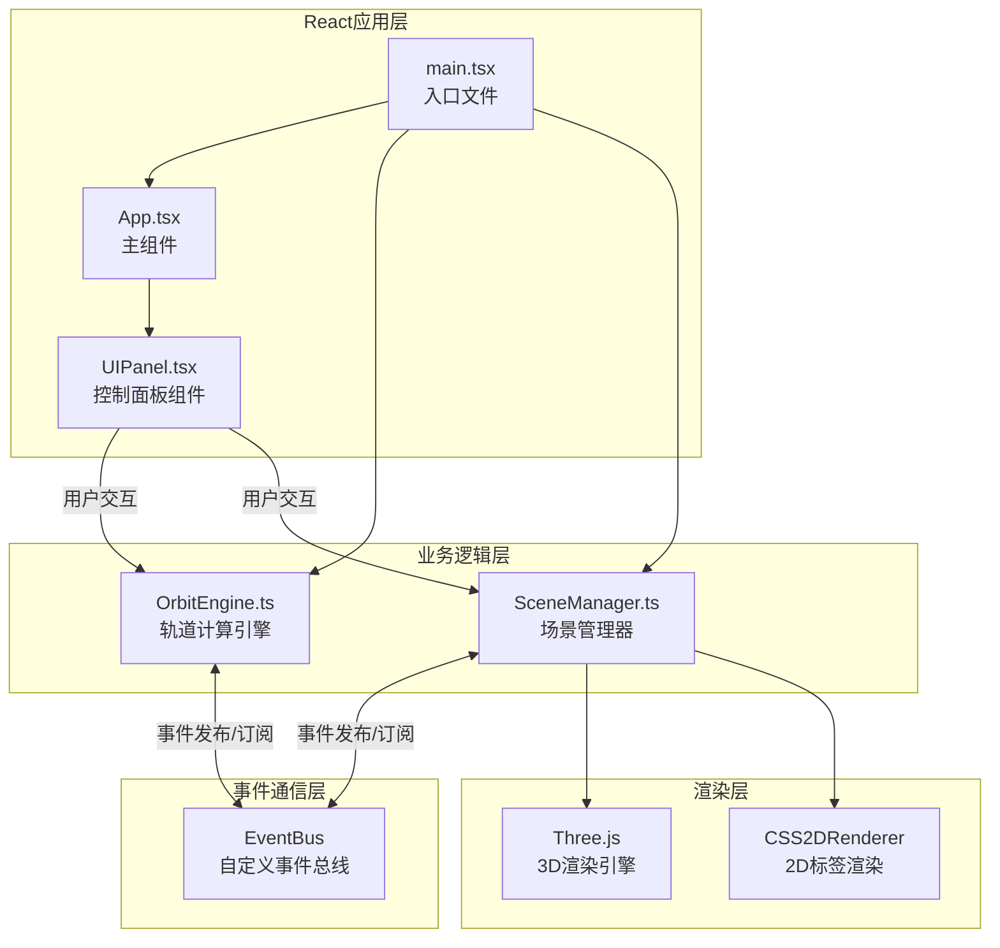

## 1. 架构设计



**数据流向说明：**
1. 用户通过UIPanel组件交互 → 调用OrbitEngine更新参数
2. OrbitEngine计算行星位置 → 通过EventBus发布update事件
3. SceneManager订阅update事件 → 更新Three.js场景中行星位置
4. 渲染循环持续运行 → 实时更新3D画面

**文件调用关系：**
- main.tsx → 初始化OrbitEngine、SceneManager，传入App.tsx
- App.tsx → 渲染布局，将engine和manager传递给UIPanel
- UIPanel.tsx → 调用engine.setTimeScale()、engine.togglePause()、manager.focusPlanet()、manager.setCameraView()
- OrbitEngine.ts → EventBus.emit('update', positions)
- SceneManager.ts → EventBus.on('update', updatePlanets)

## 2. 技术描述

- **前端框架**：React@18 + TypeScript@5
- **构建工具**：Vite@5 + @vitejs/plugin-react@4
- **3D渲染**：Three.js@0.160 + @types/three@0.160
- **动画库**：@tweenjs/tween.js@21
- **CSS方案**：原生CSS（CSS Modules）
- **类型系统**：严格模式（strict: true）
- **目标环境**：ES2020，模块化解析采用bundler模式

## 3. 核心数据结构与模块定义

### 3.1 行星数据定义

```typescript
interface PlanetData {
  name: string;
  nameCn: string;
  radius: number;
  color: string;
  orbitParams: OrbitParams;
}

interface OrbitParams {
  semiMajorAxis: number;      // 半长轴（轨道半径）
  eccentricity: number;       // 偏心率（0-1，0为圆形）
  orbitalPeriod: number;      // 轨道周期（秒，地球=60）
  initialPhase: number;       // 初始相位（弧度）
}

interface PlanetPosition {
  name: string;
  position: THREE.Vector3;
}
```

### 3.2 预设行星数据

| 行星 | 半径 | 颜色 | 半长轴 | 偏心率 | 周期（秒） |
|------|------|------|--------|--------|------------|
| 水星 | 0.15 | #8c7853 | 3 | 0.206 | 14.5 |
| 金星 | 0.3 | #ffc649 | 4.5 | 0.007 | 30.2 |
| 地球 | 0.4 | #4a90d9 | 6 | 0.017 | 60 |
| 火星 | 0.3 | #cd5c5c | 7.5 | 0.093 | 108.8 |
| 木星 | 1.2 | #d4a574 | 10 | 0.049 | 711.6 |
| 土星 | 1.0 | #fad5a5 | 13 | 0.057 | 1776 |

### 3.3 模块接口定义

#### OrbitEngine 接口
```typescript
class OrbitEngine {
  constructor(planets: PlanetData[]);
  setTimeScale(scale: number): void;
  togglePause(): boolean;
  isPaused(): boolean;
  getTimeScale(): number;
  getElapsedTime(): number;  // 返回累积秒数
  start(): void;
  stop(): void;
}
```

#### SceneManager 接口
```typescript
class SceneManager {
  constructor(container: HTMLElement, planets: PlanetData[]);
  focusPlanet(planetName: string): void;
  setCameraView(view: 'top' | 'side'): void;
  getRenderer(): THREE.WebGLRenderer;
  getCSS2DRenderer(): CSS2DRenderer;
  dispose(): void;
}
```

#### 事件总线事件
- `'update'`：载荷为 `PlanetPosition[]`，每帧发布
- `'timeUpdate'`：载荷为 `{ elapsed: number; formatted: string }`，每秒发布

## 4. 项目结构

```
OrbitViz/
├── package.json
├── vite.config.js
├── tsconfig.json
├── index.html
└── src/
    ├── main.tsx                    # React入口
    ├── App.tsx                     # 主组件
    ├── App.css                     # 主样式
    ├── UIPanel.tsx                 # 控制面板组件
    ├── UIPanel.css                 # 控制面板样式
    ├── OrbitEngine.ts              # 轨道计算引擎
    ├── SceneManager.ts             # 场景管理器
    ├── EventBus.ts                 # 事件总线
    ├── types.ts                    # 类型定义
    └── data/
        └── planets.ts              # 行星数据配置
```

## 5. 关键技术实现方案

### 5.1 轨道计算（开普勒定律简化版）
- 基于椭圆参数方程计算行星位置
- 考虑偏心率实现近日点/远日点速度差异
- 时间缩放因子控制模拟速度
- 使用requestAnimationFrame驱动计算循环

### 5.2 事件总线实现
- 简单的发布/订阅模式
- 类型安全的事件名称和载荷
- 支持事件订阅与取消订阅

### 5.3 相机动画
- 使用TWEEN.js实现平滑过渡
- 缓动函数：easeInOutCubic
- 动画时长：1000ms
- 支持目标点位置插值和朝向插值

### 5.4 性能优化
- 行星使用低多边形球体（segments=16）
- 轨道环使用LineSegments而非完整几何体
- 事件节流：时间显示每秒更新一次
- 多边形总数控制：6行星×~1536面 + 6轨道环×~128段 = ~10,000面

## 6. 性能指标

| 指标 | 目标值 | 实现策略 |
|------|--------|----------|
| 帧率 | ≥50fps | 使用requestAnimationFrame，减少每帧计算量 |
| 多边形数 | ≤20,000 | 低多边形模型，复用几何体 |
| 内存占用 | <100MB | 及时释放资源，避免内存泄漏 |
| 响应时间 | <100ms | 用户交互反馈延迟 |
