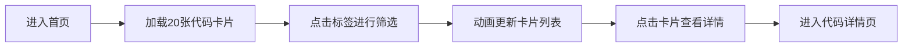
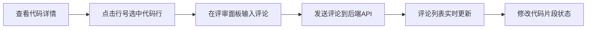
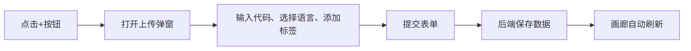

## 1. 产品概述

CodeMosaic是一款面向开发团队的代码片段协作与代码评审应用，让开发人员可以像浏览艺术画廊一样查看、注释和审批代码片段，通过智能标签系统自动归类并生成热力图分析代码讨论热点。

- **核心价值**：提升团队代码评审效率，可视化展示代码讨论热度，促进知识共享
- **目标用户**：开发团队、技术经理、代码审查者
- **解决痛点**：传统代码评审工具枯燥乏味，缺乏直观的热度分析和分类管理

## 2. 核心功能

### 2.1 用户角色

| 角色 | 注册方式 | 核心权限 |
|------|----------|----------|
| 开发者 | 应用内登录 | 浏览代码片段、上传代码、添加评论、标签筛选 |
| 评审者 | 应用内登录 | 代码评审、修改状态、添加审批意见 |

### 2.2 功能模块

1. **画廊首页**：代码片段卡片网格展示、标签筛选、上传入口、导航切换
2. **代码详情页**：完整代码展示（支持行号高亮）、评审面板、评论列表
3. **热力图页面**：按语言标签展示代码评论热度矩阵
4. **上传弹窗**：代码文本输入、语言选择、标签自动补全

### 2.3 页面详情

| 页面名称 | 模块名称 | 功能描述 |
|-----------|-------------|---------------------|
| 画廊首页 | 卡片网格 | 320px宽卡片，展示代码前5行、语言标签、作者信息、点赞/评论数 |
| 画廊首页 | 标签筛选栏 | 水滴形标签，支持多选组合筛选，动画过渡 |
| 画廊首页 | 上传按钮 | 左上角"+"按钮，悬停旋转90度，触发上传弹窗 |
| 代码详情页 | 代码展示区 | 70%宽度，语法高亮，行号点击选中高亮 |
| 代码详情页 | 评审面板 | 30%宽度，评论列表倒序排列，输入框+发送按钮 |
| 热力图页面 | 热度矩阵 | 60x60px格子，颜色从浅蓝到深红渐变，悬停显示详情 |
| 上传弹窗 | 表单区域 | 代码文本域（深色主题）、语言下拉、标签自动补全 |

## 3. 核心流程

### 用户浏览与筛选流程

### 代码评审流程

### 上传代码流程

## 4. 用户界面设计

### 4.1 设计风格

**设计方向**：科技感画廊风格，融合代码的理性与艺术展示的美感

- **主色调**：
  - 导航栏深色：#2d3748
  - 主背景：#f7fafc
  - 卡片背景：#ffffff
  - 品牌色（交互元素）：#667eea → #5a67d8（悬停）
  - 选中高亮：#e8f5e9（浅绿色）
  
- **辅助色**：
  - JavaScript标签：#f7df1e
  - Python标签：#3572A5
  - 热力图渐变：#bee3f8 → #e53e3e

- **字体**：系统字体栈 -apple-system, BlinkMacSystemFont, 'Segoe UI', Roboto，代码使用 monospace 字体

- **按钮与交互风格**：
  - 圆角设计：卡片12px，标签8px/20px，输入框20px，按钮50%圆形
  - 阴影层次：默认0 2px 12px rgba(0,0,0,0.06)，悬停0 6px 20px rgba(0,0,0,0.12)
  - 过渡动画：0.2s-0.3s ease 缓动效果
  - 输入聚焦：外发光效果 0 0 0 3px rgba(102, 126, 234, 0.3)

### 4.2 页面设计概述

| 页面名称 | 模块名称 | UI 元素与交互 |
|-----------|-------------|-------------|
| 画廊首页 | 导航栏 | 56px高度深色背景，白色文字，品牌Logo+页面切换 |
| 画廊首页 | 标签筛选区 | 水滴形标签横向排列，选中状态颜色反转 |
| 画廊首页 | 卡片网格 | 自适应3列布局，卡片悬停上浮2px并加深阴影 |
| 画廊首页 | 浮动按钮 | 左上角+号，悬停旋转90度 |
| 代码详情页 | 代码区 | 左侧70%，深色代码编辑器风格，行号可点击 |
| 代码详情页 | 评审面板 | 右侧30%，评论气泡样式，底部输入框 |
| 热力图页面 | 矩阵区域 | 居中展示格子矩阵，颜色渐变，悬停提示 |
| 上传弹窗 | 表单区 | 深色代码输入域，语言选择下拉，标签自动补全 |

### 4.3 响应式设计

采用 **Desktop-First** 设计策略：

- **桌面端（≥769px）**：画廊3列布局，详情页左右70/30分栏
- **平板端（481px-768px）**：画廊2列布局，详情页改为上下布局
- **移动端（≤480px）**：画廊单列布局，详情页全屏展示，评审面板底部弹出
- **触摸优化**：增大点击区域至44x44px，优化手势交互

### 4.4 动画与动效

- **入场动画**：卡片加载采用交错渐入效果（staggered reveal）
- **筛选过渡**：标签切换时卡片平滑过滤，使用 CSS transform + opacity
- **悬停反馈**：按钮和卡片统一的悬停上浮与阴影变化
- **加载状态**：骨架屏占位，内容加载后平滑过渡
