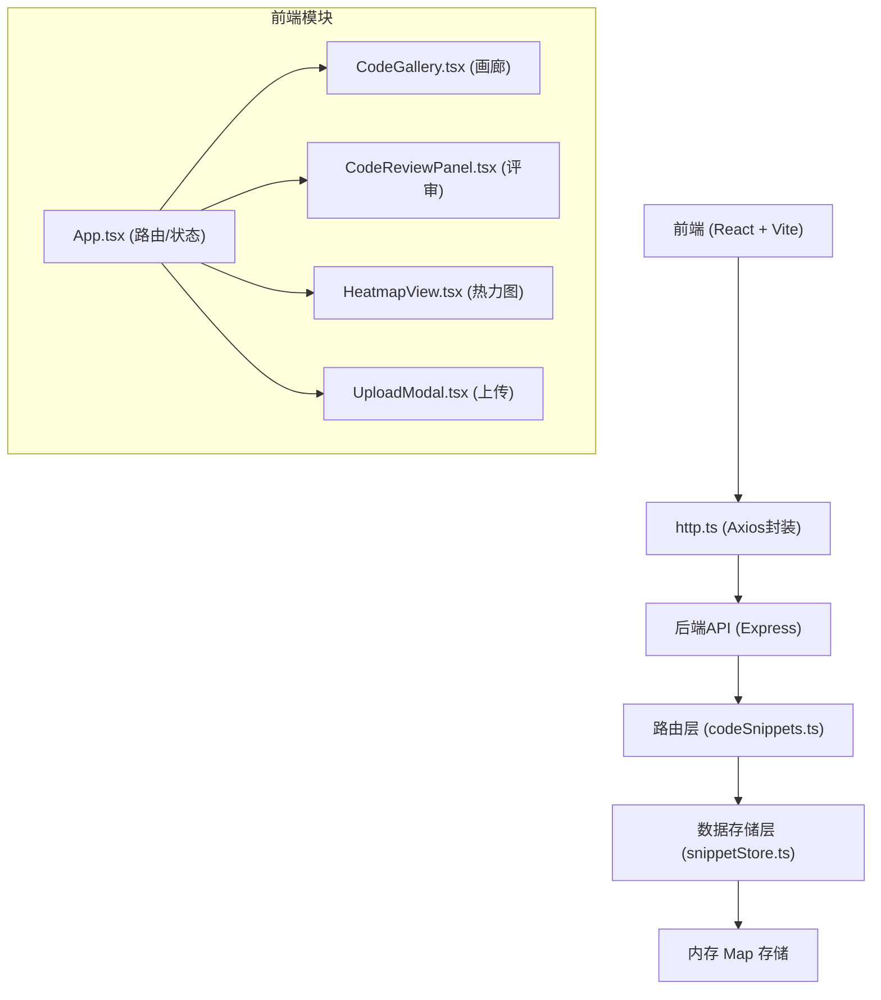
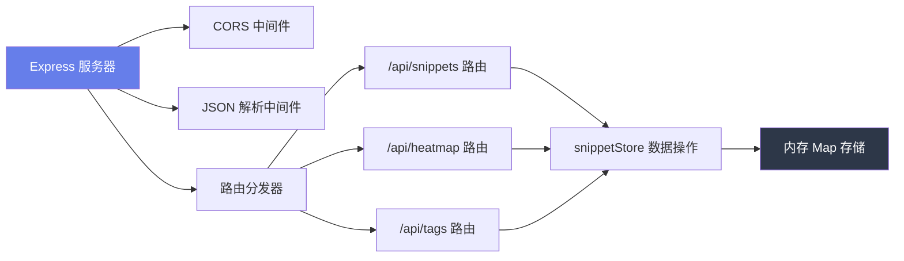
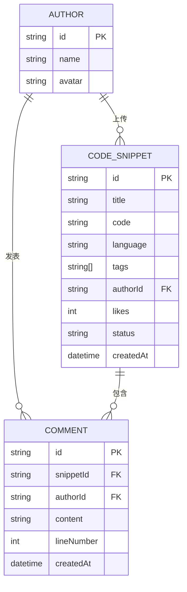

## 1. 架构设计



## 2. 技术描述

### 2.1 前端技术栈
- **框架**: React@18 + TypeScript
- **构建工具**: Vite@5
- **样式方案**: CSS-in-JS (styled-components 或原生 CSS Modules)
- **图表库**: recharts@2 (热力图辅助)
- **HTTP客户端**: axios@1
- **路径别名**: @/* 映射到 src/client/*

### 2.2 后端技术栈
- **框架**: Express@4
- **运行时**: Node.js + TypeScript (ts-node 或 tsx)
- **中间件**: cors, express.json()
- **数据存储**: 内存 Map (开发阶段)

### 2.3 项目初始化
- 使用 `npm create vite@latest` 初始化前端
- 后端手动配置 Express + TypeScript
- 统一使用 TypeScript 严格模式 (`strict: true`)

### 2.4 启动方式
- 前后端并发启动，前端端口 5173，后端端口 3001
- Vite 配置代理转发 API 请求到后端

## 3. 路由定义

### 前端路由 (React Router)
| 路由 | 页面/组件 | 用途 |
|-------|-----------|------|
| `/` | CodeGallery | 代码画廊首页 |
| `/snippet/:id` | SnippetDetail + CodeReviewPanel | 代码详情与评审 |
| `/heatmap` | HeatmapView | 热力图分析页 |

### 后端 API 路由
| Method | Route | 用途 |
|--------|-------|------|
| GET | `/api/snippets` | 获取代码片段列表（支持标签筛选） |
| GET | `/api/snippets/:id` | 获取单个代码片段详情 |
| POST | `/api/snippets` | 上传新的代码片段 |
| PUT | `/api/snippets/:id/status` | 更新代码片段状态 |
| POST | `/api/snippets/:id/comments` | 添加评论 |
| GET | `/api/snippets/:id/comments?page=1&limit=10` | 分页获取评论 |
| GET | `/api/heatmap` | 获取热力图数据 |
| GET | `/api/tags` | 获取所有标签列表（用于自动补全） |

## 4. API 定义

### 4.1 TypeScript 类型定义

```typescript
// 代码片段
interface CodeSnippet {
  id: string;
  title: string;
  code: string;
  language: string;
  tags: string[];
  author: {
    id: string;
    name: string;
    avatar: string;
  };
  likes: number;
  status: 'pending' | 'approved' | 'changes_requested';
  createdAt: string;
  comments: Comment[];
}

// 评论
interface Comment {
  id: string;
  snippetId: string;
  author: {
    id: string;
    name: string;
    avatar: string;
  };
  content: string;
  lineNumber?: number;
  createdAt: string;
}

// 热力图数据点
interface HeatmapData {
  language: string;
  commentCount: number;
  snippetCount: number;
}

// API 响应包装
interface ApiResponse<T> {
  success: boolean;
  data: T;
  message?: string;
}

// 分页响应
interface PaginatedResponse<T> {
  items: T[];
  total: number;
  page: number;
  limit: number;
  hasMore: boolean;
}
```

### 4.2 请求/响应 Schema

#### GET /api/snippets
**Query Params**:
- `tags?: string[]` - 标签筛选
- `language?: string` - 语言筛选
- `page?: number` - 页码（默认1）
- `limit?: number` - 每页数量（默认20）

**Response**: `ApiResponse<PaginatedResponse<CodeSnippet>>`

#### POST /api/snippets
**Request Body**:
```typescript
{
  code: string;
  language: string;
  tags: string[];
  title?: string;
}
```

**Response**: `ApiResponse<CodeSnippet>`

#### POST /api/snippets/:id/comments
**Request Body**:
```typescript
{
  content: string;
  lineNumber?: number;
  authorId: string;
}
```

**Response**: `ApiResponse<Comment>`

## 5. 服务器架构图



## 6. 数据模型

### 6.1 数据模型 ER 图



### 6.2 内存存储结构

```typescript
// snippetStore.ts
class SnippetStore {
  private snippets: Map<string, CodeSnippet>;
  private comments: Map<string, Comment>;
  
  constructor() {
    this.snippets = new Map();
    this.comments = new Map();
    this.initializeMockData();
  }
  
  // 初始化20条模拟数据
  private initializeMockData(): void;
  
  // 查询方法
  getSnippets(filters?: { tags?: string[], language?: string }, page?: number, limit?: number): PaginatedResponse<CodeSnippet>;
  getSnippetById(id: string): CodeSnippet | undefined;
  getComments(snippetId: string, page?: number, limit?: number): PaginatedResponse<Comment>;
  getHeatmapData(): HeatmapData[];
  getAllTags(): string[];
  
  // 变更方法
  createSnippet(data: Omit<CodeSnippet, 'id' | 'createdAt' | 'likes' | 'status' | 'comments'>): CodeSnippet;
  updateSnippetStatus(id: string, status: CodeSnippet['status']): CodeSnippet | undefined;
  addComment(snippetId: string, data: Omit<Comment, 'id' | 'createdAt'>): Comment;
  incrementLikes(id: string): CodeSnippet | undefined;
}
```

### 6.3 模拟数据初始化

应用启动时自动生成20条模拟代码片段，覆盖多种语言（JavaScript, TypeScript, Python, Go, Rust）和标签（算法, 前端, 后端, 数据库, 性能优化等），每条包含3-8条随机评论，用于热力图展示。

## 7. 性能优化策略

### 7.1 前端性能
- **虚拟滚动**：画廊卡片超过50条时启用虚拟滚动
- **懒加载**：图片和头像使用 Intersection Observer 懒加载
- **防抖**：标签筛选和搜索输入使用 150ms 防抖
- **Memo 优化**：React.memo 包裹卡片组件，避免不必要重渲染
- **代码分割**：按路由拆分代码包，首屏加载 < 200KB

### 7.2 性能指标承诺
- 初始加载20张卡片 FPS ≥ 55
- 标签筛选切换响应 < 200ms
- 评论列表按需加载（每次10条，滚动自动加载）

## 8. 开发规范

### 8.1 目录结构
```
d:\VersionFastPro\tasks\auto118/
├── package.json
├── tsconfig.json
├── vite.config.js
├── index.html
└── src/
    ├── client/
    │   ├── App.tsx
    │   ├── main.tsx
    │   ├── components/
    │   │   ├── CodeGallery.tsx
    │   │   ├── CodeReviewPanel.tsx
    │   │   ├── SnippetCard.tsx
    │   │   ├── HeatmapView.tsx
    │   │   ├── UploadModal.tsx
    │   │   ├── TagFilter.tsx
    │   │   └── Navbar.tsx
    │   ├── utils/
    │   │   └── http.ts
    │   ├── types/
    │   │   └── index.ts
    │   └── styles/
    │       └── global.css
    └── server/
        ├── index.ts
        ├── routes/
        │   └── codeSnippets.ts
        └── models/
            └── snippetStore.ts
```

### 8.2 代码规范
- TypeScript 严格模式 (`strict: true`, `noImplicitAny: true`)
- 组件函数式 + Hooks，无类组件
- 命名规范：组件 PascalCase，函数 camelCase，常量 UPPER_SNAKE_CASE
- 统一使用 `async/await` 处理异步操作
- API 请求统一通过 `http.ts` 封装，错误集中处理
