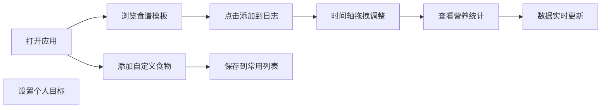

## 1. 产品概述

每日健康饮食规划与营养跟踪应用，帮助个人用户快速规划每日饮食并跟踪营养摄入。
- 解决用户手动计算每餐卡路里和营养素繁琐、市面应用过于复杂难以坚持的痛点
- 目标用户：关注健康饮食、需要简单易用营养管理的个人用户
- 产品价值：提供简单直观的饮食记录与营养分析工具，降低健康饮食门槛

## 2. 核心功能

### 2.1 用户角色

| 角色 | 注册方式 | 核心权限 |
|------|----------|----------|
| 普通用户 | 无需注册，本地使用 | 使用全部饮食记录、营养统计、目标设置功能 |

### 2.2 功能模块

1. **首页-饮食日志**：食谱模板卡片、自定义食物添加、时间轴餐次管理、拖拽排序
2. **统计面板**：环形进度图、7天热量趋势折线图、营养素占比饼图
3. **目标设置**：个人信息设置、基础代谢估算、推荐摄入范围

### 2.3 页面详情

| 页面名称 | 模块名称 | 功能描述 |
|----------|----------|----------|
| 首页 | 食谱模板面板 | 展示早中晚餐预设模板（每类3-4种），点击添加到当日日志 |
| 首页 | 自定义食物面板 | 手动添加自定义食物（名称、份量、热量、蛋白质、碳水、脂肪），系统自动保存供后续选择 |
| 首页 | 时间轴日志 | 四个时段（早餐/午餐/晚餐/加餐），拖拽食物条目调整餐次分配 |
| 右侧统计面板 | 环形进度图 | 展示当日热量、蛋白质、碳水、脂肪摄入进度 |
| 右侧统计面板 | 7天趋势折线图 | 展示近7天热量摄入趋势 |
| 目标设置 | 个人目标表单 | 设置年龄、性别、身高、体重、活动量，基于Harris-Benedict公式计算BMR |

## 3. 核心流程

用户打开应用 → 查看预设食谱/添加食物到日志 → 拖拽调整餐次 → 查看营养统计 → 设置个人目标 → 系统实时更新推荐摄入数据

## 4. 用户界面设计

### 4.1 设计风格
- 主色调：柔和蓝灰色（主色#3182ce，强调色#dd6b20）
- 卡片和按钮统一使用圆角16px，过渡动画0.3s ease-in-out
- 字体：系统默认无衬线字体
- 布局：左右两栏布局，左侧日志区70%，右侧统计面板30%
- 顶部固定标题栏高度60px，背景#2d3748

### 4.2 页面设计概述

| 页面名称 | 模块名称 | UI元素 |
|----------|----------|--------|
| 首页 | 食谱卡片 | 宽260px，圆角16px，背景#ffffff，阴影0 2px 8px rgba(0,0,0,0.04)，已选左侧绿色边框#2ecc71 |
| 首页 | 食物条目 | 高度56px，背景#f7fafc，圆角8px，可拖拽 |
| 首页 | 时间轴时段 | 四个时段区隔背景#edf2f7 |
| 统计面板 | 环形进度图 | 半径60px，厚度20px，颜色分段：热量#e53e3e、蛋白质#3182ce、碳水#dd6b20、脂肪#805ad5 |
| 统计面板 | 折线图 | 线条宽度2.5px，圆点半径5px |
| 全局 | 标题栏 | 高度60px，背景#2d3748，字体#ffffff，左侧菜单# a0aec0 |

### 4.3 响应式设计
- 桌面端（≥1024px）：左右两栏布局
- 平板端（<1024px）：右侧面板折叠为底部面板，高度自适应
- 移动端（<768px）：所有卡片变为单列全宽

### 4.4 性能要求
- 每次添加或删除食物后，图表更新应在300ms内完成
- 页面初始加载时间不超过2秒（基于Chrome DevTools模拟3G网络）
