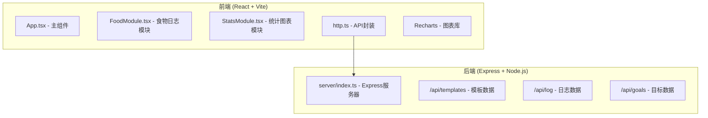
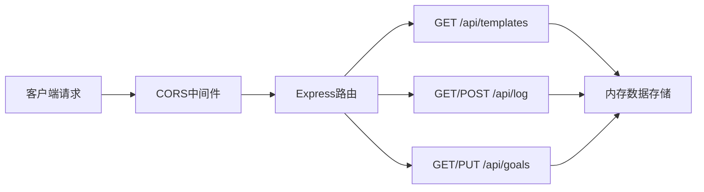
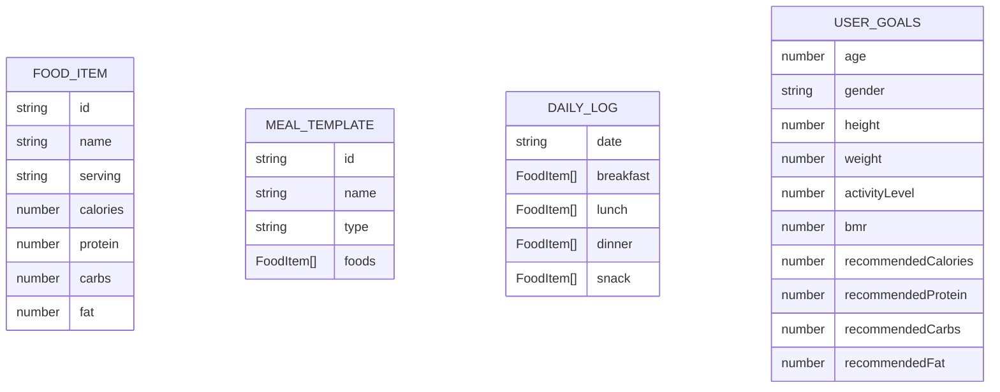

## 1. 架构设计



## 2. 技术描述

- 前端：React 18 + TypeScript + Vite
- UI：原生CSS（内联样式
- 图表：Recharts
- HTTP客户端：Axios
- 后端：Express 4 + TypeScript
- 数据存储：内存存储（模拟数据）
- 跨域：cors中间件

## 3. 项目结构

```
.
├── package.json
├── index.html
├── tsconfig.json
├── vite.config.js
├── src/
│   ├── App.tsx          # 主页面组件
│   ├── http.ts          # Axios封装
│   ├── FoodModule.tsx   # 食物选择与日志管理
│   └── StatsModule.tsx  # 营养统计与图表
└── server/
    └── index.ts         # Express服务器
```

## 4. API 定义

### 4.1 类型定义

```typescript
interface FoodItem {
  id: string;
  name: string;
  serving: string;
  calories: number;
  protein: number;
  carbs: number;
  fat: number;
}

interface MealTemplate {
  id: string;
  name: string;
  type: 'breakfast' | 'lunch' | 'dinner' | 'snack';
  foods: FoodItem[];
  image?: string;
}

interface DailyLog {
  date: string;
  meals: {
    breakfast: FoodItem[];
    lunch: FoodItem[];
    dinner: FoodItem[];
    snack: FoodItem[];
  };
}

interface UserGoals {
  age: number;
  gender: 'male' | 'female';
  height: number;
  weight: number;
  activityLevel: number;
  bmr: number;
  recommendedCalories: number;
  recommendedProtein: number;
  recommendedCarbs: number;
  recommendedFat: number;
}
```

### 4.2 接口定义

| 接口 | 方法 | 描述 |
|------|------|------|
| /api/templates | GET | 获取食谱模板列表 |
| /api/log | GET | 获取当日饮食日志 |
| /api/log | POST | 保存当日饮食日志 |
| /api/goals | GET | 获取用户目标 |
| /api/goals | PUT | 更新用户目标 |

## 5. 服务器架构



## 6. 数据模型

### 6.1 数据模型定义



### 6.2 Harris-Benedict公式

- 男性BMR = 88.362 + (13.397 × 体重kg) + (4.799 × 身高cm) - (5.677 × 年龄)
- 女性BMR = 447.593 + (9.247 × 体重kg) + (3.098 × 身高cm) - (4.330 × 年龄)
- 每日推荐摄入 = BMR × 活动系数

活动系数：
- 久坐（很少运动）：1.2
- 轻度活动（每周1-3天）：1.375
- 中度活动（每周3-5天）：1.55
- 高度活动（每周6-7天）：1.725
- 极高活动（体力劳动+运动）：1.9

## 7. 性能优化

- 组件使用React.memo优化重渲染
- 图表数据使用useMemo缓存计算
- 拖拽操作使用requestAnimationFrame优化
- 使用CSS transitions实现平滑动画
