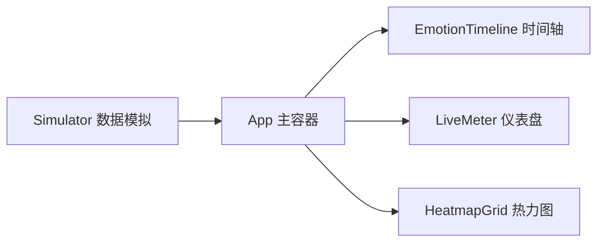
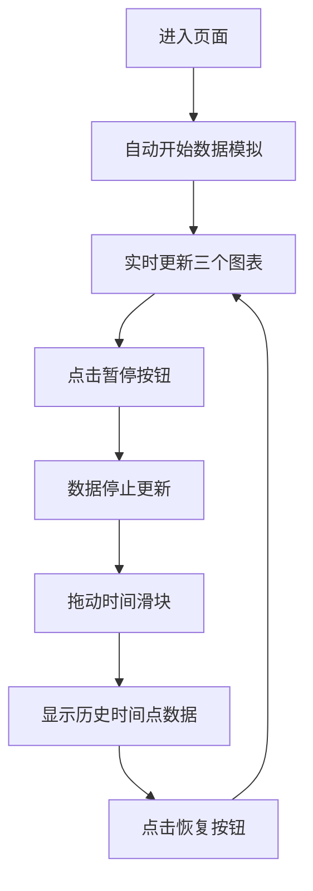

## 1. 产品概述

MoodBoard 是一款用于在线会议的实时情绪可视化仪表盘，通过收集和分析参会者的情绪反馈，帮助主持人直观了解听众反应，从而优化会议节奏和内容。

- **核心价值**：将抽象的参会者情绪转化为直观的可视化图表，提升会议互动质量
- **目标用户**：会议主持人、讲师、培训师、团队管理者
- **解决问题**：传统会议难以实时感知参会者情绪变化，缺乏数据驱动的会议优化手段

## 2. 核心功能

### 2.1 用户角色

| 角色 | 使用方式 | 核心能力 |
|------|----------|----------|
| 会议主持人 | 打开仪表盘查看会议情绪 | 实时查看情绪趋势、主导情绪、参会者热力图 |

### 2.2 功能模块

1. **实时情绪仪表盘**：环形进度条展示当前主导情绪占比，中心显示emoji和百分比
2. **情绪时间轴**：横向折线图展示四种情绪（高兴/恐惧/愤怒/惊喜）的时间变化趋势
3. **参会者热力图**：网格热力图展示每位参会者的情绪强度分布
4. **回放控制**：暂停/恢复按钮 + 时间滑块，支持回溯历史数据

### 2.3 页面详情

| 页面名称 | 模块名称 | 功能描述 |
|---------|---------|----------|
| 主仪表盘 | 顶部标题栏 | 应用名称、暂停/恢复按钮、当前会议时间 |
| 主仪表盘 | 情绪时间轴（左） | 最近30分钟四种情绪得分走势折线图 |
| 主仪表盘 | 实时情绪仪表（中） | 主导情绪环形进度条、emoji、百分比 |
| 主仪表盘 | 参会者热力图（右） | 16×30网格热力图，展示参会者情绪强度 |

## 3. 核心流程

### 3.1 数据流向

### 3.2 交互流程

## 4. 用户界面设计

### 4.1 设计风格

- **主题**：深色科技风，专业数据可视化
- **主色调**：深色背景 #0f172a，卡片背景 #1e293b
- **情绪色彩**：高兴 #fbbf24 / 恐惧 #ef4444 / 愤怒 #f97316 / 惊喜 #38bdf8
- **按钮样式**：圆角 8px，主色 #6366f1，白色文字
- **字体**：现代无衬线字体，标题字重 700，正文常规
- **布局风格**：三栏卡片式布局，带分隔线和阴影
- **图标/emoji**：使用标准 emoji 表情符号

### 4.2 页面设计概述

| 页面名称 | 模块名称 | UI 元素 |
|---------|---------|---------|
| 主仪表盘 | 标题栏 | 左标题、右按钮+时间标签，高 64px |
| 主仪表盘 | 情绪时间轴 | 折线图、图例、悬停 tooltip、横轴 5 分钟刻度 |
| 主仪表盘 | 实时仪表 | 环形进度条（弧宽 24px）、中心 emoji + 百分比 |
| 主仪表盘 | 热力图 | 16 行 × 30 列网格、圆角格子、悬停详情卡片 |

### 4.3 响应式

- **桌面端**：三栏布局（40% / 25% / 35%），分隔线 1px
- **移动端**（< 768px）：纵向堆叠，每栏 100% 宽度
- **交互优化**：触摸友好的按钮和滑块

### 4.4 动效设计

- 折线过渡动画：duration 0.5s ease
- 图表更新过渡：transition all 0.3s ease
- 仪表刷新间隔：500ms
- 数据更新频率：每 2 秒一次
