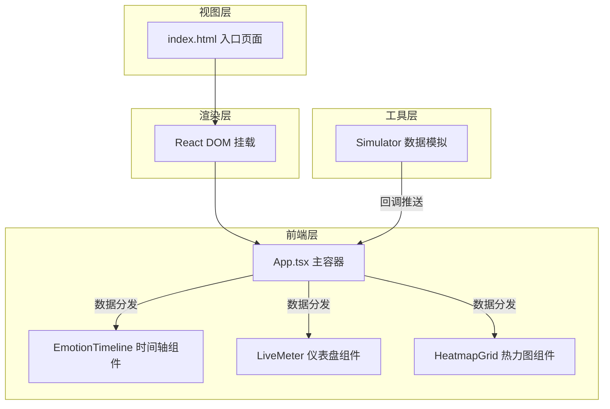

## 1. 架构设计



## 2. 技术描述

- **前端框架**：React 18 + TypeScript
- **构建工具**：Vite + @vitejs/plugin-react
- **图表库**：Recharts
- **数据压缩**：lz-string
- **项目初始化**：vite-init
- **后端**：无（纯前端模拟数据）
- **数据库**：无

### 2.1 核心依赖版本

| 依赖包 | 用途 |
|--------|------|
| react | UI 框架 |
| react-dom | DOM 渲染 |
| recharts | 图表可视化 |
| lz-string | 数据压缩（预留） |
| typescript | 类型系统 |
| vite | 构建工具 |

## 3. 目录结构

```
├── package.json
├── vite.config.js
├── tsconfig.json
├── index.html
└── src/
    ├── main.tsx          # React 根组件挂载
    ├── App.tsx           # 主容器组件（状态管理、布局）
    ├── components/
    │   ├── EmotionTimeline.tsx   # 时间轴折线图
    │   ├── LiveMeter.tsx         # 实时情绪仪表盘
    │   └── HeatmapGrid.tsx       # 参会者热力图
    └── utils/
        └── Simulator.ts          # 模拟数据生成器
```

## 4. 数据模型

### 4.1 情绪数据类型

```typescript
interface Emotions {
  joy: number;      // 高兴 -1~1
  fear: number;     // 恐惧 -1~1
  anger: number;    // 愤怒 -1~1
  surprise: number; // 惊喜 -1~1
}

interface EmotionData {
  timestamp: number;    // 时间戳（毫秒）
  userId: string;       // 参会者ID（A01~A16）
  emotions: Emotions;
}
```

### 4.2 数据流向

1. **Simulator** 每 2 秒生成 16 条 EmotionData（每人一条）
2. 通过回调函数推送给 **App.tsx**
3. **App.tsx** 维护时间序列状态，按组件需求分发子集数据
4. 各子组件通过 React.memo + useMemo 优化重渲染

## 5. 性能优化策略

| 优化手段 | 应用位置 | 效果 |
|---------|---------|------|
| React.memo | 三个子组件 | 避免无关状态变化导致的重渲染 |
| useMemo | 数据计算（平均情绪、主导情绪） | 避免重复计算 |
| 数据窗口 | 仅保留最近 30 分钟数据 | 控制内存和渲染量 |
| 分批处理 | 子组件只接收所需子集数据 | 减少每帧计算量 |

### 5.1 性能指标

- 数据更新频率：每 2 秒一次
- 单次更新渲染时间：< 30ms
- 数据点数量：16 人 × 30 分钟 × 30 次/分钟 = 14,400 条（窗口内）
- 热力图网格：16 行 × 30 列 = 480 格
