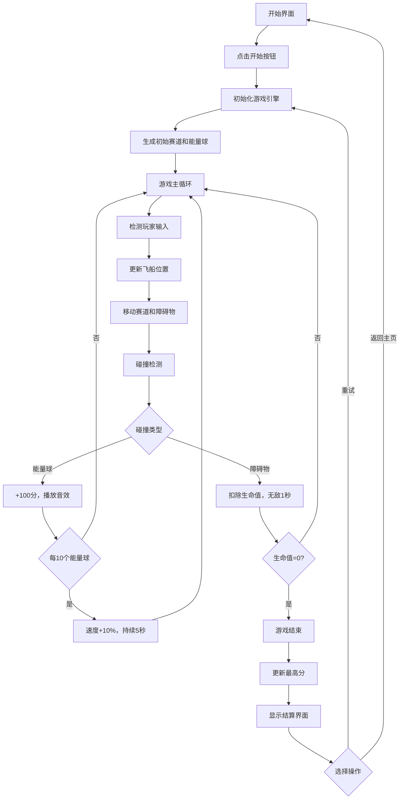

## 1. 产品概述

AstroRacer 是一款在浏览器中运行的太空竞速游戏，玩家操控飞船在星云赛道中躲避障碍物并收集能量球，考验玩家的反应力和策略规划能力。

- 核心玩法：2D俯视视角，键盘/触摸控制飞船移动，躲避随机生成的障碍物，收集能量球获得分数和加速效果
- 目标用户：休闲游戏爱好者、喜欢反应力挑战的玩家
- 产品价值：提供快节奏、沉浸式的太空竞速体验，通过渐进式难度和分数系统保持游戏挑战性

## 2. 核心功能

### 2.1 用户角色
| 角色 | 注册方式 | 核心权限 |
|------|---------|----------|
| 普通玩家 | 无需注册 | 体验完整游戏流程，本地存储最高分 |

### 2.2 功能模块

1. **开始界面**：游戏标题、开始按钮、最高分显示
2. **游戏主场景**：飞船控制、赛道生成、障碍物、能量球、粒子特效
3. **HUD界面**：实时速度、得分、生命值显示
4. **结算界面**：最终得分、最高分、重试和返回按钮
5. **音频系统**：背景音乐、得分音效、碰撞音效
6. **计分系统**：基础得分、能量球奖励、速度加成、最高分记录

### 2.3 页面详情

| 页面名称 | 模块名称 | 功能描述 |
|---------|---------|----------|
| 开始界面 | 标题模块 | 显示"ASTRO RACER"标题，带发光效果 |
| 开始界面 | 按钮模块 | 开始游戏按钮，悬停缩放动画 |
| 开始界面 | 最高分模块 | 显示本地存储的历史最高分 |
| 游戏场景 | 飞船控制 | WASD/方向键控制飞船上下左右移动 |
| 游戏场景 | 赛道生成 | 程序化生成星云背景和障碍物 |
| 游戏场景 | 碰撞检测 | 飞船与障碍物/能量球的碰撞判定 |
| 游戏场景 | 粒子特效 | 飞船拖尾、能量球光晕、爆炸效果 |
| HUD界面 | 速度显示 | 当前速度（km/h，四位数字格式） |
| HUD界面 | 得分显示 | 当前得分，变化时有放大动画 |
| HUD界面 | 生命显示 | 3颗心形图标，红色/灰色表示状态 |
| 结算界面 | 得分面板 | 最终得分、最高分（刷新时高亮） |
| 结算界面 | 操作按钮 | 重试按钮、返回主页按钮 |

## 3. 核心流程

## 4. 用户界面设计

### 4.1 设计风格
- 主色调：深空紫渐变背景（#0f0c29 → #302b63 → #24243e）
- 主亮色：青色 #00d2ff、金色 #ffd700
- 按钮风格：圆角30px，线性渐变背景，悬停缩放1.05倍，过渡0.3s ease
- 字体：白色配亮色阴影，标题64px加粗，按钮文字26px
- 布局：居中卡片布局，圆角20px，阴影0 10px 30px rgba(0,0,0,0.5)
- 图标风格：简洁几何图形，心形生命图标

### 4.2 页面设计概述

| 页面名称 | 模块名称 | UI元素 |
|---------|---------|--------|
| 开始界面 | 标题 | 64px加粗白色字体，阴影0 0 20px #00d2ff |
| 开始界面 | 按钮 | 200x60px，圆角30px，渐变#00d2ff→#3a7bd5 |
| 开始界面 | 最高分 | 白色文字，居中显示 |
| 游戏场景 | 飞船 | 青色三角形（底边30px，高40px），拖尾粒子 |
| 游戏场景 | 障碍物 | 不规则多边形，颜色随机（#ff6b6b/#feca57/#48dbfb/#ff9ff3） |
| 游戏场景 | 能量球 | 金色圆形（半径12px），带光晕阴影 |
| 游戏场景 | 背景 | 渐变色星云，随机散布光点 |
| HUD界面 | 速度 | 四位数字格式 0000 km/h |
| HUD界面 | 得分 | 整数，变化时放大0.2s |
| HUD界面 | 生命 | 3颗心形，红色#ff4757 / 灰色#57606f |
| 结算界面 | 面板 | 400px宽，圆角20px，背景#1e272e |
| 结算界面 | 最高分 | 刷新记录时高亮闪烁 |
| 结算界面 | 按钮 | 重试按钮（主色）、返回按钮（浅色#2d3436） |

### 4.3 响应式
- 桌面端：Canvas占满整个视口，HUD固定在Canvas上方
- 移动端：Canvas自适应屏幕尺寸，触摸滑动控制飞船
- 触控优化：支持触摸事件，响应区域足够大

### 4.4 动效设计
- 飞船拖尾：随机散落半透明青色小点
- 能量球光晕：呼吸式阴影动画
- 得分变化：短暂放大动画（0.2s）
- 按钮悬停：亮度增加 + 缩放1.05倍
- 碰撞闪烁：飞船被击中后闪烁1秒无敌
- 新纪录：最高分高亮闪烁效果
