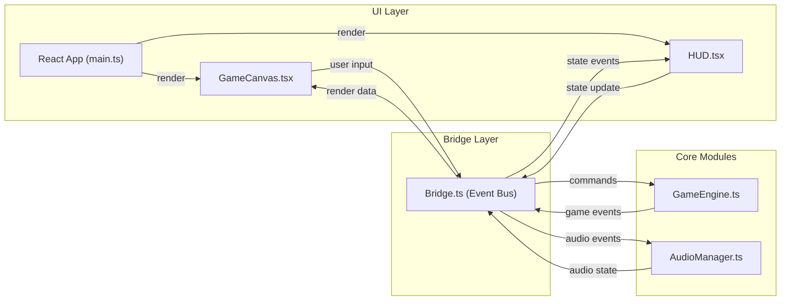

## 1. 架构设计



## 2. 技术描述

- 前端框架：React 18 + TypeScript
- 构建工具：Vite 5
- 渲染方式：2D Canvas API
- 音频处理：Web Audio API
- 状态管理：事件总线（Event Emitter模式）
- 本地存储：localStorage（最高分记录）

## 3. 目录结构

```
auto127/
├── package.json
├── index.html
├── tsconfig.json
├── vite.config.js
└── src/
    ├── main.ts
    ├── App.tsx
    ├── Bridge.ts
    ├── GameEngine.ts
    ├── AudioManager.ts
    ├── types.ts
    └── ui/
        ├── GameCanvas.tsx
        ├── HUD.tsx
        ├── StartScreen.tsx
        └── GameOverScreen.tsx
```

## 4. 模块定义

### 4.1 Bridge.ts - 事件总线

```typescript
type EventType = 
  | 'game:start'
  | 'game:stop'
  | 'game:pause'
  | 'game:resume'
  | 'game:over'
  | 'input:move'
  | 'engine:update'
  | 'engine:score'
  | 'engine:speed'
  | 'engine:lives'
  | 'engine:collision'
  | 'engine:collect'
  | 'engine:boost'
  | 'audio:playMusic'
  | 'audio:stopMusic'
  | 'audio:playSFX'

interface Bridge {
  on(event: EventType, callback: (data?: any) => void): void
  off(event: EventType, callback: (data?: any) => void): void
  emit(event: EventType, data?: any): void
}
```

### 4.2 GameEngine.ts - 游戏引擎

```typescript
interface GameState {
  running: boolean
  paused: boolean
  score: number
  speed: number
  lives: number
  energyCollected: number
  boostActive: boolean
  boostEndTime: number
  invincible: boolean
  invincibleEndTime: number
  elapsedTime: number
}

interface Ship {
  x: number
  y: number
  width: number
  height: number
  velocityX: number
  velocityY: number
}

interface Obstacle {
  id: number
  x: number
  y: number
  width: number
  height: number
  color: string
  vertices: number[]
}

interface EnergyOrb {
  id: number
  x: number
  y: number
  radius: number
  collected: boolean
}

interface Particle {
  x: number
  y: number
  vx: number
  vy: number
  life: number
  maxLife: number
  color: string
  size: number
}
```

### 4.3 AudioManager.ts - 音频管理器

```typescript
interface AudioManager {
  init(): Promise<void>
  playMusic(): void
  stopMusic(): void
  playSFX(type: 'collect' | 'collision' | 'boost'): void
}
```

### 4.4 GameCanvas.tsx - 画布组件

Props:
- width: number
- height: number

Responsibilities:
- 渲染游戏场景（背景、飞船、障碍物、能量球、粒子）
- 监听键盘事件（WASD / 方向键）
- 监听触摸事件
- 驱动 GameEngine 更新

### 4.5 HUD.tsx - 抬头显示组件

Props:
- speed: number
- score: number
- lives: number
- boostActive: boolean

Responsibilities:
- 显示格式化速度（0000 km/h）
- 显示当前得分（变化动画）
- 显示生命值心形图标
- 显示加速状态提示

## 5. 性能优化策略

1. **游戏循环**：使用 requestAnimationFrame，固定时间步长更新
2. **碰撞检测**：AABB 矩形近似检测，避免复杂计算
3. **对象池**：障碍物和能量球重用，减少 GC
4. **渲染优化**：仅渲染视口内对象，背景分层绘制
5. **音频预加载**：音频缓冲预加载，播放时低延迟
6. **数量限制**：同时存在的障碍物和能量球不超过 50 个
7. **帧率监控**：目标 60 FPS，动态调整生成频率

## 6. 配置常量

```typescript
// 游戏常量
const INITIAL_SPEED = 200 // km/h
const MAX_SPEED = 800 // km/h
const SPEED_INCREMENT = 20 // km/h per 10s
const SPEED_INCREMENT_INTERVAL = 10000 // ms
const INITIAL_LIVES = 3
const ENERGY_SCORE = 100
const ENERGY_BOOST_THRESHOLD = 10
const BOOST_MULTIPLIER = 1.1
const BOOST_DURATION = 5000 // ms
const INVINCIBLE_DURATION = 1000 // ms

// 画布边界
const CANVAS_PADDING = 10

// 飞船属性
const SHIP_WIDTH = 30
const SHIP_HEIGHT = 40
const SHIP_COLOR = '#00d2ff'

// 能量球属性
const ENERGY_RADIUS = 12
const ENERGY_COLOR = '#ffd700'

// 障碍物颜色
const OBSTACLE_COLORS = ['#ff6b6b', '#feca57', '#48dbfb', '#ff9ff3']

// 背景渐变
const BG_GRADIENT = ['#0f0c29', '#302b63', '#24243e']
```
