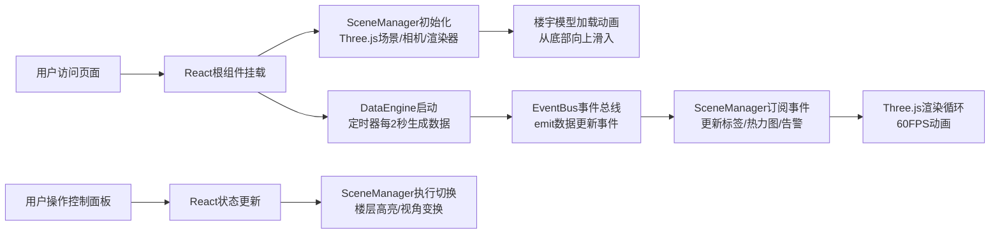

## 1. 产品概述

TwinTower 是一款面向智慧园区的实时交互3D楼宇监控看板，为数字孪生工程师提供楼宇能耗、人流量、告警信息的三维可视化监控能力。通过将多维度数据以悬浮标签和热力图形式叠加在三维模型上，实现楼宇运行状态的直观感知与快速决策。

- 核心价值：将抽象的楼宇运行数据转化为沉浸式3D可视化体验，提升监控效率与异常响应速度
- 目标用户：数字孪生工程师、园区运维管理人员、楼宇监控中心人员

## 2. 核心特性

### 2.1 用户角色

| 角色 | 使用场景 | 核心需求 |
|------|----------|----------|
| 数字孪生工程师 | 系统搭建与调试 | 模型展示准确性、数据刷新实时性、交互流畅度 |
| 园区运维人员 | 日常监控与巡检 | 告警快速识别、楼层数据快速切换、多视角浏览 |

### 2.2 功能模块

1. **3D楼宇场景**：10层半透明楼宇模型、网格地面、鼠标拖拽旋转与滚轮缩放
2. **悬浮数据标签**：每层楼外立面显示楼层号与能耗值，悬停展示人流量与告警详情
3. **热力图覆盖**：每层楼顶面 4x4 分区热力图，根据人流量动态变色
4. **告警闪烁标记**：高告警级别楼层边框闪烁 + 顶部感叹号图标
5. **控制面板**：楼层选择、视角切换、实时数据面板

### 2.3 页面详情

| 页面名称 | 模块名称 | 功能描述 |
|---------|----------|----------|
| 主监控页 | 3D场景模块 | 展示10层楼宇模型，支持OrbitControls旋转缩放，模型加载时有从底向上滑入动画 |
| 主监控页 | 悬浮标签模块 | 10层楼各一个Sprite标签，显示楼层号与能耗，悬停放大并显示人流量/告警 |
| 主监控页 | 热力图模块 | 每层顶面4x4网格热力图，蓝到红渐变，2秒刷新，0.5秒过渡动画 |
| 主监控页 | 告警标记模块 | 告警≥2级时楼层边框红色闪烁，顶部出现红色感叹号Sprite |
| 主监控页 | 控制面板模块 | 左侧浮动面板，含楼层下拉、视角切换按钮、实时数据展示 |

## 3. 核心流程

用户打开应用 → 3D场景初始化（楼宇模型从底部滑入） → 数据引擎启动（每2秒生成模拟数据） → 事件总线推送数据更新 → 场景管理器更新标签、热力图、告警状态 → 用户通过控制面板切换楼层/视角 → 场景联动更新

## 4. 用户界面设计

### 4.1 设计风格

- **主色调**：深色科技风，主背景 `#0f172a`，面板背景 `#1e293b`，高亮色 `#3b82f6`（蓝色）、`#22d3ee`（青色）、告警色 `#ef4444`（红色）
- **按钮风格**：圆角矩形，选中态蓝色填充，hover亮度提升，0.2秒过渡动画
- **字体**：无衬线字体，数字使用等宽样式，突出科技感
- **布局风格**：3D场景全屏居中，左侧浮动控制面板，亚克力半透明质感
- **视觉质感**：背景半透明、边框高光、柔和阴影，整体呈现透明亚克力/玻璃态效果

### 4.2 页面设计概览

| 页面名称 | 模块名称 | UI元素 |
|---------|----------|--------|
| 主监控页 | 3D场景 | 全屏canvas，深色背景，10层半透明灰蓝色楼宇，白色线框，白色网格地面 |
| 主监控页 | 悬浮标签 | 黑色半透明圆角Sprite，白色14px文字，悬停放大1.2倍显示Tooltip |
| 主监控页 | 热力图 | 4x4网格，蓝到红渐变，平滑过渡动画 |
| 主监控页 | 告警标记 | 红色边框闪烁，顶部红色感叹号Sprite |
| 主监控页 | 控制面板 | 左侧240px宽浮动面板，圆角12px，半透明0.9，阴影柔和，含下拉/按钮/数据展示 |

### 4.3 响应式

- **桌面端**（≥768px）：左侧垂直浮动控制面板，宽240px，距左20px，距顶20px
- **移动端**（<768px）：顶部横向控制面板，宽100%，高60px，圆角0，内容水平排列，简洁按钮与下拉菜单
- 触控优化：按钮最小点击区域44px，下拉菜单触控友好

### 4.4 3D场景指引

- **环境氛围**：深色科技空间感，环境光 + 方向光组合，突出楼宇轮廓
- **光照设置**：AmbientLight 基础照明（强度0.4），DirectionalLight 主光源（强度0.8，从斜上方照射），营造立体感
- **相机设置**：PerspectiveCamera，初始视角为斜45度俯瞰，fov=60
- **交互控制**：OrbitControls 支持拖拽旋转、滚轮缩放、右键平移
- **构图与焦点**：楼宇位于场景中心，地面网格提供空间参照，悬浮标签沿楼体立面分布
- **动画效果**：模型入场从底部向上滑入（1秒 ease-out），热力图颜色过渡（0.5秒），告警闪烁（1秒周期）
- **性能预算**：集成显卡不低于30FPS，标签不超过11个，热力图重绘≤15ms
