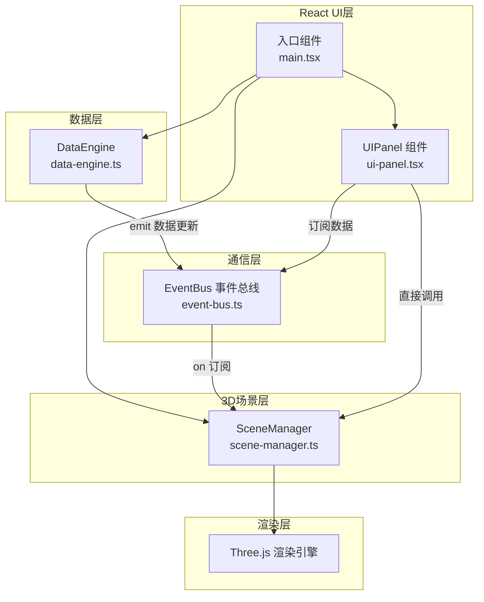

## 1. 架构设计



**数据流向说明：**
1. DataEngine 每2秒生成模拟数据，通过 EventBus 发出 `data:update` 事件
2. SceneManager 订阅事件，更新3D场景中的标签、热力图、告警标记
3. UIPanel 订阅事件，更新UI面板上的实时数据显示
4. UIPanel 通过直接调用 SceneManager 的方法切换楼层视角
5. SceneManager 通过 Three.js 渲染循环驱动场景动画

## 2. 技术选型

- **前端框架**：React@18 + TypeScript@5
- **构建工具**：Vite@5 + @vitejs/plugin-react
- **3D引擎**：Three.js + @types/three
- **状态管理**：React useState/useEffect + 自定义事件总线
- **样式方案**：内联样式 + CSS变量，避免引入额外CSS框架

## 3. 模块与文件结构

| 文件路径 | 职责 | 依赖 |
|---------|------|------|
| `src/main.tsx` | 应用入口，初始化React根组件、创建SceneManager实例、启动DataEngine | React, ReactDOM, UIPanel, SceneManager, DataEngine |
| `src/ui-panel.tsx` | React控制面板组件，楼层选择、视角切换、实时数据展示 | React, DataEngine, SceneManager, EventBus |
| `src/scene-manager.ts` | Three.js场景管理，楼宇模型、悬浮标签、热力图、告警标记 | Three.js, EventBus |
| `src/data-engine.ts` | 模拟数据生成引擎，定时器生成各楼层能耗/人流量/告警数据 | EventBus |
| `src/event-bus.ts` | 简易事件总线，发布订阅模式 | 无外部依赖 |
| `index.html` | HTML入口文件 | - |
| `vite.config.js` | Vite构建配置 | @vitejs/plugin-react |
| `tsconfig.json` | TypeScript配置 | - |
| `package.json` | 项目依赖与脚本 | - |

## 4. 核心数据模型

### 4.1 楼层数据类型

```typescript
interface FloorData {
  floor: number;        // 楼层号 1-10
  energy: number;       // 能耗 kW
  people: number;       // 人流量 人
  alertLevel: 0 | 1 | 2 | 3; // 告警级别
}

interface BuildingData {
  floors: FloorData[];
  timestamp: number;
}
```

### 4.2 事件定义

| 事件名 | 数据类型 | 触发时机 |
|-------|----------|----------|
| `data:update` | `BuildingData` | DataEngine 每2秒生成新数据时 |
| `floor:select` | `number` (楼层号) | 用户在控制面板选择楼层时 |
| `view:change` | `'overhead' \| 'front' \| 'free'` | 用户切换视角时 |

## 5. SceneManager 模块设计

### 5.1 公共方法

| 方法 | 参数 | 返回值 | 说明 |
|------|------|--------|------|
| `constructor(container: HTMLElement)` | DOM容器 | 实例 | 初始化Three.js场景 |
| `start()` | - | `void` | 启动渲染循环 |
| `dispose()` | - | `void` | 清理资源，停止渲染 |
| `selectFloor(floor: number)` | 楼层号 | `void` | 高亮选中楼层 |
| `setView(view: ViewMode)` | 视角模式 | `void` | 切换相机视角 |
| `updateData(data: BuildingData)` | 楼宇数据 | `void` | 更新场景数据 |

### 5.2 内部对象

| 对象 | 类型 | 数量 | 说明 |
|------|------|------|------|
| `buildingGroup` | THREE.Group | 1 | 楼宇模型组合 |
| `floorMeshes` | THREE.Mesh[] | 10 | 各楼层几何体 |
| `floorEdges` | THREE.LineSegments[] | 10 | 各楼层边框线框 |
| `labelSprites` | THREE.Sprite[] | 10 | 各楼层悬浮标签 |
| `heatmapMeshes` | THREE.Mesh[] | 10 | 各楼层热力图网格 |
| `alertSprites` | THREE.Sprite[] | 10 | 告警感叹号图标 |
| `groundGrid` | THREE.GridHelper | 1 | 地面网格 |
| `controls` | OrbitControls | 1 | 轨道控制器 |

## 6. 性能优化策略

1. **Sprite 标签复用**：使用 CanvasTexture 生成标签纹理，文字更新时仅更新纹理数据
2. **热力图颜色插值**：使用 lerp 颜色插值实现0.5秒平滑过渡，避免每帧重绘
3. **几何体合并**：楼层主体使用单个 BoxGeometry 实例，通过位置偏移创建多层
4. **渲染循环优化**：仅在数据变化时更新对象，静止场景降低渲染频率
5. **事件节流**：鼠标悬停检测使用 Raycaster，每帧检测但仅状态变化时触发更新
6. **纹理缓存**：相同样式的 Sprite 复用 Canvas 纹理，减少内存占用
