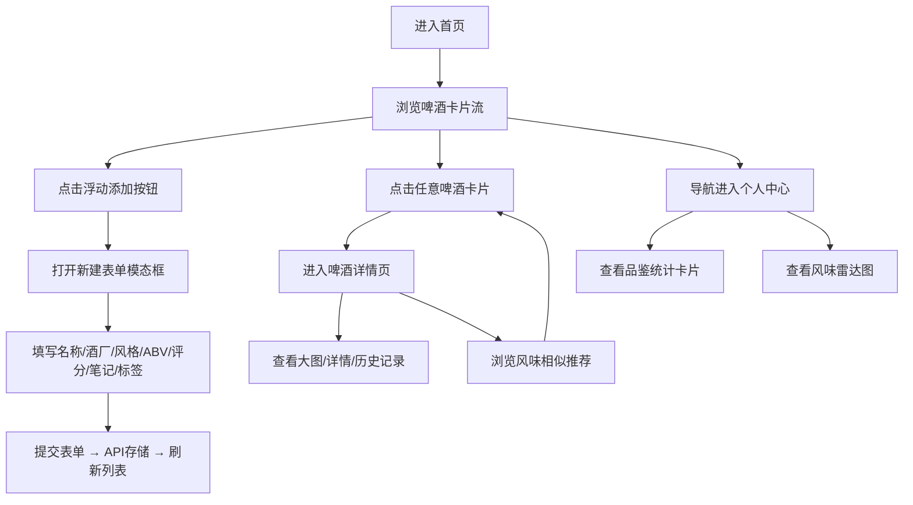

## 1. 产品概述
BrewGuide是一款专为精酿啤酒爱好者打造的品鉴记录与智能推荐应用，解决爱好者用Excel/记事本管理品鉴记录低效且缺乏推荐功能的痛点。
- 核心价值：帮助用户系统化记录品鉴历史、管理个人酒评、通过风味标签发现相似好酒
- 目标用户：精酿啤酒爱好者、啤酒收藏家、品鉴达人

## 2. 核心功能

### 2.1 功能模块
1. **首页**：啤酒卡片流列表、浮动添加按钮、新建/编辑表单模态框
2. **啤酒详情页**：大图展示区、详细信息、历史品鉴记录、风味相似推荐
3. **个人中心页**：品鉴统计（总数/平均分/最爱风格/最爱标签）、雷达图可视化

### 2.2 页面详情
| 页面名称 | 模块名称 | 功能描述 |
|-----------|-------------|---------------------|
| 首页 | 啤酒卡片流 | 网格布局展示所有啤酒，卡片含名称/酒厂/风格/评分，悬停上浮动画 |
| 首页 | 浮动添加按钮 | 右下角渐变圆形按钮，点击打开新建表单模态框 |
| 首页 | 啤酒表单模态框 | 含名称/酒厂/风格/ABV滑块/星标评分/品鉴笔记/风味标签多选 |
| 首页 | 卡片操作按钮 | 每张卡片底部编辑/删除图标按钮，支持CRUD操作 |
| 啤酒详情页 | 大图展示区 | 高400px区域居中展示酒名加粗文字 |
| 啤酒详情页 | 品鉴记录列表 | 按日期展示该啤酒所有历史评分、笔记和日期 |
| 啤酒详情页 | 风味推荐列表 | 横向滚动容器，基于标签相似度推荐6款相似啤酒 |
| 个人中心页 | 统计卡片组 | 四张卡片展示总品鉴数/平均评分/最爱风格/最爱风味标签 |
| 个人中心页 | 风味雷达图 | 使用recharts库展示六大风味维度的分布可视化 |

## 3. 核心流程
用户进入首页浏览啤酒卡片流 → 点击浮动按钮新建啤酒记录（填写表单并提交）→ 点击卡片进入详情页查看完整信息和推荐 → 在个人中心查看品鉴统计与风味偏好

## 4. 用户界面设计

### 4.1 设计风格
- **主色调**：#f59e0b（橙色渐变 #f59e0b → #d97706）
- **背景层级**：#0a0a1a（页面）→ #16213e（表单）→ #1a1a2e（卡片）
- **文字颜色**：#ffffff（主文字）、#a0a0b0（辅助文字）、#4a4a6a（空星标）
- **按钮风格**：圆角按钮，平滑过渡动画（0.2s ease），悬停上浮放大效果
- **卡片风格**：圆角16px，柔和阴影，悬停translateY(-4px) + 阴影加深
- **图标风格**：24x24px线性图标，常态#a0a0b0，悬停#ffffff

### 4.2 页面设计概览
| 页面名称 | 模块名称 | UI元素 |
|-----------|-------------|-------------|
| 首页 | 啤酒卡片 | 320px宽卡片，圆角16px，#1a1a2e背景，0 4px 20px阴影，悬停上浮+阴影加深 |
| 首页 | 浮动按钮 | 56px直径圆形，圆角50%，橙色线性渐变，白色加号，悬停scale(1.1) |
| 首页 | 表单模态框 | 480px宽，#16213e背景，圆角20px，内边距32px，淡入淡出+缩放动画 |
| 详情页 | 大图区 | 高400px，#1a1a2e背景，居中36px加粗白字酒名，圆角24px |
| 详情页 | 推荐卡片 | 200px宽，圆角12px，#16213e背景，横向滚动容器 |
| 个人中心 | 统计卡片 | 200px宽，圆角12px，#1a1a2e背景，文字居中 |

### 4.3 响应式设计
- 桌面端（≥1024px）：三列卡片网格布局
- 平板端（768px-1023px）：两列卡片网格布局
- 手机端（<768px）：单列卡片网格布局，卡片宽度自适应
- 模态框在小屏幕下宽度自适应屏幕宽度

### 4.4 性能要求
- 页面初次加载时间 ≤ 2秒
- 卡片列表滚动帧率 ≥ 45fps
- 所有交互动画使用CSS transition/transform，保证GPU加速
