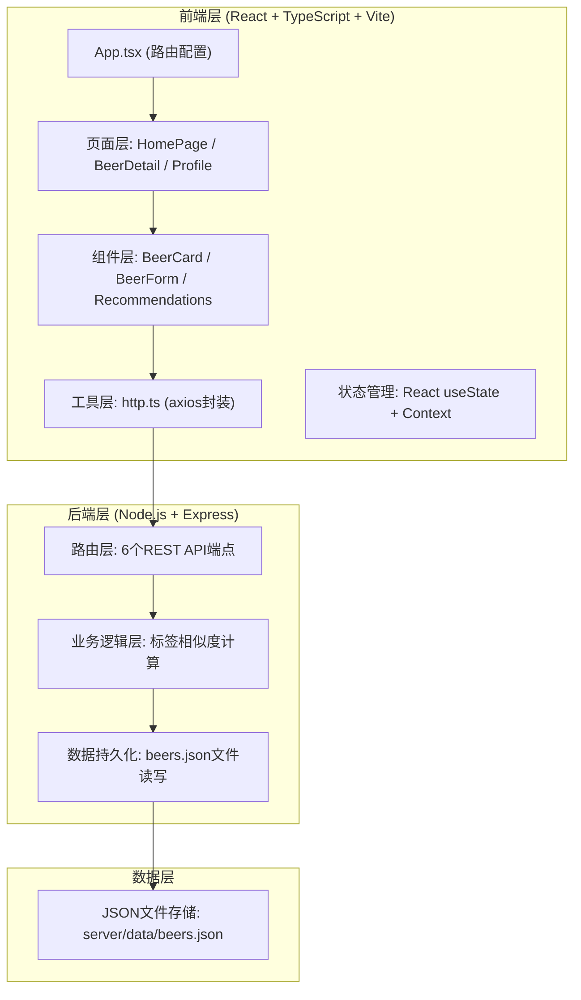
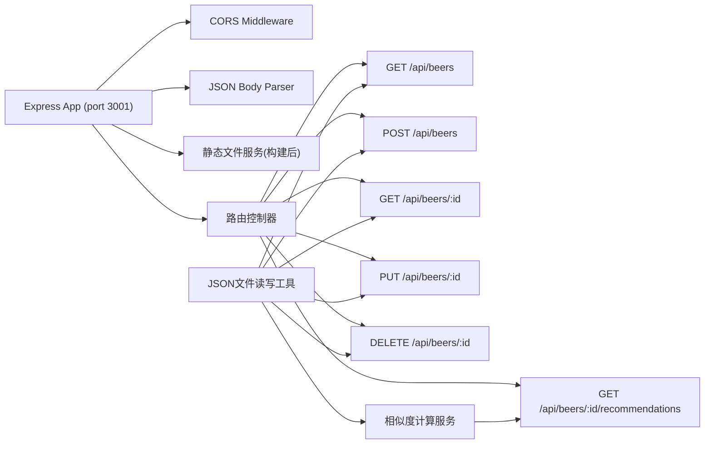
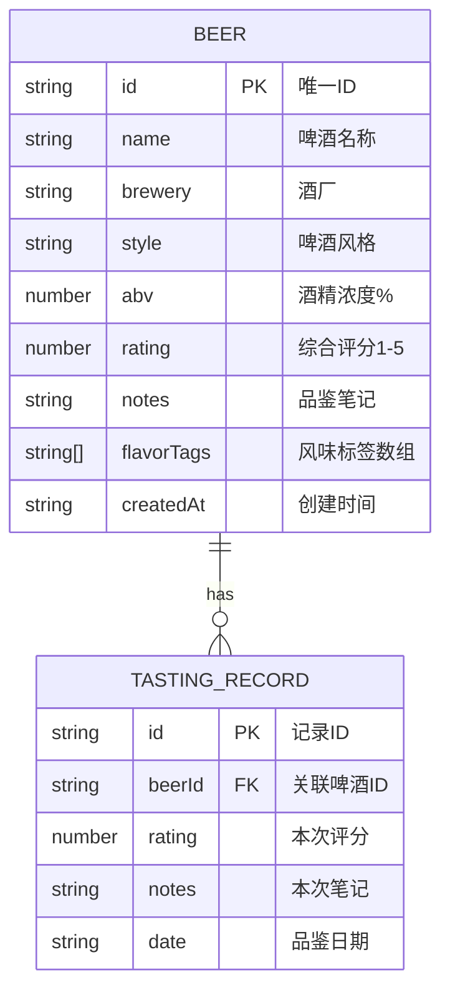

## 1. 架构设计



## 2. 技术说明
- **前端框架**: React@18 + TypeScript@5 + Vite@5
- **路由**: react-router-dom@6 (BrowserRouter模式)
- **图表库**: recharts@2 (雷达图)
- **HTTP客户端**: axios (前端) / express内置 (后端)
- **后端框架**: Express@4 + CORS中间件
- **数据存储**: JSON文件 (fs模块读写)
- **开发服务器**: Vite开发服务器(5173端口) + Express API服务器(3001端口)，Vite配置/api代理到后端

## 3. 路由定义
| 前端路由 | 页面组件 | 说明 |
|-------|---------|------|
| / | HomePage | 首页 - 啤酒卡片列表 + 浮动添加按钮 |
| /beer/:id | BeerDetail | 详情页 - 单瓶啤酒详情 + 品鉴记录 + 推荐 |
| /profile | Profile | 个人中心 - 品鉴统计 + 雷达图 |

## 4. API定义
| 方法 | 路径 | 功能 | 请求体 | 响应 |
|------|------|------|--------|------|
| GET | /api/beers | 获取所有啤酒列表 | - | Beer[] |
| POST | /api/beers | 新建啤酒记录 | BeerInput | Beer |
| GET | /api/beers/:id | 获取单瓶啤酒详情 | - | Beer |
| PUT | /api/beers/:id | 更新啤酒记录 | BeerInput | Beer |
| DELETE | /api/beers/:id | 删除啤酒记录 | - | { success: true } |
| GET | /api/beers/:id/recommendations | 获取相似啤酒推荐 | - | Beer[] |

### 4.1 TypeScript类型定义
```typescript
interface TastingRecord {
  id: string;
  rating: number;
  notes: string;
  date: string;
}

interface Beer {
  id: string;
  name: string;
  brewery: string;
  style: string;
  abv: number;
  rating: number;
  notes: string;
  flavorTags: string[];
  tastingRecords: TastingRecord[];
  createdAt: string;
}

interface BeerInput {
  name: string;
  brewery: string;
  style: string;
  abv: number;
  rating: number;
  notes: string;
  flavorTags: string[];
}

interface Stats {
  totalBeers: number;
  avgRating: number;
  favoriteStyle: string;
  favoriteTag: string;
  radarData: { dimension: string; value: number }[];
}
```

### 4.2 推荐算法说明
基于Jaccard相似度计算风味标签匹配度：
- 相似度 = 两个啤酒标签交集数量 / 并集数量
- 按相似度降序排列，返回前6条结果（排除自身）

## 5. 服务器架构图


## 6. 数据模型
### 6.1 数据模型定义


### 6.2 初始数据结构
初始beers.json为空数组`[]`，用户首次添加啤酒后自动生成记录。

### 6.3 风味标签预设
```javascript
const FLAVOR_TAGS = [
  '柑橘', '热带水果', '莓果', '苹果', '蜂蜜',
  '焦糖', '巧克力', '咖啡', '坚果', '烘烤',
  '麦芽', '面包', '花香', '草本', '香料',
  '胡椒', '松木', '树脂', '烟熏', '橡木',
  '奶油', '清爽', '干爽', '甜润', '苦涩'
];
```

### 6.4 啤酒风格预设
```javascript
const BEER_STYLES = [
  'IPA', '双料IPA', '新英格兰IPA', '世涛', '帝国世涛',
  '波特', '酸啤', '兰比克', '古斯', '小麦啤',
  '比利时白啤', '修道院啤酒', '皮尔森', '拉格', '博克',
  '琥珀艾尔', '棕色艾尔', '大麦酒', '赛松', '其他'
];
```
