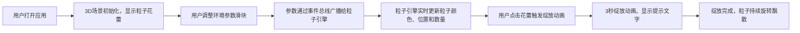

## 1. 产品概述

CrystalBloom是一个沉浸式3D粒子花卉生长模拟应用，用户可以通过鼠标交互控制虚拟花卉从种子到绽放的完整过程，并实时调整环境参数影响花卉形态。

- 主要用途：提供一个互动式的3D视觉体验，用于艺术欣赏、创意设计展示和教育演示
- 目标用户：艺术爱好者、设计师、教育工作者和普通用户
- 产品价值：将科学与艺术结合，通过粒子系统模拟植物生长过程，创造独特的沉浸式视觉体验

## 2. 核心特性

### 2.1 功能模块

1. **3D粒子花卉系统**：花蕾结构、绽放动画、粒子生命期管理
2. **环境控制面板**：光照角度、风速、粒子密度三个可调节参数
3. **交互系统**：鼠标拖拽旋转视角、滚轮缩放、点击触发绽放
4. **实时反馈系统**：帧率显示、粒子计数、状态提示文字

### 2.2 页面详情

| 页面名称 | 模块名称 | 功能描述 |
|-----------|-------------|---------------------|
| 主页面 | 3D渲染场景 | 全屏显示粒子花卉，支持鼠标拖拽旋转、滚轮缩放、点击绽放 |
| 主页面 | 控制面板 | 三个滑块控制光照角度、风速、粒子密度，实时更新场景 |
| 主页面 | 状态栏 | 底部显示当前帧率和粒子总数 |

## 3. 核心流程

## 4. 用户界面设计

### 4.1 设计风格

- **配色方案**：深空紫主题，背景#0a0a1a，主文本#e0e0ff，强调色#8e2de2和#ff007f
- **UI风格**：半透明玻璃质感，柔和阴影，统一圆角（12px/16px）
- **字体**：无衬线字体，清晰可辨，层级分明
- **交互动效**：滑块hover亮度增加，点击微缩放，标签颜色变化反馈

### 4.2 页面设计概述

| 页面名称 | 模块名称 | UI元素 |
|-----------|-------------|-------------|
| 主页面 | 3D渲染场景 | 全屏Three.js画布，圆形地面，粒子花蕾/花朵，OrbitControls交互 |
| 主页面 | 控制面板 | 三个带标签和数值显示的滑块，半透明玻璃背景，渐变边框 |
| 主页面 | 状态栏 | 半透明底部条，显示帧率（绿色）和粒子数（白色） |
| 主页面 | 绽放提示 | 动画期间显示"绽放中..."文字，带粉色发光效果 |

### 4.3 响应式设计

- **桌面端**：控制面板固定左下角（宽280px），状态栏底部中央
- **移动端**（<768px）：控制面板移至底部（宽度100%），状态栏隐藏帧率仅显示粒子数，滑块宽度100%
- **触摸优化**：滑块支持触控拖动，所有交互元素确保足够触摸面积

### 4.4 3D场景设计

- **环境**：深空背景，圆形地面（半径50，颜色#1a1a2e）
- **光照**：环境光配合方向光，支持光照角度调节影响粒子颜色
- **相机**：默认位置前方15单位，仰角30度，OrbitControls带阻尼
- **粒子系统**：使用BufferGeometry优化，最多1000个粒子
- **动画**：花蕾旋转浮动，绽放贝塞尔曲线展开，风向正弦波偏移
- **性能**：直接修改attribute避免重新编译，帧率保持30fps以上
