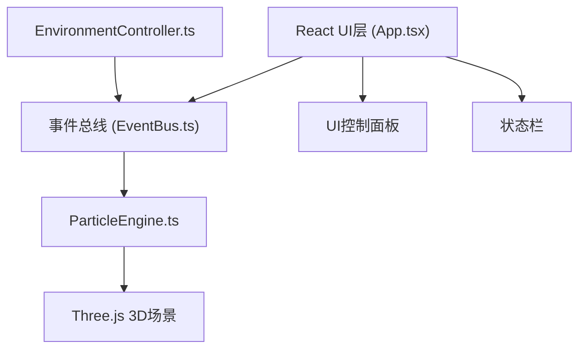

## 1. 架构设计

## 2. 技术描述

- **前端框架**：React 18 + TypeScript
- **构建工具**：Vite 5
- **3D渲染引擎**：Three.js + @types/three
- **状态通信**：自定义EventBus事件总线
- **样式方案**：原生CSS（不使用Tailwind，按用户要求）

## 3. 项目文件结构

| 文件路径 | 用途 |
|----------|------|
| `package.json` | 项目依赖和脚本配置 |
| `index.html` | 入口HTML页面 |
| `tsconfig.json` | TypeScript配置（严格模式） |
| `vite.config.js` | Vite构建配置 |
| `src/main.tsx` | React应用入口 |
| `src/App.tsx` | 顶层组件，UI布局和3D场景集成 |
| `src/components/EventBus.ts` | 事件发布订阅类 |
| `src/components/EnvironmentController.ts` | 环境参数管理和广播 |
| `src/components/ParticleEngine.ts` | 粒子系统管理和动画 |
| `src/styles.css` | 全局样式 |

## 4. 核心模块说明

### 4.1 EventBus
- 简单的发布-订阅模式实现
- 支持事件注册、触发和取消订阅
- 关键事件类型：`environment:update`、`bloom:start`

### 4.2 EnvironmentController
- 维护三个参数状态：lightAngle（0-360°）、windSpeed（0-10）、particleDensity（1-5）
- 提供setter方法，参数变化时通过EventBus广播
- 60次/秒的更新频率
- 最大粒子数：1000

### 4.3 ParticleEngine
- 使用Three.js的BufferGeometry和Points实现粒子系统
- 粒子属性：位置、速度、生命期、颜色、大小
- 响应环境事件调整粒子运动轨迹和颜色
- 花蕾结构：螺旋锥体，200个粒子，半径2，高度3
- 绽放动画：6片花瓣，每片50粒子，贝塞尔曲线排列
- 性能优化：直接修改attribute数组，不重新编译shader

### 4.4 App.tsx
- Three.js场景初始化：场景、相机、渲染器、OrbitControls
- 点击检测：Raycaster检测花蕾点击
- 响应式布局监听
- 帧率统计和粒子数显示

## 5. 关键技术点

### 5.1 性能优化
- 使用BufferGeometry存储粒子数据
- 在动画循环中直接更新position、color等attribute
- 粒子增删使用透明度淡入淡出过渡（0.5秒）
- 组件卸载时清理所有Three.js资源

### 5.2 颜色系统
- HSV颜色空间处理，光照角度影响色相偏移
- 偏移量 = 光照角度 / 360 * 180
- 饱和度0.7，亮度0.9保持恒定

### 5.3 动画系统
- 花蕾：绕Y轴0.1弧度/秒旋转，上下浮动振幅0.2，频率1Hz
- 绽放：3秒动画，贝塞尔曲线展开，粒子大小变化0.15→0.3→0.1
- 绽放后：绕Y轴0.05弧度/秒旋转，最大偏移0.5
- 风向：X/Z轴正弦波偏移，振幅=风速*0.1，频率2Hz

### 5.4 交互系统
- OrbitControls：阻尼0.05，旋转速度0.5，缩放范围5-30
- 射线检测：点击花蕾触发绽放
- 滑块交互：hover、active状态反馈，值变化标签高亮
