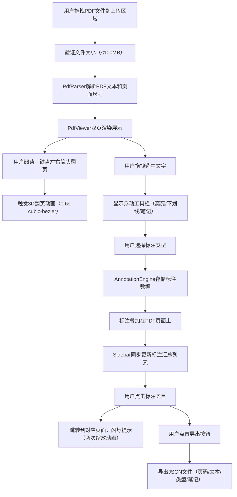

## 1. 产品概述

沉浸式PDF翻书阅读器，解决在屏幕上阅读长文档时缺乏纸质书翻页沉浸感和笔记难以整理归档的问题。面向需要深度阅读学术论文、书籍、报告等长文档的用户，提供纸质书般的阅读体验与便捷的数字笔记管理。

## 2. 核心功能

### 2.1 用户角色
| 角色 | 注册方式 | 核心权限 |
|------|---------|---------|
| 普通用户 | 无需注册，本地使用 | 上传PDF、阅读、标注、导出 |

### 2.2 功能模块
1. **PDF上传模块**：拖拽上传、文件大小限制、加载状态显示
2. **翻书阅读模块**：双页展开、3D翻页动画、键盘导航、单/双页自适应
3. **文字标注模块**：文字选中、浮动工具栏、高亮/下划线/笔记三种标注
4. **笔记面板模块**：便签式笔记编辑、保存删除、折叠展开
5. **标注汇总模块**：右侧边栏、按页码分组、跳转定位、闪烁提示
6. **数据导出模块**：JSON格式导出、localStorage持久化

### 2.3 页面详情
| 页面名称 | 模块名称 | 功能描述 |
|---------|---------|---------|
| 主页面 | 上传区域 | 拖拽上传PDF，支持最大100MB，显示加载进度 |
| 主页面 | 翻书区域 | 双页展开展示，中间书脊缝隙，3D翻页动画，键盘左右翻页 |
| 主页面 | 浮动工具栏 | 选中文本后显示，提供高亮、下划线、笔记按钮 |
| 主页面 | 笔记面板 | 右侧弹出便签式面板，编辑笔记内容，保存删除 |
| 主页面 | 右侧边栏 | 标注汇总列表，按页码分组，点击跳转，导出按钮 |

## 3. 核心流程

## 4. 用户界面设计

### 4.1 设计风格
- **主色调**：米色 #fdf6e3（模拟旧纸）、深灰 #2d3436（文字）
- **辅助色**：高亮黄 #fde68a、下划线蓝 #60a5fa、笔记面板 #fffbeb
- **翻书区域背景**：#e2dcc6 带轻微噪点纹理
- **按钮样式**：圆角8px，毛玻璃效果 backdrop-filter: blur(8px)
- **字体**：系统字体栈，正文14px，标题16px
- **布局风格**：居中翻书区域 + 右侧边栏，卡片式面板
- **阴影效果**：书脊底部暗色阴影渐变，浮动工具栏阴影 0 4px 20px rgba(0,0,0,0.15)

### 4.2 页面设计概览
| 页面名称 | 模块名称 | UI元素 |
|---------|---------|-------|
| 主页面 | 翻书区域 | 双页各占40%，中间书脊20px，3D透视翻页动画 |
| 主页面 | 浮动工具栏 | 高36px，白底圆角8px，三个操作按钮 |
| 主页面 | 笔记面板 | 宽280px，顶部折叠，展开背景#fffbeb，圆角12px，边框#fde68a |
| 主页面 | 右侧边栏 | 标注列表按页码分组，黄色方块/蓝色对话框图标 |

### 4.3 响应式设计
- **大屏（≥768px）**：双页展开模式，左右页各占40%，右侧边栏固定宽度
- **小屏（<768px）**：单页模式，翻书区域占满宽度，右侧边栏改为底部抽屉
- **过渡动画**：模式切换时平滑过渡，持续0.3s ease

### 4.4 动画规范
- **翻页动画**：0.6s cubic-bezier(0.25, 0.46, 0.45, 0.94)，3D透视旋转，纸张背面微微透明
- **闪烁提示**：两次缩放动画，每次0.3s，scale(1.05) → scale(1) → scale(1.05) → scale(1)
- **面板展开**：高度自适应过渡，0.3s ease
- **页面加载**：淡入动画，0.5s ease

## 5. 性能要求
- 翻页动画帧率稳定60fps
- 100页以上PDF首次加载不超过3秒
- 标注操作响应延迟<100ms
- 内存占用优化，大PDF分页渲染
