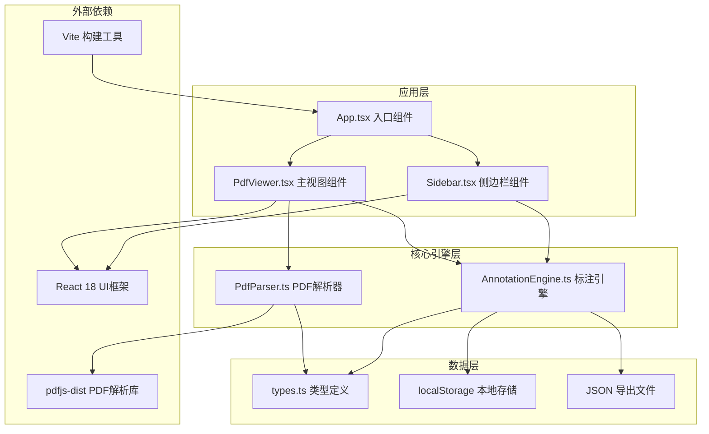

## 1. 架构设计



## 2. 技术选型说明

- **前端框架**：React@18 + TypeScript@5
- **构建工具**：Vite@5 + @vitejs/plugin-react@4
- **PDF解析**：pdfjs-dist@4
- **样式方案**：CSS Modules + CSS Variables
- **状态管理**：React useState/useReducer + 自定义hooks
- **数据持久化**：localStorage
- **导出格式**：JSON

## 3. 项目文件结构

```
auto137/
├── package.json
├── index.html
├── vite.config.js
├── tsconfig.json
├── src/
│   ├── main.tsx              # 应用入口
│   ├── App.tsx               # 根组件
│   ├── PdfViewer.tsx         # PDF阅读器主组件
│   ├── PdfParser.ts          # PDF解析引擎
│   ├── AnnotationEngine.ts   # 标注数据管理
│   ├── Sidebar.tsx           # 标注汇总侧边栏
│   ├── types.ts              # TypeScript类型定义
│   ├── styles/
│   │   ├── global.css        # 全局样式
│   │   └── variables.css     # CSS变量
│   └── hooks/
│       └── useKeyboard.ts    # 键盘事件hook
```

## 4. 核心数据模型

### 4.1 TypeScript 类型定义

```typescript
// types.ts

export type AnnotationType = 'highlight' | 'underline' | 'note';

export interface Annotation {
  id: string;
  pageNumber: number;
  type: AnnotationType;
  text: string;
  rect: { x: number; y: number; width: number; height: number };
  noteContent?: string;
  createdAt: number;
}

export interface PageData {
  pageNumber: number;
  width: number;
  height: number;
  textContent: string;
  textItems: TextItem[];
  canvas?: HTMLCanvasElement;
}

export interface TextItem {
  str: string;
  dir: string;
  transform: number[];
  width: number;
  height: number;
}

export interface PdfDocument {
  numPages: number;
  pages: PageData[];
  fileName: string;
}
```

### 4.2 AnnotationEngine 数据结构

```typescript
// 内部存储结构
type AnnotationStore = Map<number, Annotation[]>;

// 导出JSON格式
interface ExportData {
  version: string;
  exportedAt: number;
  fileName: string;
  annotations: Annotation[];
}
```

## 5. 核心模块设计

### 5.1 PdfParser.ts

| 方法 | 参数 | 返回值 | 说明 |
|------|------|--------|------|
| `parsePdf` | `buffer: ArrayBuffer` | `Promise<PdfDocument>` | 解析PDF文件，返回文档数据 |
| `getPageText` | `page: PDFPageProxy` | `Promise<TextItem[]>` | 获取单页文本内容 |
| `renderPageToCanvas` | `page: PDFPageProxy, scale: number` | `Promise<HTMLCanvasElement>` | 渲染页面到Canvas |

### 5.2 AnnotationEngine.ts

| 方法 | 参数 | 返回值 | 说明 |
|------|------|--------|------|
| `addAnnotation` | `pageNumber: number, annotation: Omit<Annotation, 'id' | 'createdAt'>` | `Annotation` | 添加标注 |
| `deleteAnnotation` | `annotationId: string` | `boolean` | 删除标注 |
| `getAnnotationsByPage` | `pageNumber: number` | `Annotation[]` | 获取指定页标注 |
| `getAllAnnotations` | - | `Annotation[]` | 获取所有标注 |
| `exportToJson` | - | `string` | 导出JSON字符串 |
| `saveToLocalStorage` | `key: string` | `void` | 保存到localStorage |
| `loadFromLocalStorage` | `key: string` | `Annotation[]` | 从localStorage加载 |

### 5.3 PdfViewer.tsx 组件 Props

```typescript
interface PdfViewerProps {
  document: PdfDocument | null;
  annotations: Annotation[];
  onAddAnnotation: (annotation: Omit<Annotation, 'id' | 'createdAt'>) => void;
  onDeleteAnnotation: (id: string) => void;
  currentPage: number;
  onPageChange: (page: number) => void;
  highlightAnnotationId: string | null;
}
```

### 5.4 Sidebar.tsx 组件 Props

```typescript
interface SidebarProps {
  annotations: Annotation[];
  onJumpToAnnotation: (annotation: Annotation) => void;
  onExport: () => void;
  onDeleteAnnotation: (id: string) => void;
}
```

## 6. CSS 变量定义

```css
:root {
  /* 主色调 */
  --color-bg: #fdf6e3;
  --color-text: #2d3436;
  --color-book-bg: #e2dcc6;
  
  /* 标注颜色 */
  --color-highlight: #fde68a;
  --color-underline: #60a5fa;
  --color-note-bg: #fffbeb;
  --color-note-border: #fde68a;
  
  /* 组件样式 */
  --toolbar-height: 36px;
  --toolbar-radius: 8px;
  --toolbar-shadow: 0 4px 20px rgba(0, 0, 0, 0.15);
  --panel-width: 280px;
  --panel-radius: 12px;
  --panel-padding: 16px;
  --spine-gap: 20px;
  
  /* 动画 */
  --page-flip-duration: 0.6s;
  --page-flip-timing: cubic-bezier(0.25, 0.46, 0.45, 0.94);
  --blink-duration: 0.3s;
  
  /* 毛玻璃效果 */
  --glass-blur: blur(8px);
  --glass-bg: rgba(255, 255, 255, 0.8);
}
```

## 7. 性能优化策略

1. **PDF分页懒加载**：只渲染当前可见页面，预加载相邻页面
2. **Canvas复用**：翻页时复用Canvas元素，避免重复创建
3. **requestAnimationFrame**：翻页动画使用RAF确保60fps
4. **will-change**：对翻页元素设置 will-change: transform 提升性能
5. **CSS硬件加速**：使用 transform3d 触发GPU加速
6. **防抖节流**：窗口resize、滚动事件添加防抖
7. **文本缓存**：解析后的文本内容缓存，避免重复解析
8. **虚拟列表**：标注列表使用虚拟滚动（如标注超过100条）

## 8. 关键实现要点

### 8.1 3D翻页动画实现
```css
.book-container {
  perspective: 2000px;
  transform-style: preserve-3d;
}

.page {
  position: absolute;
  width: 100%;
  height: 100%;
  backface-visibility: hidden;
  transform-style: preserve-3d;
  transition: transform var(--page-flip-duration) var(--page-flip-timing);
}

.page.flipping {
  transform: rotateY(-180deg);
}

.page-back {
  position: absolute;
  width: 100%;
  height: 100%;
  backface-visibility: hidden;
  transform: rotateY(180deg);
  opacity: 0.85;
}
```

### 8.2 文字选中与坐标转换
- 使用 `window.getSelection()` 获取选中文本
- 使用 `getRangeAt(0).getBoundingClientRect()` 获取选中区域坐标
- 转换为相对于PDF页面的坐标系统存储
- 渲染标注时根据当前缩放比例转换回屏幕坐标

### 8.3 响应式单/双页切换
- 使用 `window.matchMedia('(max-width: 768px)')` 监听屏幕尺寸
- 双页模式：左右页各占容器40%宽度
- 单页模式：页面占满容器宽度，禁用3D翻页改用滑动动画
